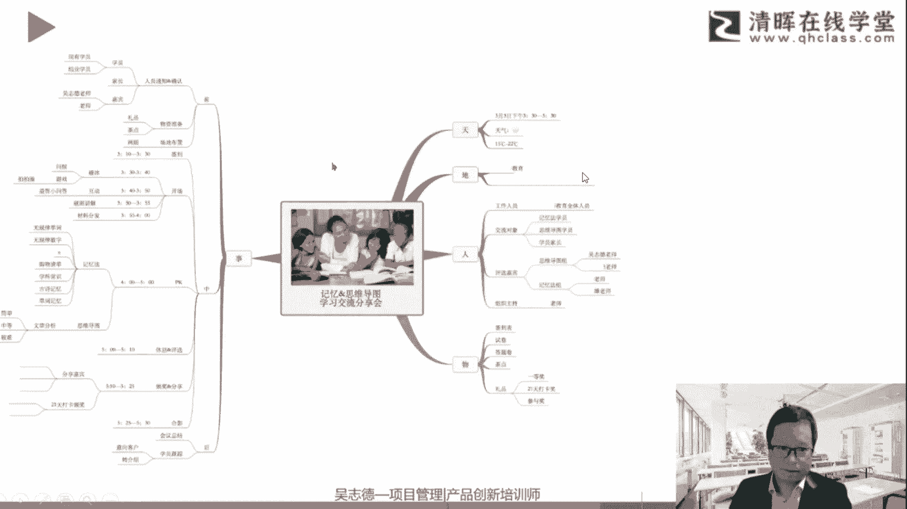
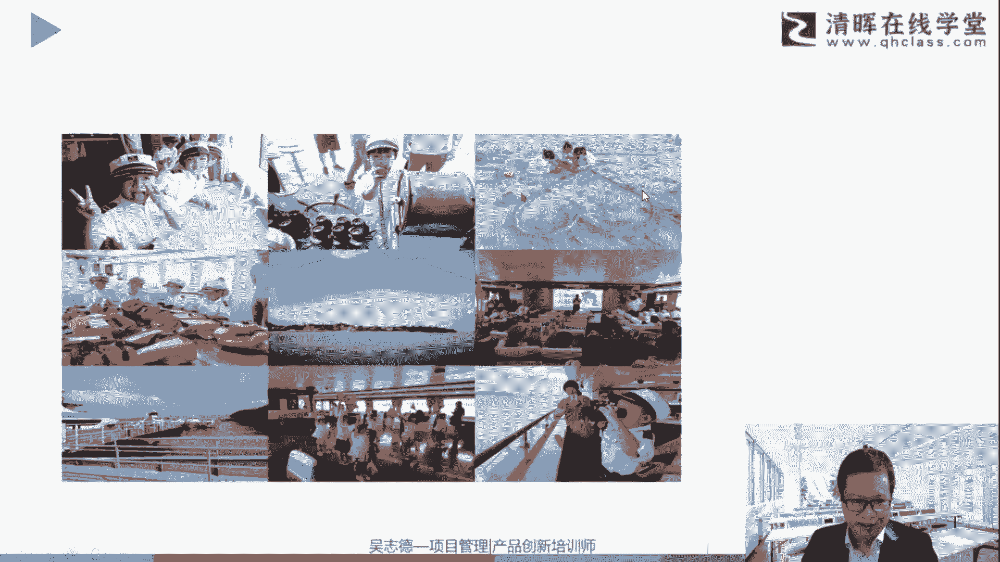
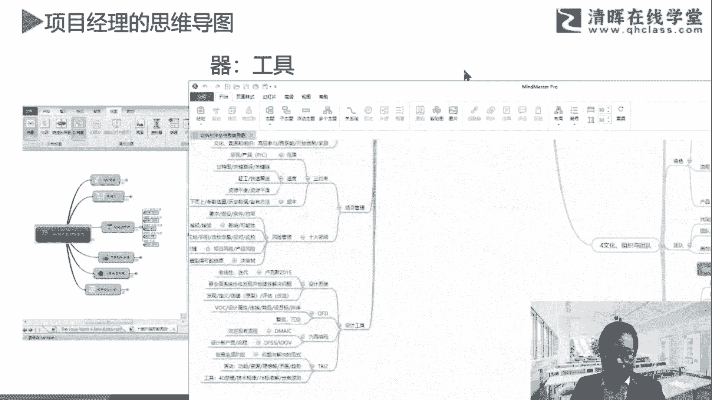

# 高效简单的思维导图小技巧 - P1 - 清晖Amy - BV1ar421J7ED

就讲完了哈，我会进行一下总结，刚才说了几个关键词进行对应，一要有对应的一个图像，然后包裹的中心图像还可以应用一些小插图，它是非常有价值，能够增进我们的整体大脑的一个理解和记忆，来强化我们的理解跟记忆。

并且万事万物之间的相互关联，应用到不仅是文字语言，还有视觉图像啊，我们一定今天会记住，那个非常经典的那个小片段，那这个线条也非常重要，而且线条是曲线相连的，往往有些软件或者我们自己画的时候，如果你没学。

经常能用直线进行连接，那其实线条才是更符曲线的，这种线条才是更符合啊自然规律啊，对应的连接，然后要推对应出进行突出，逻辑有层次感啊，当然不见得说一定是直线就不行啊，只是说你结合你的喜好哈，然后关键词啊。

关键词在总结提炼在我们的线条上啊，或者说框框中，如果你用软件的，有些它是可以有色块或者其他的来，他的重要价值在于，我们能够紧要的抓住这个要点，而不是一长串的话，然后提提纲挈领啊，那色彩一定非常重要哈。

它整体我们是一种有颜色的，有色彩的一个图形和线条，能够帮助我们更好的那个识别，包括记忆调动我们的一个作用了，然后刺激我们的一个用了，然后逻辑的一个布局啊，整体的这个就是结构思考力的方式。

如何进行层级的提炼，一级一级的关系的展开，同级之间的对应关系，这个关于逻辑的一个布局跟提炼本身展开，就是一个金字塔原理，或者结构思考力对应的部分哈，帮助我们如何更好的记忆跟调动各种感官。

比如我们常说的三明治法，写故事开头中间结尾，然后又是什么时间故事人物啊等等的一个方式。

结合对应的内容好，那接着往下，刚才其实那些都是管理，讲整体干货或者刑法中对应的部分，那接着具体绘制步骤其实也不难。

我们围绕展开五步走，同样还是用思维导图来讲，思维导图就把刚才那几个展开，首先先拿一张纸，A3或者A4啊，你把它放中间，然后现在中心画一个结合这个主题相关的，这个中心图像或者中央图像。

然后写上对应的一些主题，然后画上对应的一些分支，然后对应有有颜色啊，比如3~5种或者3~7种，然后最少三种啊，当然也不见得一定要花个十来种，或者80几岁啊，那个太费劲了哈。

呃比如最近我女儿她刚买了一套笔，那个马克笔80色的，她说她现在是美术生，那36色已经无法满足他对应的要求啊，那我们平常其实12色已经非常能够满足了哈，通常其实也用不了那么多色。

我用的最多的其实是七色以内哈，那接着呢就是分支啊，强调这个分支是连接到这个中央图像的，然后曲线相连的逐层逐层的展开和细化的哈，那关键词的一个提炼，是需要在我们日常工作中，不断的一个总结和提炼啊。

语言文字本身的提炼，所以这既有结合到视觉图像，又有结合到语言文字图像本身，那也可以结合一些配图，当然如果你是手绘的，就可以用涂鸦思维导图的方式，如果是画电子档的，经常大家会忽略的这个配图的方式。

就把字敲完就完了，其实如果配一点配图也会达到更好的一个特点，当然这个配图不是乱配，这配图是结合对应的关键词，比如有哪些语言文字的关键词，你想把它用图片的方式进行转化的方式，你先自己百度一下啊。

百度一个词它会弹出很多对应的图片或者图标，那你再结合一张有意思的在进行结合战争进入，当然软件它本身也会有一些对应的一个图标，跟图片的使用啊，好然后更好的一个灵动啊，所以这个几步展开是什么呢。

第一个就是白纸横跨啊，注意是横着，而不是竖的，从中间开始，第二个由中心线画中心图像啊，这个中心图像是结合这张图本身的一个主题，相关的，容易联想，而且容易让人有视觉焦点，第三个组成的细化分支啊，曲线相连。

然后提炼关键词写在线上，然后结构逻辑先整理好啊，然后结合一些视觉语言啊，如果刚才讲到了，如果是手工的，你可以进行手工涂鸦绘制，如果是电脑的，可以进行一些电脑的配图啊，这五步走，这对应就是干货。

那同样这就来到今天的第二个课后作业啊。

那你拿一张纸，这个可能你好久没有拿一个纸，拿好几支笔，有颜色的画一个作品，可以这样讲，那这里定一个主题是我是谁啊，那个我从哪里来，我要干什么，然后我们说人生三本呃，这个常说的这是什么介绍法啦。

唐唐僧介绍哈，唐僧通常是怎么介绍的，平生唐玄奘来自东土，大唐去往西天取经对吧，我是谁，我从哪里来，我要到哪里去，还讲我要干什么啊，其实唐僧自我介绍，往往是这四句话的一个介绍方式，那你可以基于这个维度。

也可以基于其他维度来进行展开，那以前的那个我经常有自己举例哈，及我自己对应的不同时期的画作啊，咱们今天线上人数有点多，我就不举例介绍我自己了哈，今天已经损失又突破了5000多的在线人数啊。

然后热热度有9万3啊，所以感谢大家的支持哈，这个留留个一个作业吧。

哈我就不再介绍自己了啊，就不展开这些对应的信息，那接着往下最下面一个部分是惯例，项目经理是思维导图的哈。

其实就是结合你工作中如何进行更好的一个，思维导图的一个介绍，那同样由于时间关系啊，我们也不能演练跟进行展开，对应的一些项目的一些规划，那在过往如果是线，线下都会有很多一些演练跟对应的一些课程。

这几句简单举一个例子哈，这次有一次有个机构关思维导图的，他策划了一个活动，那里面大家会看到它围绕这个天地，人物事的事情展开来进行介绍啊，那当时是邀请我去做一个思维导图的，这个评选的嘉宾对吧。

所以我是在这里面诶，他把这个环节发给我，我就发现挺有意思的啊，这就是一个项目规划了，但是简单的一页纸就把这个事情给安排好，天哪一天D哪个地点啊，这些有些我做了一些处理哈，人需要哪些人物的对接邀请跟安排。

包括评选嘉宾，主持人是谁，工作人员，包括学员有哪些故，还要准备哪些物料，那事前UFN前中后，事前做什么，事中做什么，事后做什么啊，对应的内容，这就是一个很好的项目规划啊。

再结合大家具体工作中去进行应用，那你那个实际工作中可能有很多项目啊，比如说你要做一些一些对应的一些项目的策划，你可以结合，对应的一些讨论啊，这些就不展开了哈，那这个是过往实际有一些操作。

跟最后实际落地的。

不仅我们做完规划，还带着家里的小朋友一起去。

把这个事情给完结了哈，好那最后呢跟大家会问到用啥软件对吧，那大家关注的，我们就把手绘导图和软件导图跟大家归类一下。

刚才都讲的其实是关于手绘部分，或者说它是原理部分，那再结合到工具中你进行转化，那最终如果更转化，后面不管你是手绘或者电子感，最终你能够得到的一个方式就是你大脑里有图，你不一定要画出来啊。

这就是形成一种思维方式，所以思维导图到变成导图思维的一种训练，那手绘有什么好处呢，随手可会印象深刻，可粗可细，它能够真正调动你，动笔就是动手，就是动脑的一个过程，当然电子档的有它的好处。

比如世界没观容易修改啊，方便方便分享啊，这是非常好的诶，你画了特别是这个容易修改这一块部分，那可能是电子版是非常优于手绘版的啊，手绘你要再修改一下，发的时间可能比较多，那电子档你多增1+1栏。

多往下下拉一栏啊。

这个是非常容易的事情，所以各有各的方式啊，所以纯手绘呢它通常漂亮美观，视觉效果好，耗时较多，效果看个人啊，所以大家有机画的好的，也有画的不好的，比如你是美术生，可能这一块是会更出效果，从艺术感的角度哈。

那如果纯软件呢清晰明了，逻辑层次层次好，耗时较少，但是效果要看软件，那另外这个纯软件往往会把这个图做得很大，往往会忽略了这个关键词的一个体验，把它做成一大段话，所以这个建议大家还是不要忽略了。

关键词的一个提炼，那还有一种方式就是手绘加软件啊，如果你觉得我自己手绘不是太好，你的手绘随时把想法记下来，打个草稿，然后你要软件做精品，那要跟人分享，特别是工作中啊，会更好的一个出效果，然后实战效率高。

所以手绘跟软件不要进行忽视啊。

那这里再结合到我们做职场中。

其实要衍生，其实我总结其实是有职场三张图啊，其实一就是思维导图，能够帮助我们天马行空产生创意，那第二个叫做PPT，叫上传下达沟通汇报，你是需需要向上层汇报，又需要向你的团队去进行传达，如何进行沟通汇报。

那第三个就是我们的项目管理叫甘特图，执行利器，法度森严，这是三个图形，是非常结合，能够提升我们的职场核心竞争力，的一个高效工具，那当然这个甘特图只是一个代称，它其实背后说的就是项目管理。

那思维导图它也只是一种呈现它背后的原理，其实导图思维啊，包括我们做的一个发散收敛，包括结构思考力等等的一个方式，包括我们视觉语言跟文字语言的一个综合形成，但其实PPT也是一种呈现方式。

它PCP背后的是你你你的逻辑思维方式啊，你如何站在自己，站在他人的角度来思考，这个沟通汇报的一个层级啊，其实他背后是更核心的管理，与人打交道，包括沟通的核心啊等等的一个方式。

那这三个结合我们落实到气的层面。

就大家会问用啥软件，这这就是你要的干货，就在这里，用什么工具呢。

给大家介绍一个，有没有一个工具能把包括思维导图，包括甘特图，包括PPT的功能多，有的一个软件，那这里是不是卖软件的，因为这个软件本身是免费的哈，这些这个软件叫MAD master，是咱们国产的一个软件。

当然还有其他很多的，那个很多的思维导图的软件哈，大家都可以结合用，可能你用S8用的多用mod manager，用的多，等等都可以啊，这个只是我觉得比较好用的一个方式，最近几年我都用这个，我把他拉过来啊。

那这个就如果大家问他这个叫madam manager啊，它本身就有这个软件啊，它其实是有免费的一个版本，我这是pro啊，pro我是买了一个专业版终身版的啊。

那大家平常他就有免费版的啊，比如大家看到这个哈，这个前面这些都是能用的，pro的就是具有其他的功能，那另外它有很多模板，那另外这些模板都是联网的啊，都是其他更新的，比如我们说项目管理，这里就有项目计划。

培训计划等等等等，还有读书笔记产品问题分析，我们随便打开了一下啊，呃我就不多展开了，大家去研究哈，省得好像我是卖软件似的啊，那就不好了哈，OK然后除了思维导图，它如果你用它还会有其他方式，比如鱼骨图啦。

那个圆饼图啦等等的一个方式，那我打开来刚才那个图哈。

跟大家说明一下，如何把三个图结合的一个内容哈，大家会看到这里既有甘特图，又有思维导图部分，那当然你也可以转化成PPT的一个，方式的内容啊，诶稍等一下啊，好稍等啊，这个软件打开有点慢啊。

我今天开的程序有点多啊。

好比如我这打开一个，还在打开，比如说打开一个文档啊，我们简单看看，大家会看，虽然还没打开哈，但里面其实他也有幻灯片对应的内容啊，对看来也有其他伙伴有买过啊，我这个是好多年前买的，所以我也没太关注他啊。

我因为买的是终身版啊，就一次性就搞定了啊，然后有其他事出，然后里面它也有一个甘特图啊，就像刚才那个对应设定的一个内容啊。

你可以设定成对应的一个甘特图，也可以设有多多长的一个工作时间，然后设里程碑啊进行对应的一个乘积，大家会看这个对应的一个定义任务信息啊，优先级进度开始时间截止时间转化，当然还可以设定对应的一些视图。

进行播放的演示。

所以把刚才那种三个图对应的一个展开的方式，那所以能同时做到思维导图PPT，还有甘特图的一个软件，跟大家介绍对应的一个使用哈，我就不展开了。

相机软件各个其实都是类似的哈，然后包括这张图啊，本来是要打开刚刚那个软件演示的，打开有点慢啊，那其实这是之前截的图哈，比如你把这些对应的一个承接，然后可以设定啊，目前属于哪一天，大家会看啊。

学项目管理PMP中，还包括用project相关的，如果你只是简单一点的工作，不需要用那么复杂的，比如project来进行完制作用，这个其实能够满足你很多小项目，或者日常工作中的一个需要啊。

这就进行对应的介绍好，那我们今天主体的一个内容其实就介绍完了，我们做一个简要的回顾，前面说用项目管理的思维看世界，然后回顾一下核心的思维，特别细节的结合这个项目，分解系统思维来展开主体。

介绍这个涂鸦思维导图的一个方式，然后讲到了项目管理相关的思维导图，还包括接到的MAD manager啊，对应的一个软件的一个内容，那这里的一个核心呢，谈到了一个涂鸦思维导图的方式。

建议大家可以再重新拿起我们的笔，以及对应的画笔嗯，早点时间找点空闲啊，涂涂画画呃，跟家里的孩子多交流啊，重新找回童年的对应的视觉思维，视觉文字的对应的一个内容好，那我们今天的分享就到这了。

还剩大概10分钟左右的时间，大家看有没有什么要交流的啊，对mana manager也是挺好用的，我以前对应也用madam manager，那madam manager，它对应其实是比较刚才说到的左脑型。

它在艺术感生上面，在那个图像艺术这一块相对会弱一点，它是比较左脑的理工科的啊，在医务脑上当，当然也会有一些也能插点图片啥的，但是相对没那么好看啊，啊也是挺好用啊，好谢谢啊，谢谢苏晓啊。

好那今天的分享就到这了，看看有没有什么疑问啊，需要那个课件的，或者说需要呃讲我个人微信的什么的，大家就联系咱们的线上那个的小伙伴，就可以了啊，这个债券协商的小伙伴啊。

大家平常现在用什么软件MAD manager吗，还是SM用的多好，感谢刘志啊，当然如果没啥问题哈，那咱们今天的直播就环节到此为止哈，那个也是一个干货满满的一天啊，相信对待虽然看起来不复杂啊。

相信对大家提升你的职场的高效性是有帮助的，好谢谢啊，呃具体多少钱你去了解哈，我可能现在也没太关注了，而且有对应不同活动，大家可以看啊，好谢谢大家啊，谢谢啊，以shell画甘特图也是很好的方式。

也有很多好的一些，那个excel甘特图模板还是非常好用的啊，我手头也有几个挺好用的啊，当然如果在更专业一点，你可以用比如麦克show project或者等等哦，还有这个这个软件。

它皮也有配套一个关于project的啊。

