# 高效简单的思维导图小技巧 - P2：如何运用色彩让思维导图更直观？ - 清晖Amy - BV1ar421J7ED

那个书画里面，所以其实大家可能会看到我，我其实这书桌上还是有很多奇奇怪怪的，各种颜色的，各种材质的对应的一个工具啊，所以我平常拿笔还是拿得多的啊，而且是拿各种奇奇怪怪的比啊，那接着下一个主题。

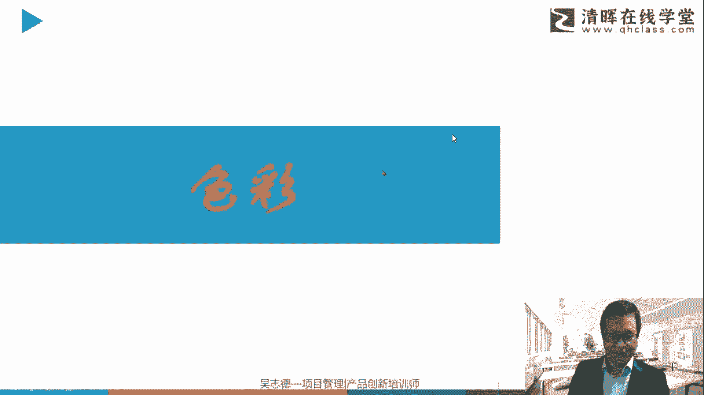

关于涂鸦思维导图，就是关于色彩，为什么是彩色呢，这个彩色是大，那个大自然赋予我们人类一个非常重要的功能，不是每种生物都能看到彩色的，这个相信大家都知道，而且不见得是像我们能看到那么五颜六色。

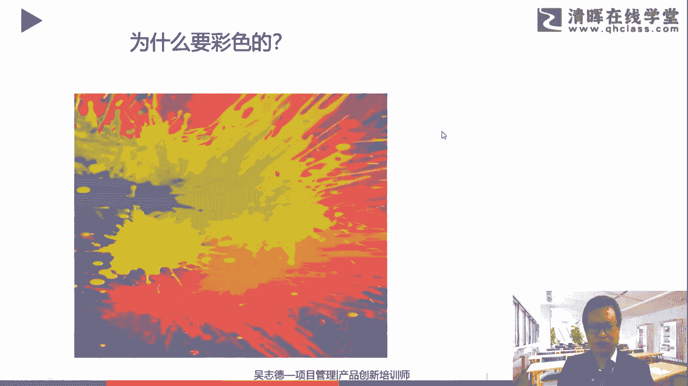

所以色彩的一个重要性啊，那简单对比一下，大家会看两张图，一个是彩色的。

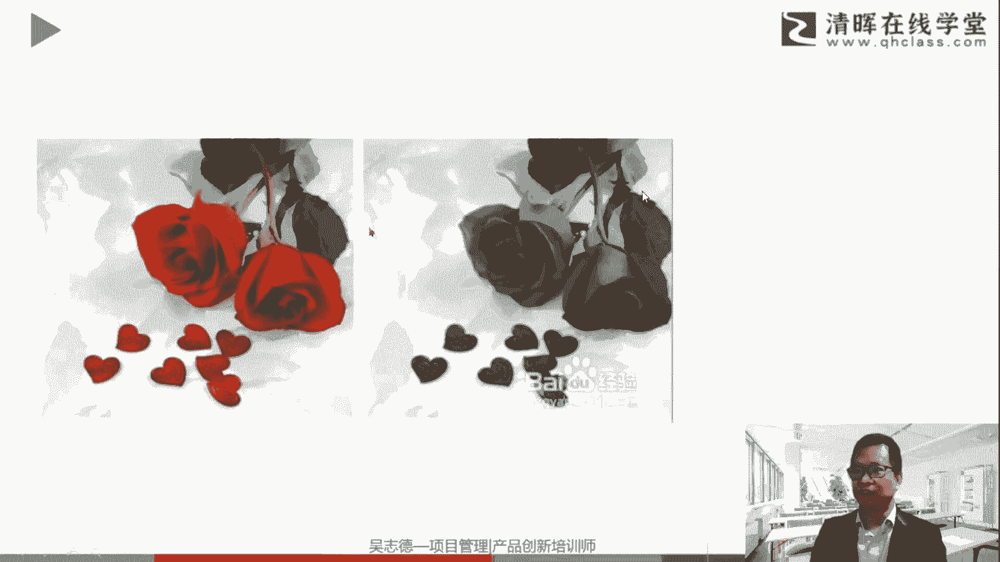

一个是黑白的，这就是非常不一样的内容，那比如我举例哈，这个图片也来源于网络啊，这是一种彩色的思维导图啊。

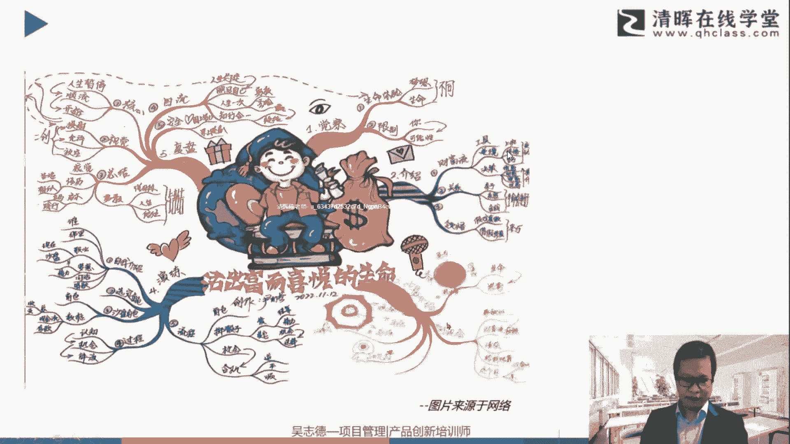

大家一看就是一个对应的一个艺术品，那如果把它处理成黑白的，你可能就会发现诶这一下子就不对味了啊。

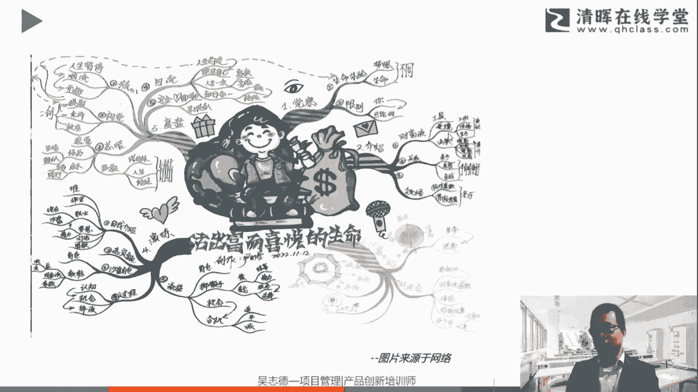

所以这就是关于彩色结合的一个重要性，所以为什么思维导图要对应用颜色呢，啊不管大家是用电子档的也一样哈，可能大家现在经常工作中，学习中会整理笔记，建议大家也进行色彩的一个划分，为什么要用颜色呢。

第一个它能够帮助我们对大脑进行刺激，让整个画面整个工作，整个这个过程更有趣味啊，能够更好地进行人，人类大脑还是喜欢颜色丰富的哈，当然也不见得一定是五颜六色，颜色非常多啊。

但是起码3~5种会是一个好的一个方式啊，七种左右，七种以内的应用都是比较合理的哈，3~5种如果你要简单一点，可能3~5种就可以，能够帮助我们强化图像的记忆，还好理解我们对应的事情，如果你都是黑白的。

这个事情就比较单调乏味，而且没有变化啊，就整体而失去我们的一个趣味性。

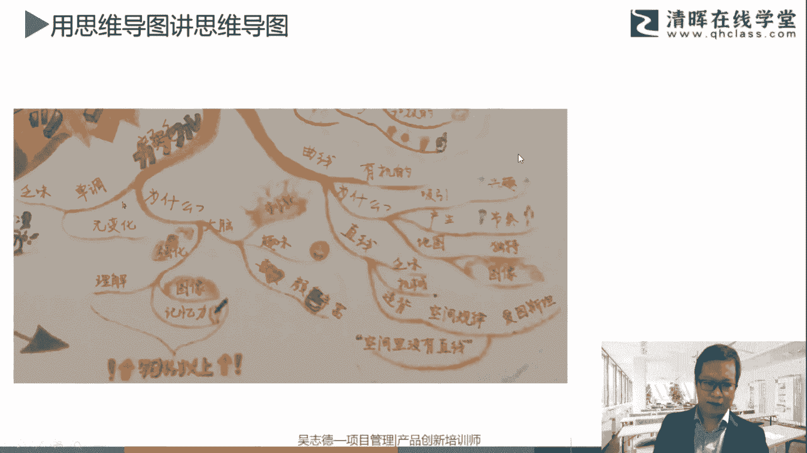

好那接着讲一下思维导图的这个用处啊。

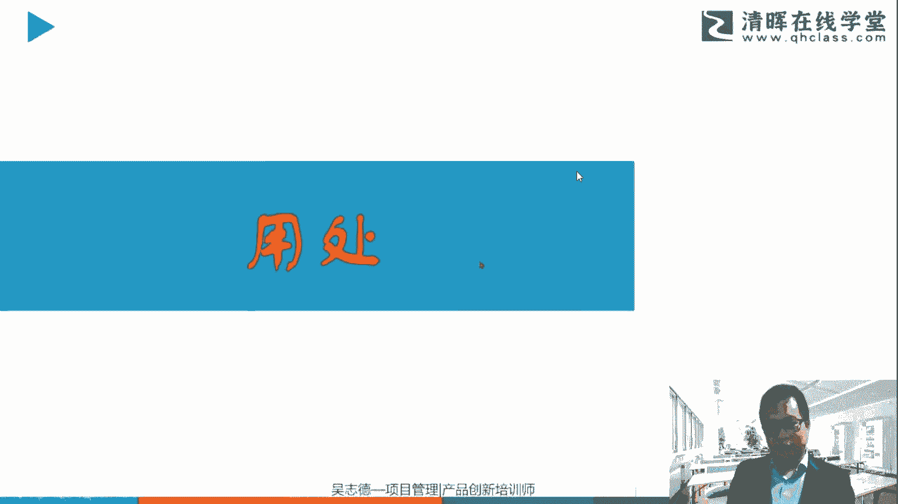

这个用处非常多啊，其实非常广泛，不限于工作中，也不限于说你做一个考试，包括一个其他的一个学习或者读书笔记，那包括可以用于什么呢，我们整理自己的想法啊，包括我们进行学习跟记忆力的一个训练和提升。

包括很多经常进行备考的啊，大家都会整理成自己的一个思维导图，那对于信息的一个有效的一个提炼，组织跟分析都是非常好的一种方式，那如果你要跟人进行谈话或者对话，你会发现有些人去谈话是毫无章法的。

或者说你抓不住他的重点，那有些人是比较有重点的，那这就是关于大脑的一个语言组织，那做规划啊，包括你长期短期的一个计划，包括这就结合我们的项目管理相关，还有其他各种的，可以说是无限的一种应用啊。

所以结合你所需要的大的小的中的都可以进行，有很好的一个结合，所以这个用处是非常广泛。

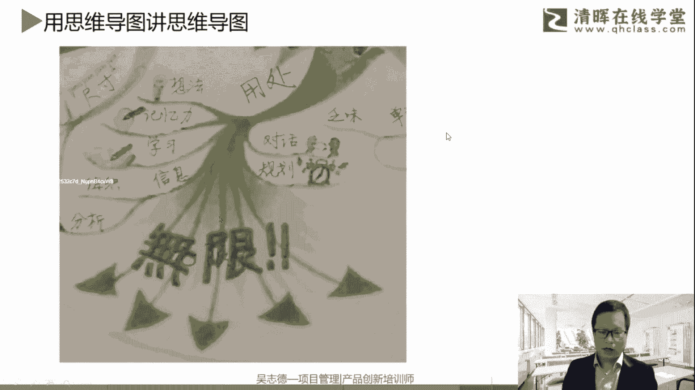

就非常多，就不用多展开，结合大家自己的一个理解。

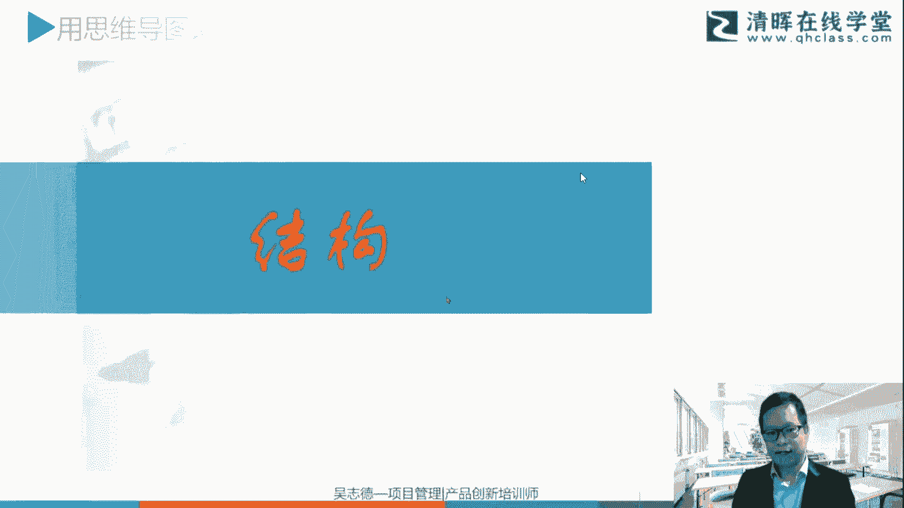

大家可能学习中会用得多，它其实也是一种备考的一个好的一个方式，那工作中可能也用得多，但是也许你整理了，不见得是按照思维导图一个要求，更多是基于逻辑知识信息的一个整理它，但是它其实我们结合刚才大脑的左脑。

右脑，其实你可能只用了一半的功功能或者左右。

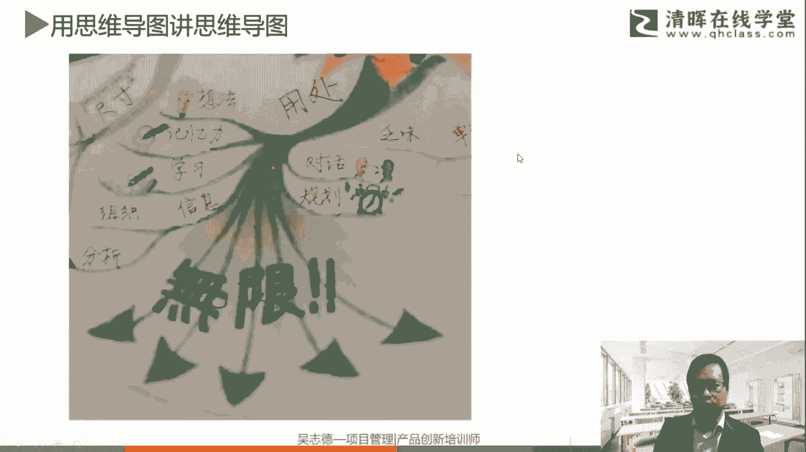

那接着我们来讲一个关键词，就是关于结构，那这整体的一个结构，它是由中间向四周发散的，一个放射性的一种方式哈，所以它整体是基于我们这种发散性思维的，包括刚才说的，如果两个维度你想向外发散，就是一种发散性。

那如果你要收纳总结，往内归，那就是一种收敛，那这个它其实是符合自然科学的，包括我们的神经元，我们你去观察大自然的树叶，或者说其他的树枝等等的，也是基于这种不断的一个发射延展的一个过程。

包括更多的比如说自然的空间啊，宇宙啊，对印度是以这种方式进行发展的，所以是符合自然规律的，那这个发展过程中，就可以有一级一级分支的一个展开，所以这在这就是关于左脑的，关于这逻辑的一个总结啊。

我们要提炼一级分支可能有哪些主要陈述，哪些部分，对就是结构化思维的啊，这个对应的一个内容包括结构思考力啊等等啊，或者军事塔原理啊，其实就融入到这些对应的内容，然后进行标题的提炼啊等等的一个要要素。

然后一级一级的展开啊，根据你的一个方式啊，如何主次，如何并列，如何连接的一个方式进行展开啊，所以这是整体的结构，其实也相对不陌生，但我们整个世界其实也是一个一级一级的展开，然后每一级分支上要有对应的。

关键词的一个提炼，那为什么是关键词呢，那就是因为它更好的一个记忆，当然你可以辅助一些关键的一些小图标啊，或者夸张的你自己能理解的，别人可能不见得能理解的，能够启发你各种感官记忆的对应的部分，那尺寸呢。

这个根据我们你自己图图形的一个需要啊，因为整体比如说A4或者A3纸，是比较合适的啊，我们先说手绘的哈，当然如果你用电子的有一个特点，就是这个图会越做越大，做的很大，它可能你实际打出来它可能非常庞大。

那如果用图示的方式，如何负载更多的一个信息量啊，往往你可以把它拆分成不同的画画面，不同的思维导图，多张思维导图进行结合啊，所以你结合这个对应的尺寸的选择跟粗细，那通常越居中的字体比较大啊。

包括那个图像也比较大，越往外围的相对来讲就越细分那层级，当然如果你一张图层积一般也不建议太多啊，比如说那个3~5层，3~77成，那七成已经其实蛮多的啊。

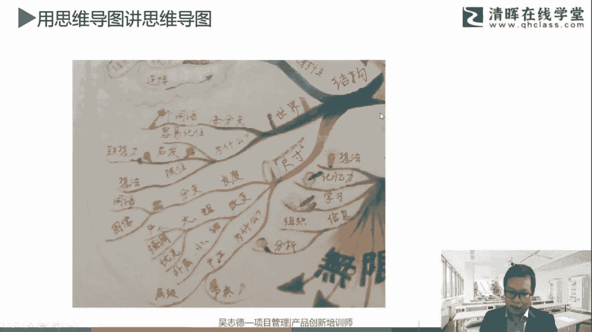

3~5层是比较好的一种方式啊，好那其实下一个关键词跟大家分享一下。

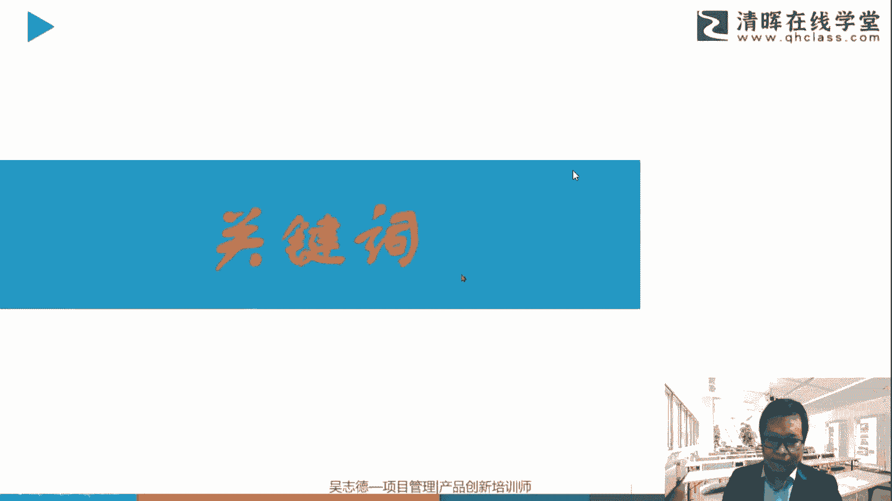

关键词的一个提炼，这个关键词往往容易被大家忽视啊，比如我们经常会做的，用电子或者软件做成的思维导图，往往可能长这样，那我打开了一个给大家看一下啊，这个是关于NPDP的啊，我整理的一个全书的。

主要的一些信息数或者知识数的一个特点哈，那大家会看到，可能你平常工作中或学习中也经常整理，它往往是比较庞大，而且不见得你能够自己完全能记住它，那用手绘跟电子档有什么区别呢，好我把它移过来一下啊。

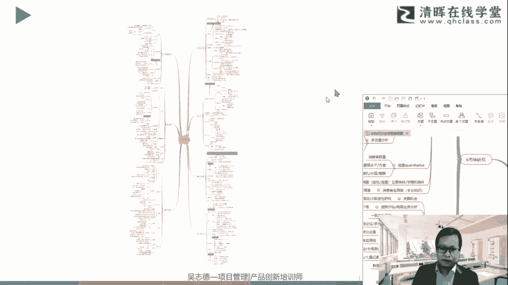

比如这张图啊，我们举例它可能全数有很多，然后展开可能有庞大的信息量啊，这作为一个了解。

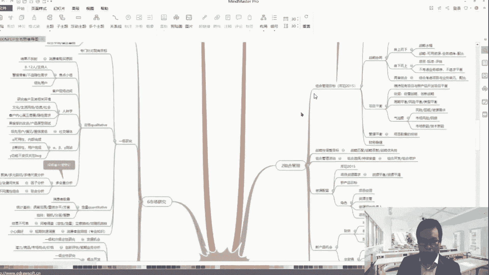

我们就不展开讲这张图哈，主要跟大家相信大家自己整理，也经常会整理这些对应的信息素，或者说电子档的思维导图，所以它通常其实不见得是一种思维导图，更多是一种知识数或者先系数，那以这张相对应的。

虽然这张也是软件做的电子档，大家会发现有什么不一样，第一它是一张图，第二是有关键词啊，至于问用什么软件做好，待会会揭秘哈，待会会讲到软件器的时候，会跟大家介绍，一定会讲啊，所以大家放心啊，我用什么软件。

之前用MAD manager，现在不用了，那至于现在用哪个，待会跟大家讲啊，然后大家会看到这里，其实就有关键词的一些提炼，比如说第一层多为什么是无缘，然后都有五个演讲演导演推演，排眼路演。

然后等等是什么方式，那这个图如果是你自己整理的，你会发现有车关键时的整理，即使我这张图丢了，他在我的脑袋里，我能够再把它说出来或者画出来，这就是经过提炼的，那如果是刚才那种信息素的方式。

他问你可能那张纸丢了，你就回想不起来，所有的内容，或者说大部分的内容你都回想不起来，所以要进行对应的一个关键词的一个提炼，当然这个如何提炼，这个就是我们语文阅读理解的啊，以前语文阅读理解。

无非就是那个说扩写或者缩写，那你如何捕获对应的点，浏览一些进行展开。

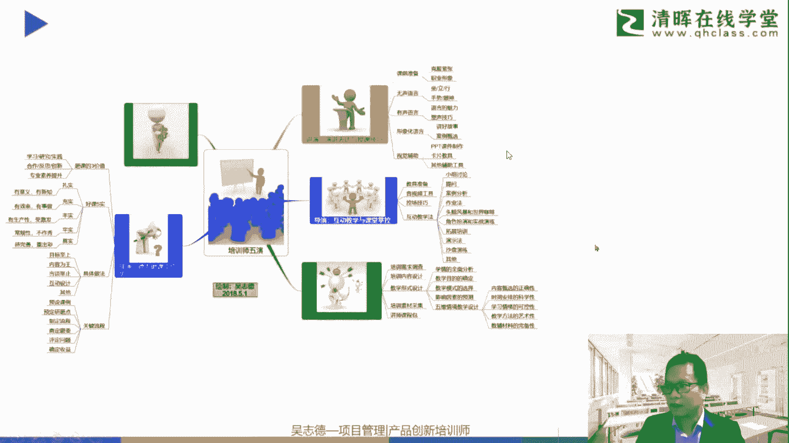

那这些当然也是实际在对应的一个工作中的，包括平常的语言。

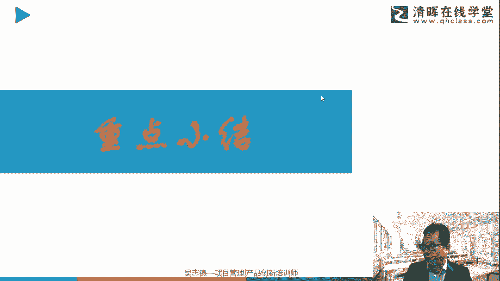

语言文字的对应的一个结合啊，那这里简单简单说一下关键词的一些提炼啊，同样也有用一张思维导图的方式来讲，这个对应的一个提炼啊，这张图不是我画的，还是源于网络啊，包括你对应你基于自己的一个学习方式。

进行不断的一个体验，然后其实无非就是多练，然后进行，然后精髓呢通过关键字词的提炼，包括这些关键小图形图标，是能够帮助你自己进行的提炼跟记忆，不见得一定别人能理解，你自己能理解就行。

那包括你可以用中心句话，逻辑顺序法啊，分层，包括结合刚才说的那个结构思考力的一个锻炼，包括还是金字塔原理啊，都可以进行对应的内容，那无非多点多提升。

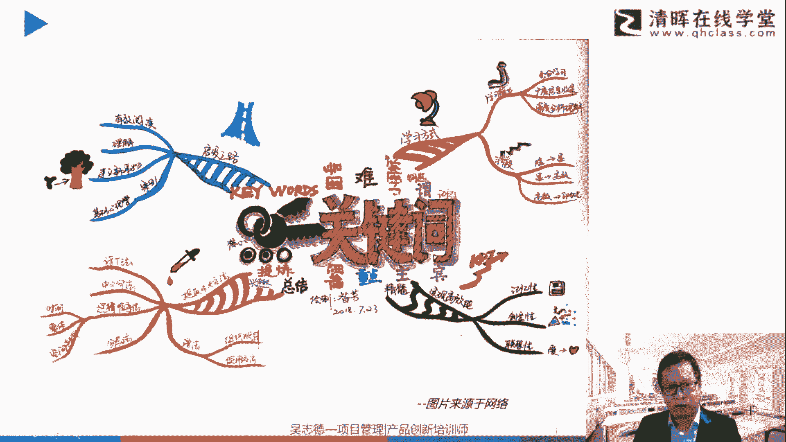

可能往往刚开始你容易写一大段话，但是经过多练啊，能够更好的进行对应的一个绘制啊。