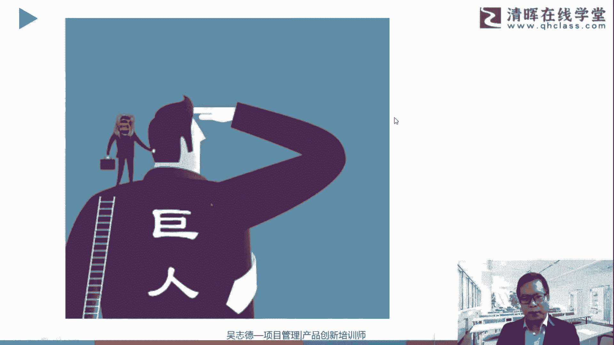

# 高效简单的思维导图小技巧 - P3：思维导图的创始——人类天才的思维方式！ - 清晖Amy - BV1ar421J7ED

那今天跟大家用线上的方式进行，对应的一个分享，那线上的方式同样大家认为干货的部分啊，同样能够很好的进行分享，但是可能在演练的这块环节，咱们就不展开了，那演练怎么办呢，这里跟大家汇报告一下，演练环节。

你就做一个作业，当然我监督不到你啊，大家成年人，大家靠自觉，那大家就是可以带着这一个演练的作业，可以进行自己小练习一下，那练习完你可以跟家里的伙伴啊，比如家里那口子，比如你有孩子的话。

有幼儿园或者小学的其实更好啊，幼儿园小学的话，你跟他一起分享，跟一起再去呃，做这个作业其实会发现挺有意思的啊，我个人这个思维导图的一个过程中，都包括涂鸦的过程中，是跟我女儿一起成长起来的啊。

这个虽然在理科生的那个角度，用思维导图的方式。

我可能有20几年，但是在涂鸦这一块，其实跟我女儿重新的一个成长的一个过程，那简单的这个关于导图的算式要重温一下哈，这个对应的一个一个创始人啊，就是东林博战啊，这个老人家前几年去世了。

英国英国的一个那老人家当然他也说了哈，这个不是他原创，他说了，他是在巨人的肩膀上进行总结，站在巨人的肩膀上进行总结和分享。

然后并把它进行全球化的一个推推广，那这个巨人是谁呢，这些巨人其实就是超级人类，这些什么超级人类，我们称之为天才的这些人，那其实有一个榜单是人类天才排行榜啊，里面有牌，有很多天才的人。

跟我们不大一样的这些超级人类，然后动力博赛先生就是分析这些超级天才，或者说几个超级天才，他做笔记跟我们有什么不一样，他这些人的思维方式，跟我们普通人又有什么不一样，那从呈现方式的角度。

也就是它的笔记又有什么不一样，那最终提炼有一个好的一个方式来进行记录，我们想法的过程的图示是什么，那我们举例这些天才都有谁呢，那这些底下的这些手绘或者说涂鸦哈，这些是我我手工涂的啊。

比如这个相信大家不陌生哈，这个叫做爱因斯坦对吧，他其实也是一流的涂鸦者哈，而且它是一种左右脑联动的一个方式，呃听了老师的课程啊，到时候可以自己画对，非常好，可以画一下哈，然后接着往下就是。

其实他在人类天堂排行榜里面排第九啊，虽然我们非常耳熟能详，离我们最近的一个时间点的爱因斯坦啊，他在这些很多想法其实都知道，他也在整体的一个介绍中说到，我们在想法是包括物理学的等等的一些想法。

是在拉小提琴的过程中想到的啊，所以称之为音乐涂鸦者。

然后这个是尼古拉特斯拉啊，相信可能有些伙伴也有点熟悉啊，它相对知名度可能还低一点，但是它其实是一个超级天才，在人类天才排行榜里面排第三啊，那刚才说到的任何事物的产生和创造都有两次，第一次是在大脑里产生。

第二次是在真实世界的存在，那特斯拉有一个非常惊人的一个能力，与众不同的就是对应的他的第一次大脑里产生，就是在大脑，你就把这个事情这个发明想得极近于完美，极极尽接近于真实世界的一个存在啊，这个是对应的。

特斯拉是当时是跟那个爱迪生啊，是在进行对应的，对是交流电的哈，对应跟爱迪生有一个关于学术上，交流电还是那个直流电的啊，那个对应的一个方式啊，那个爱迪生是主推这个交流电的啊。

其实尼尼古拉尼古拉特斯拉是主推直直流电啊，交流电是那个爱迪生推的啊，当然最后这个爱迪生他的名气比较高啊，那也把这个整体的一个交流电对应的一个推动，当然他除了这个直流电的一个推动。

还有很多其他的很多的一个画面跟专利啊，那他这个第一次就能把这个事情给想的，非常通透，所以他说这个爱迪生这个画面，灯泡这个事情要做多少次实验失败啊，他更多的就是在大脑里就把它想清楚了，然后想清楚啊。

已落地到真实世界中，就接近于它最终的一个形态啊。

好还有这个人类天才排行榜里面排第一的，大家看这个图像就能想到是谁吧，大家可以应该能想到啊，那个因为这已经有对应的一个配图了，那这个他我们中堂理解他的是一个画家，那个达芬奇对吧，那其实除了我们认知的画家。

他其实还有很多其他的一个内容啊，包括雕刻师，建筑师，音乐诗等等等等的，解剖学家，植物学家，制图师等等的方式，我们经常谈论的是T字型的知识结构，那那个达芬奇呢他不是一个T字形，它是一个数字型的结构。

他做很多事情都做到非常的惊人，那这就是对应的一个方式啊。

那比如说这些解剖图，这些工程图，机械这些都是达芬奇的一个手稿，那那个爱因斯坦曾经说，这些他已经留还留存在世的，这些手稿有6000多张，但其实有很多都没有留存的，那爱因斯坦曾说。

如果达芬奇的所有手稿都能够留存下来，人类的文明起码能够往前推进30年，这就是一个超级人类天才，对整个科技文明的一个贡献，那我们会看这些包括解剖，包括工程机械等等的一个图纸，这是他关于科学方面的这一部分。

当然我们还看到了关于那个画画，那些我们就不展开了很多名作啊，作为他一个画家的内容，那所以作为一个人类天才排行榜里面排第一的，它整理出来的能够开发完全思维的有四个要点，所以这个大家觉得重不重要。

这四个要点那就非常重要哈，所以跟大家进行分享，虽然可能你会要到课件，但是还是建议大家能够通过今天晚上课程，哪怕只有这四句话，你已经是非常有收获了，因为这四句话不是我说的，是达芬奇说的。

是人类天才排行榜排第一的，能说的啊，那第一个点叫做学习艺术的科学，第二个点叫做学习科学的艺术啊，呃那个伟人总结总是那么有道理啊，第三个是注意你的感觉，特别是观察的能力啊。

也就是我们常说有那个各种感官感觉，包括味觉，触觉那个视觉，但是特别是观察的能力，我们常说那个人类眼睛观察的一个重要性，还有第四点，意识到万事万物是相互关联的，包括我们所学习各种知识，学完之后。

如何进行对应的一个方式的一个结合啊，对有人说这个达芬奇第二哈，这种各种榜榜单还是对应有不同的一个方式啊，这个当然牛顿也是很厉害，也是天上排行榜里面排挤前几位的啊，这个各个榜单哈有有略有差异啊。

我们不用太考究啊，我看的那个榜单是第一啊，好那当然我也看过其他榜单，对这个没毛病啊，我们就不考究哈，所以这四点啊大家去总结一下哈，去好好品味一下，会发现它很有道理，第一个学习艺术的科学。

他你会发现他的很多画作，哈哈还要跟第二点来进行结合，包括学习科学的艺术，它的工程图画的就像美术作品一样，它的美术作品又每个对应的一个线条，都具有它的一个数学几何学的一个构造在里面，那另外他也去去观察。

包括去解剖，去观察各种的一个方式啊，非常有好奇心，那另外他会把各种学科事情，都非常关联在一起啊，意识到万事万物相互关联啊，从不自我设限学到的内容，能够想到其他方面啊。

