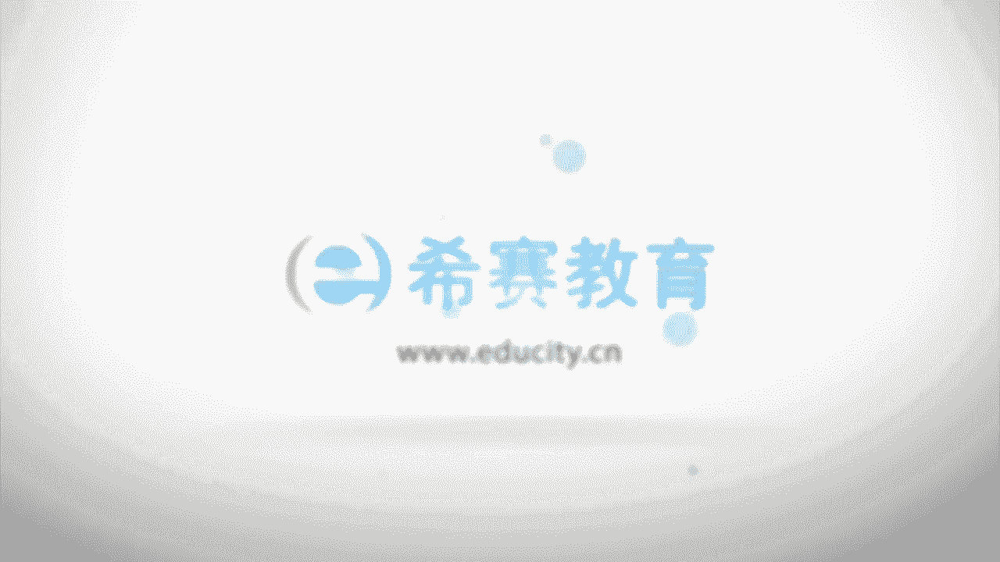

# （24年PMP）PMP项目管理认证考试零基础自学，精讲视频合集！ - P13：1.4.1运营管理 - 冬x溪 - BV1CL411f7BM

。

接下来看到的呢是一个运营的概念。呃，运营是什么意思呢？开展一个持续的活动，或是生产一个相同的一个。产品来提供这样一个重复的服务。OK也就是说，他会希望说这样一个事情是可以源源不断的一直做下去。

他会希望说是细水长流，一直做下去。所以运营管理关注的是说持续的生产或是服务的一个持续的运作。泰克项目是本质的，不相同。我们项目是为了创造一个独特的产品成果或服务而进行的临时性的工作，还记得吗？

它是临时的OK项目呢是临时的。而这个运营呢，它是会希望能够持续的，这是他们最显著的不同。也就是说，我们做项目本身我们是临时的，我们会希望说它能够达到目标以后呢，就可以结束掉项目就可以close掉。

而运营呢它是一个持续的。并且呢它会希望说一直能够去维系去维持这样一个业务的进行。但是他们也有相同的地方，不管说是项目也好，还是运营也好，它都是由人来做。同时呢都是有一些资源的限制。

并且呢我们不管做项目还是做运营，我们都需要去规划执行和监控。当然，规划执行和监控也是我们五大过程组中的三个过程组，是三个最重要的过程组。好。

还有呢就是说都是为了实现这样一个组织的目标或是战略计划来去做的这样一个东西。也是我们不管是做一些项目也好，还是呃去做一些运营也好，都是为了能够达到或者满足这样一个组织的战略目标。

我为了满足一个组织战略目标，我会去做一个一些项目，做完一些项目以后呢，有一部分有一些项目可能会投入到运营。那么这样一个运营呢，也是可能为了能够去源源不断的去有收益呀来产生，对吧？😊。

那么项目和运营他们之间是有一些交互的时点的。他们交互的时点。比如说呃我本来一个运营好好的，结果呢，我会希望说能够去有所改进，有所改动。那这个时候我就可能需要一个新的项目的产生。那么这个时候呢。

就是我项目和运营的一个交叉点。那比如说单建一个项目做完完成以后呢，要去交付到使用来投入运营。那这个时候也也是它的一个交叉的时间点。所以他说在新的产品开发产品升级或是提高产量的时候，它都是一个交付的点。

然后再去改进这样线运营或是产品开发的流程的时候，以及那个在产品的生命周期最后的阶段的时候，每一个阶段结束的时候，都有他们的在些交叉的时间节点。这是关于运营。😊。

