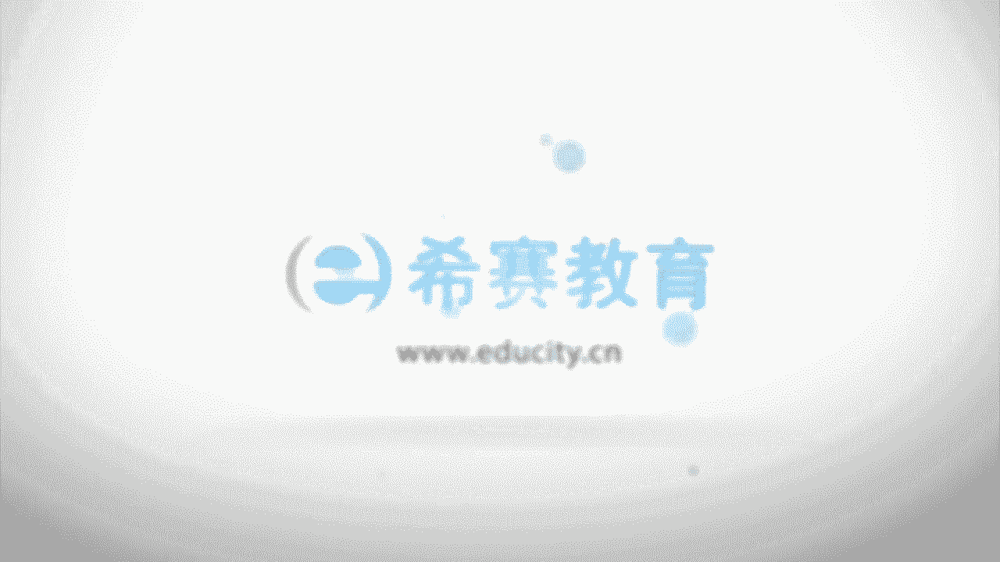

# （24年PMP）PMP项目管理认证考试零基础自学，精讲视频合集！ - P17：1.6.1项目管理过程 - 冬x溪 - BV1CL411f7BM

。

呃，接往下面来看到的是项目管理的过程。呃，过程呢有一个夏话是这样说的，他说有一个老板呢想要去让他的小儿子有所见识，于是呢呃就带他的小儿子去工厂里面去参观。😊，啊，然后一参观以后呢。

那个小孩子就非常的兴奋的跟爸爸说，哇，爸爸爸爸好神奇。他说你看那一头猪进去，然后就是火腿肠出来。OK在这边的话有一头猪进去。😊，然后呢，就会有火腿肠出来。这就是我们的输入，对不对？这就是我们的输入。

然后呢，这个呢就是我们的输出。然后中间可能会有一些很复杂的哎处理啊，处理啊，各种处理的方式。比如说把那个猪的毛给弄掉了呀，然后又是把那个肉给切了呀，然后又是把它怎么弄成了火腿肠，对吧？反正不管它啊。

那么这个就跟我们的过程很相似。每一个项目管理过程都是通过合适的这样一些工具和技术，将一个或多个输入，也就是咱们的这样一个输入，对不对？转换成一个或多个的输出，也就是咱们这样一个火腿肠，对不对？

也就是说我们的这样一些猪头猪，然后变成火腿肠，这就是我们的一个过程的一个比喻。😊，呃，这样一些输出呢，它可以是可交付成果，它也可以是最终成果，就它可以是中间的成果，也可以是最终的成果。

那项目管理它适用于各行各业。通常情况下啊一个过程的输出，它有可能会成为下一个过程的输入。OK比如说火腿肠会成为你炒那个什么啊黄瓜炒火腿的一一个输入，对不对？😊，然后过程通常会分到了几类。

因为呢他说是仅展开一次的这样一些过程。还有一些呢是可能需要去定期来展开的过程。然后还有一些呢是他说在采购之前才执行实施的这样一些过程，还是是贯穿于始终的这样一些过程。那我们会在第三章中。

以及在后面的从第四章开始，一直到第12章都会把过程。我们说的是49个过程，一个一个来跟大家做一个讲解。😊。

