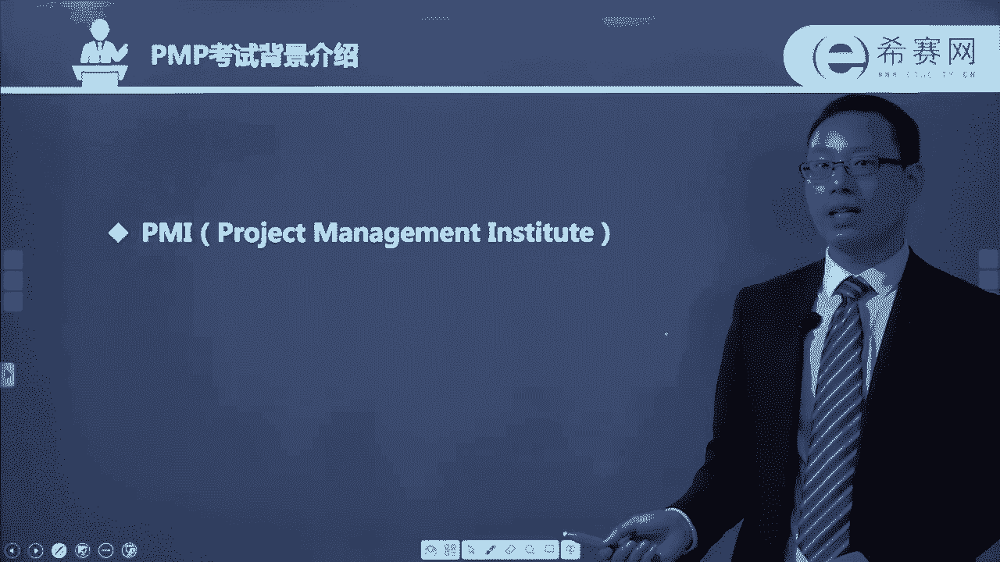

# （24年PMP）PMP项目管理认证考试零基础自学，精讲视频合集！ - P1：01PMP考试背景介绍 - 冬x溪 - BV1CL411f7BM

。

大家好，欢迎来到西塞教育。接下来由我跟大家一起分享关于PMP考试的一些呃介绍性的信息形式。呃，我觉得学习本身是一件比较枯燥的事情。大家呢也都是在工作之余来抽空学习，所以都会比较辛苦。

那我会希望用一种简单的方式用一种比较容易理解的方式来跟大家去讲解关于PP。呃，首先说到PMP的话，这个机构是不得不提叫PMI。它的英文叫project management institute。

叫项目管理协会。项目管理协会呢它是啊已经存在了大概有50多年呃，它的最大的一个作用或者价值就是能够创造一套标准的项目管理知识体系。

也就是我们在学习和参加考试的这样1个PMP，它是由PMI由项目管理协会来弄出来的。然后他把全球各行各业中项目管理的通用部分把它收集整理。

然后分析以后得到一个相对来讲被认可度最大的那些呃实用的最佳实践或叫良好实践。而只得到这样一个得到这样一个知识体系。而这个知识体系呢，它也是能够应用到接近说是绝大部分的行业。呃，他编写了一本书。

叫项目管理的知识体系指南，叫ti报指南。这本书呢目前是已经到了第六版。第六版呢是在2018年的3月份开始正式的启用。那么嗯。这个版本相较于之前的第五版呢有比较多的改动。

我们会在后面的章节中逐渐的去看到展现。它给我们的感觉就是越来越落地，越来越接地气，更加的实用。同时对项目经理的要求也是越来越高。当然同时他也会给到更多的这样一个指导性的一个建议和意见。

然后整个PMP考试，它的英文叫project management professional professional是什么意思？专家对不对？专家或是专业人士。那整个项目管理的PMP考试呢。

它就是项目管理专业资格认证的这样一个考试。并且呢它是全球认可度最高的一个项目管理的这样一个专业人士的认证考试。呃，这张证书呢是一张全英文的证书，然后上面会有你的一个名字，到时候可以换成你的名字。

然后呢会有你的一个唯一的编码，就是你个人的这样一个编码。同时呢它会有一个有有有效期，是从哪一年开始获得这样一张证书，从哪一年截止到哪一年开始证书期满。那证数期满以后呢，是需要去续这样一个证数的。

咱们续证，到时候可以跟我们西赛的工作人员联系，我们都会给你做一个详细的解答。