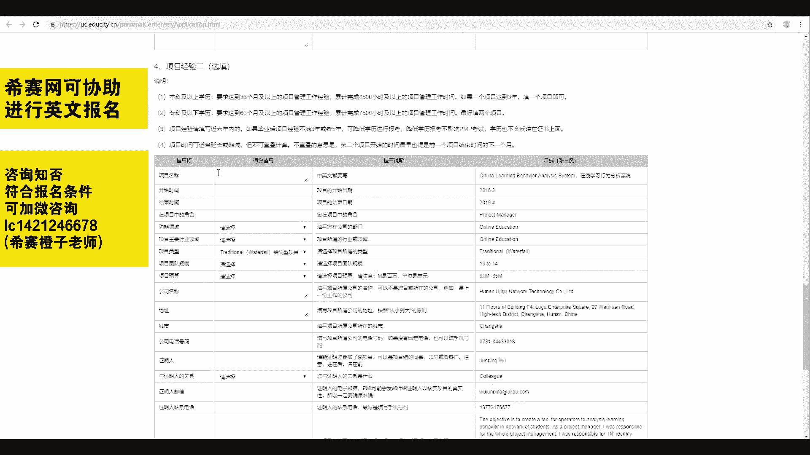

# （24年PMP）PMP项目管理认证考试零基础自学，精讲视频合集！ - P3：03PMP英文报名讲解 - 冬x溪 - BV1CL411f7BM

hello，大家好，欢迎来到西赛网专业的在线教育平台。看到最上面的PP考试注册信息以及用户编号、姓名、英文报名日期等等。注意上面这些信息是不需要咱们填写的。咱们需要填写的是下面表格中的内容。😊。

我们看到第一部分基本信息的填写。第一项姓名。那么姓名是需要分开填写的。比如我是小黄蓉，那么我需要填写小黄蓉，再填写的时候，还有一个注意事项是不管姓还是名。第一个字母都需要大写。

可以看到后面有相关的一个事例。再来看出生年份，出生年份，大家可以根据实际情况进行选择。再来看到全职工作经验以及项目管理经验，大家可以如实填写，也可以根据咱们之后填完的学历信息，再来进行一个对照修改。

如果出现任何问题，班主任小姐姐都会帮大家进行修改的。再来看到注册名、密码。这里的注册名是咱们以后在PMI官网上进行登录的用户名，注意事项必须要大于5个字符。注册名和密码都需要选择您容易记住的。

因为咱们之后在PMI官网。查询英文报名是否通过查询考试的成绩以及后续PDU登记等等事宜，都会用到这个注册名和密码。当然，如果您忘记了，也可以来西在网个人中心，我的报名进行一个查询。

再往下看到常用邮箱和备用邮箱。小黄蓉在这里强调一下，这里的邮箱非常的重要。这是偏麦与咱们联系的一个渠道，因此，需要填写您最常用的邮箱，一定要确保本邮箱是可用的，能够接收到信息，再往下看，家庭地址。

邮政编码以及工作地址，这里两个地址都有一个填写的原则叫做从小到大原则，看到右边的事例，从小到大，那么最大的应该是在最右边，这里中国湖南长沙再往下往小了写，这里是地址的一个填写规则。那么有同学说。

业务英文真的很不。好，没关系，你在这里是可以填写中文地址的。班主任小姐姐会帮大家进行一个修改。再往下看，公司的名称如实填写即可。公司主要的行业领域，这里有航空、汽车、建筑等等。

大家可以选择自己所在公司最相近的一项。如果找不到的话，可以选择其他选项。功能领域。同样的填写您公司所在部门的一个最相关的选项。再来看一下担任的职位这一栏，在这一栏。

右边的事例写的是project manager，也就是项目经理。当然，咱们考项目经理的一个认证，对应的担任的职位最好就是填写项目经理。因此大家直接把这一栏复制过来填写就可以了。再来看是否担任项目经理。

我们需要勾选yes。公司是否有项目管理办公室，是否担任项目管理办公室的领导，是否积极的参与项目的决策。那么这几个选项大家自行的选择即可。最后看到出生地和电话。大家根据自身情况进行填写。

注意遇到这种跟地区相关的填写信息，咱们同样是需要从小到大的原则，比如中国、湖南、永州，那么以上就是第一部分基本信息的填写。在这一部分比较重要的是注册名和密码以及常用邮箱的填写。好。

我们再往下看到了第二个部分，学历信息的填写。那么大家在填写学历信息的时候，保持一个原则，就是如实填写。包括学历可以填写高中专科本科硕士、博士等等。

包括入学时间、毕业时间、专业毕业的学校、学校的地址以及城市。但是咱们在报名偏批的时候，对大家的学历和工作经验会有一定的要求。看到下面的说明，如果您是本科及以上的学历需要达到36个月的。

也就是三年的项目管理工作经验。如果您是专科及以下学历，要求达到60个月，也就是5年的项目管理工作经验。所以大家在填写学历信息的时候，需要对照自己的一个毕业时间来进行填写。唉，那有同学说。

老师我本科毕业时间不足三年怎么办？如果出现最高学历。对应工作经验不符合的情况，大家就需要降低自己的一个学历来填写。比如小明同学本科毕业两年，不符合三年的工作经验。那么他的学历这一栏就可以填写高中学历。

这个时候就从本科毕业两年变成了高中毕业六年是完全符合这个工作经验的报名条件的。当然，如果你填写的是高中，那么对应的入学时间、毕业时间、毕业学校地址等等，也要根据高中的来进行填写。

在这一部分还有一个小的疑问。有同学问，在学校地址这一栏，如果我之前在某一个地方读书，现在这个学校的地址发生了变化，我填写旧地址还是新地址呢？出现这种特殊情况，大家填写自己就读的时候的旧地址就可以了。

OK那么学历部分我们也完成了，再往下走到了第三个部分，项目经验这一栏，这里有项目经验一，下面还有一个一模一样的项目经验。2，如果您在填写学历的时候填写的是专科及以下学历。

那么老师是建议大家最好填写两个项目经验的，这样比较稳妥。好，我们一起来看一下如何填写吧。第一项项目的名称，也就是你这个项目到底是做的是什么。右边的事例是在线学习行为分析系统，大家填写自己项目的名称即可。

注意事项，中英文都要填写。再往下开始时间结束时间。在这一栏需要注意的是，咱们如果填写了两个项目的话，最好第二个项目的开始时间是在第一个项目的结束时间之后的两个项目尽量不要冲突。

在项目中的角色我们填写项目经理功能领域主要的行业领域选择相近的即可。再往下，项目的类型这里有传统型项目领捷型项目以及符合型项目，一般咱们偏P的学员选择传统型项目即可。再往下，团队的规模。

规模大小有1到4人5到9人等等等等，可以进行自行的选择。项目的预算，注意项目预算，这里的单位是百万美元。因此这里的第一项指的是100万美元以下。比如这一条就是100万美元到500万美元，当然也可以选。

的保密。再往下公司的名称、地址、城市，公司的电话号码。大家根据自身情况如实填写即可。这里地址注意同样是从小到大的原则。公司的电话号码可以填写固定电话。如果没有的话，也可以填写手机号码。再往下看。

证明人证明人是指谁能够证明您参加了该项目，可以是项目组的同事领导或者客户注意信代后名在前，在填写姓名的时候，同样是按照英文的一个格式进行填写。再往下与证明人的关系，一般我们是可以填写主要干起人的。

当然你也可以写项目的发起人、客户、经理或者主管等等。下面证明人的联系电话，证明人的邮箱都可以自行填写，再往下走到了一个比较重要的部分，项目的描述在项目描述这一块，我们需要对项目进行一个高层级的描述。

对项目中的可交付成果进行说明，包括目标自己的职责、关键的可交付成果和项目的输出，注意字数限制，字数限制是在100到500个单词数之间。那么右边这里有一个示例，我们可以看到第一句话。

他写的就是这个项目的一个目标。而最后一句话写的是这个项目的一个输出，也就是你到底做了什么东西。而中间这一段从这里作为一个项目经理开始，这一段都是在描述你在这个项目中的职责以及一些关键的可交付成果。

大家可以根据自己的实际的项目情况，再结合这样一个模板，也就是目标职责关键可交付成果和项目输出来进行一定的填写。注意不要完全雷同，有可能会引起偏埋的一个抽查。再往下，这里项目描述。

同样是需要中英文对照写两个部分。而下面的项目经验二填写的注意事项和项目经验一是一模一样的。那么到这里包括基本信息、学历信息、项目经验等等。整个英文报名表我们就填写完成了。

