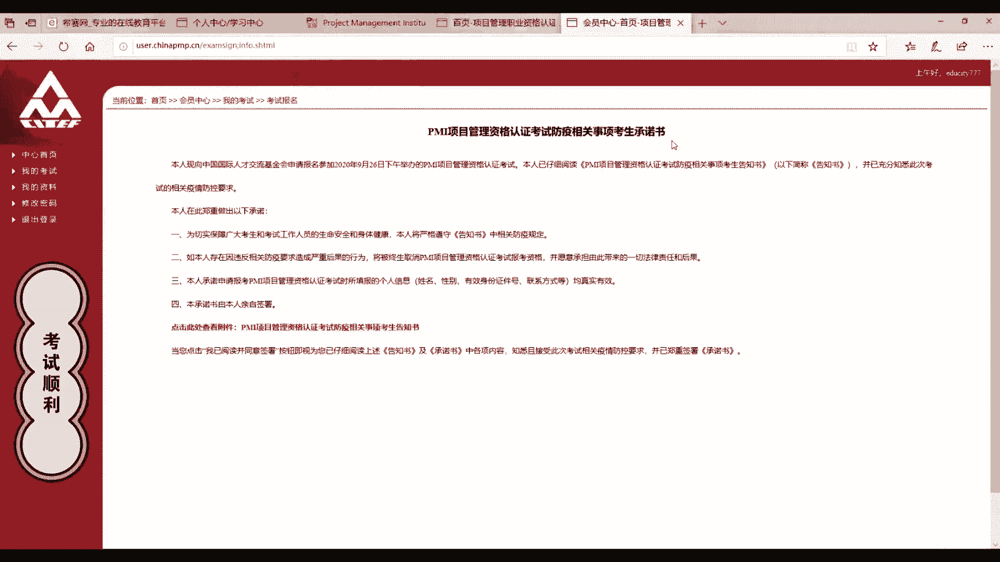
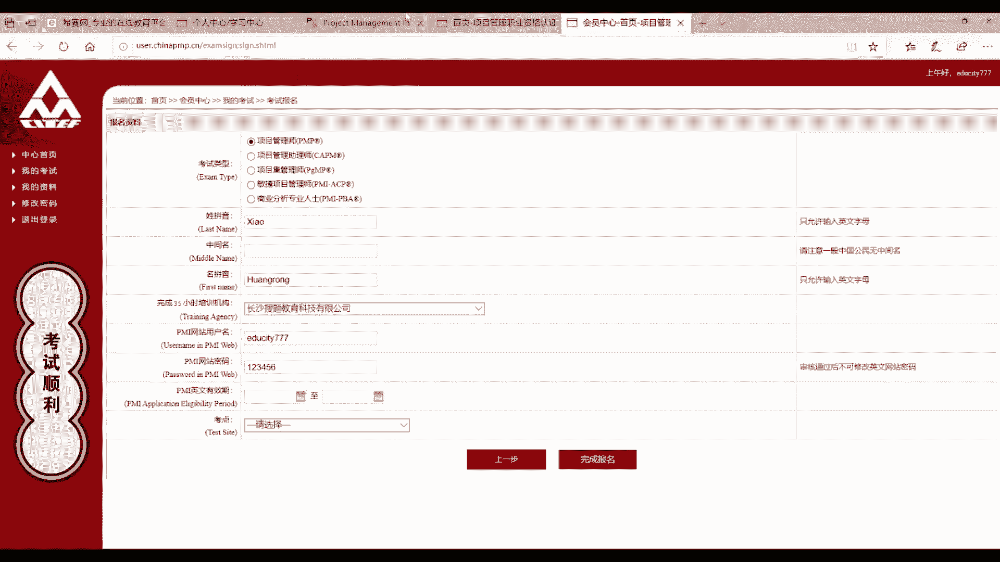

# （24年PMP）PMP项目管理认证考试零基础自学，精讲视频合集！ - P4：04PMP中文报名讲解 - 冬x溪 - BV1CL411f7BM

再来看一下第二个网站，也就是偏Y的官网，网址为3W点偏Y点ORG我们待会就需要在这里登录，然后查询自己的英文有效期。第三个网站就是本次中文报名的地址。

网址为exam点china PMP点CN外专局的官网。好，进来之后看到首页，我们一般是推荐大家在正式开放报名前就提前注册的。因为正式报名的时候，网站容易崩溃，我们提前注册的话可以节省很多的时间。

现在我们就一起来注册吧。看到这里的登录系统，注意这里用户类型我们是选择普通会员的。点击下方的新用户马上注册就会跳转到注册的页面。

首先看到上面的账户信息。这里的账户信息指的是大家在这个中文报名的网站的账户密码。注意这里的用户名密码，大家一定要自己记住，因为这里的账号密码会涉及到选择考场以及缴费，所以西塞将不会记录相关的信息。当然。

这个是可以建议和英文报名账号密码，也就是这里的账号密码保持一致的。因为这样的话，可以在西菜的个人中心查询到相关的信息，可以防止遗漏。我们现在来填写一下。

好，再看到下方的个人信息，这一部分是需要大家填写自己的真实信息的。比如说真实姓名，我们就需要填写身份证上的真实姓名。How。写一下小黄蓉性别、出生日期也按照自己身份证上的填写啊，我们随便来填一下。好。

就8月1号。再来看一下证件的类型，大家选择自己的身份证以及来填写身份证号码就可以了。这里我们随便填一下。再来看到下方这里的学历信息，注意这里学历信息一定要和英文报名保持一致。因为咱们在英文报名时。

有可能学历是进行了特殊的处理的。比如说假设我现在本科毕业两年，未满足工作经验要求。所以在进行英文报名的时候，我可能就是降低了学历，以高中毕业6年的信息来报名的。那么在这里填写的时候也要保持一致。

大家如果不记得的话，哎，进入我们刚刚说的个人中心找到我的报名，可以进行查询和确认。

好，我们来填写一下。毕业时间，那么也是跟英文报名的保持一致。那么6年前就是。哎，2014年。再来看一下专业，专业的话，大家选择自己哎合适的就可以了。如果是高中的话，我们就选择其他。最高学历。再往下看。

从事的行业，大家选择自己单位相近的就可以了。现在的单位我们如实填写。好，企业的类型。再来看到职务这一栏，大家都填写项目经理就可以了。固定电话这里的固定电话是不能为空的，大家可以填写自己公司的固定电话。

如果没有的话，可以填写西塞的号码。西塞固定电话为0731。84433018。OK再来填写自己的一个手机号码，我们这里随便填一个。12341234。好，电子邮箱。备用的。大家看一下通讯地址。

大家可以填写的稍微详细一点。好，那么这一部分信息大家一定要认真的核对，需要是真实有效的，并且跟英文报名保持一致的。特别是这个哎学历信息部分。好，这个时候我们信息就填写完成了。点击下方的条款。

点击马上注册。好，我们看到注册成功。

注册完成之后，我们就跳转到了这样一个考试报名的页面。点击这个红色的报名参加考试。这个时候我们看到有提示信息，左边说，如果您还未完成PMI网站的英文报名，就点击进行注册。当然。

我们肯定是已经进行了英文报名，并且有有效期的。我们是选择右边的这个哎已经通过了审核，点击下一步。好，这里的话看到有一个考生的承诺书。因为当前咱们这个时间节点，关于新冠肺炎防疫的工作还在进行中。

所以说大家需要来签署这样的一个协议承诺书。

点击下方，我已阅读并同意签署之后，我们就跳转到了报名的页面。

看到这里的个人资料是咱们刚刚注册时填写的，可以再确认一下。

如果信息确认无误的话，我们就点击下一步。

这个时候就正式的开始报名了。考试类型我们选择项目管理师，也就是偏僻。接下来我们需要填写自己姓名的拼音，注意一下，哎，一般中国公民是没有中间名的，所以这一个空啊大家一定不要填写，不要填写。

我们只需要填写姓和名拼音就可以了。并且首字母是需要大写的。比如说我是小黄蓉。那我的姓就是小。中间名是没有的，再次强调一下名的话哎，大写黄蓉。对，如果大家有三个字的话，就是这样进行填写的小黄蓉这样填写。

再来看一下完成35小时培训的机构。这里我们需要找到长沙搜体教育科技有限公司。注意一定是填写这个长沙搜体教育科技有限公司。再来看PI网站用户名以及PI网站的密码，也就是英文报名官网的一个账户信息。

这里如果大家不记得的话，可以到个人中心找到我的报名进行查询的。

注意这里一定不要填错。我们来填一下。这个随便填的，注意一下后面的这个红色的说审核通过后不可修改应用网站的密码。大家注意，一定不要去轻易修改应用网站的密码。

因为基金会它会用到你的账户名密码去登录网站去查询你的偏牌有效期是否是真实有效的。好，下面我们就还剩下一个英文的有效期。这个我们需要到英文报名的网站，网址是PMI点ORG登录进行查询。

我们点击右上方的log in进行登录。

点击登录。登录之后会跳转到这样一个页面，我们点击右上方的myPMI点击dashboard，稍等一下。这个时候看到右下方这里有一个小日历的图标，那么这个日历图标旁边这一部分。

哎这一串数字就代表了你的英文报名有效期。比如说这里是2020年的2月15号到2021年的2月15号，确认之后，我们就去填写。注意这个应用有效期一定是要一一对应的，不要出错。

结束日期。21年。2月15。好，那么这个时候我们这一部分信息就填写完毕了。请大家一定要认真的确认，看一下是否姓名拼音是首字母大写的，中间名是否没有填写，是不是选择了长沙搜题教育科技有限公司。

以及英文有效期是否是跟偏Y官网一致的。确认信息之后，我们就到了考点的选择，大家选择自己所在城市的考点即可。比如说我在长沙，那么我就选择长沙卓二院考点的具体位置，它是在考前打印准考证的时候。

我们才会知晓的。好，这个时候信息确认之后，我们就点击完成报名。点击之后就会跳转到这样一个界面。那么完成报名后，考点一般是1到3天内完成审核，大家需要及时的登录这个网站来查看自己的报名状态。

因为它不会有短信或者邮件的通知。那么在审核通过之后，我们就可以进行缴费了。缴费完成后即可专心备考。咱们的中文报名也算圆满结束了。

最后，小黄人祝大家中文报名顺利。