# （24年PMP）PMP项目管理认证考试零基础自学，精讲视频合集！ - P5：05PMP新版考试试题组成 - 冬x溪 - BV1CL411f7BM

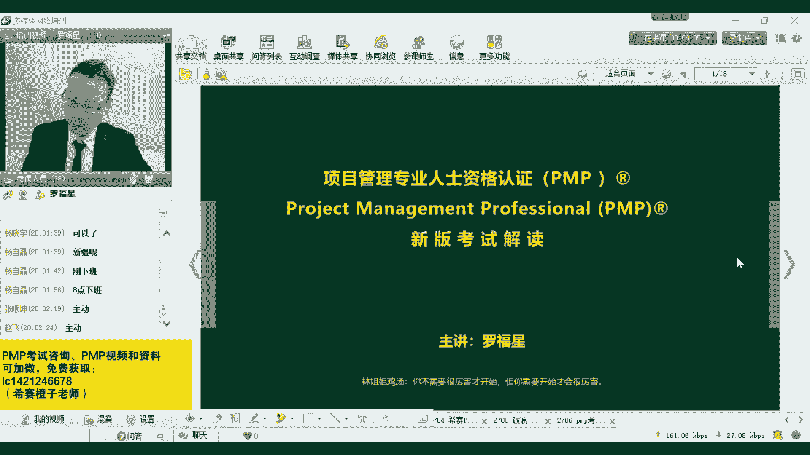

今天晚上主题会从这样的三个呃四个内容来去进行分享。呃，首先应该是管讲一下，直接来去简单粗暴简单粗暴来开场，讲一下关于新版的考试，它的这样一个试题组成，呃，会让大家能够去清楚的了解到，关于在新的一版。

也就是说9月份考试的时候，它大概是怎么一个出题的方式，这是第一个。然后第二个呢就是告诉你，其实也没有那么难。它难度其实没有那么夸张。现在已经是有学员考过了，它是在海外考的。

海外的难度其实比国内的难度还要大一点。它都能够通过3A或者是2A的方式来考试通过。所以其实你们都可以的，没有那么多关系。然后接下来第三个板块和第四个板块，可能是你最想要去了解到的。

一个是关于新版的考纲的解读。其实这个呢我们之前有做过一期这样一个分享。那今天还是因为有很多同学之前是没有了解过，对吧？呃，所以还是想要来跟大家去进行这样一个分享。呃，如果有回应。

你看一下你是不是开了多个网页。你看一下是不是开了多个玩页。呃，经常如果说有多个玩意的话，就可能声音有不同步的这样一个情况。你你看一下看是不是啊。呃，然后最后一个板块呢是关于拼搏指南第七版。呃。

其实第七版的神秘面纱还没有完全揭开，包括我们自己也都还没有完全看到。所以呢我们也只是看到一个外围的这样一个方向。呃，但是会想要去跟大家去分享一下我们目前所看到这样一部分。

包括它目前还处在一个很保密的阶段。呃，但是很有可能会在今年年底的时候能够跟大家见面。但是即便说这样一个新的版本还没有出现，但是没有关系，并不影响咱们的考试。因为这是由国家外国专安局培训中心。

他引进这一考试以来的话，它这样一个基本的规则。呃，所以没有太多关系。大家不用担心。我们一起来看一下。首先呢考试的题型，它考试还是考嗯它比以前的方式来考，其实少了20道题。以前是考200道单项选择题。

就是考全部是四选一的单项选择题，但是咱们改版以后的考试呢，它大概是180道题目，180道题目，而这个180道题目中只有。

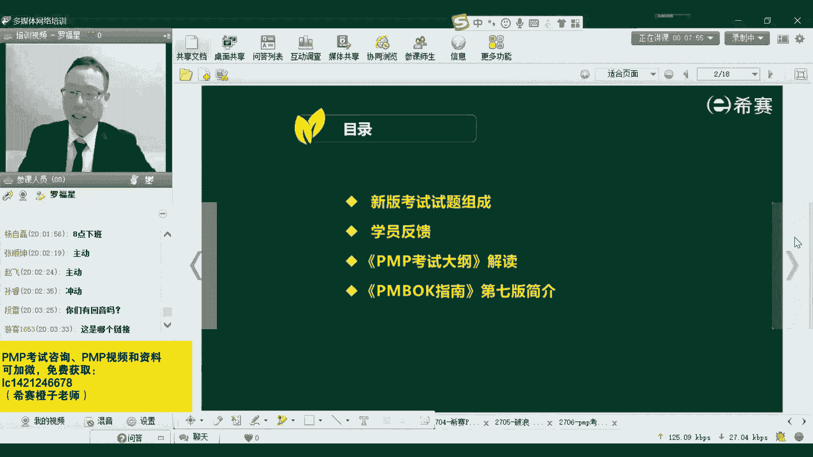

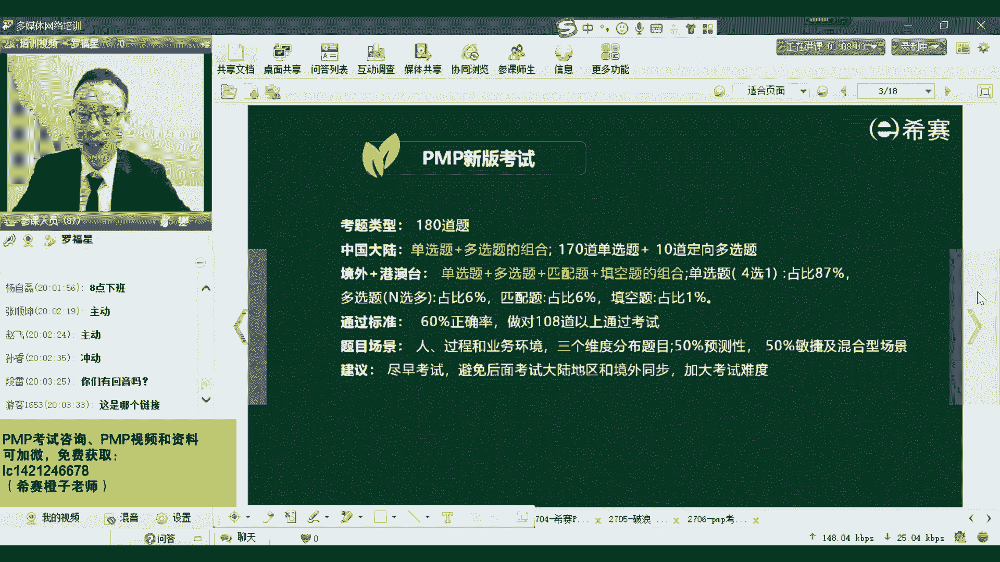

100。只有十道题目是多项选择题，然后其他呢都是单项选择题，所以是十道是多项选择题。然后170道题目是单项选择题，单项选择题就是全部都是四选一的单选题。而多项选择题呢，它是呃这里面还有一个点。

你需要去了解，它难度没有你想象那么大。它是会告诉你有几个选项，它是定向的多项选择题。也就是说这个题目可能会有三个选项，他就会告诉你说有三个选项。

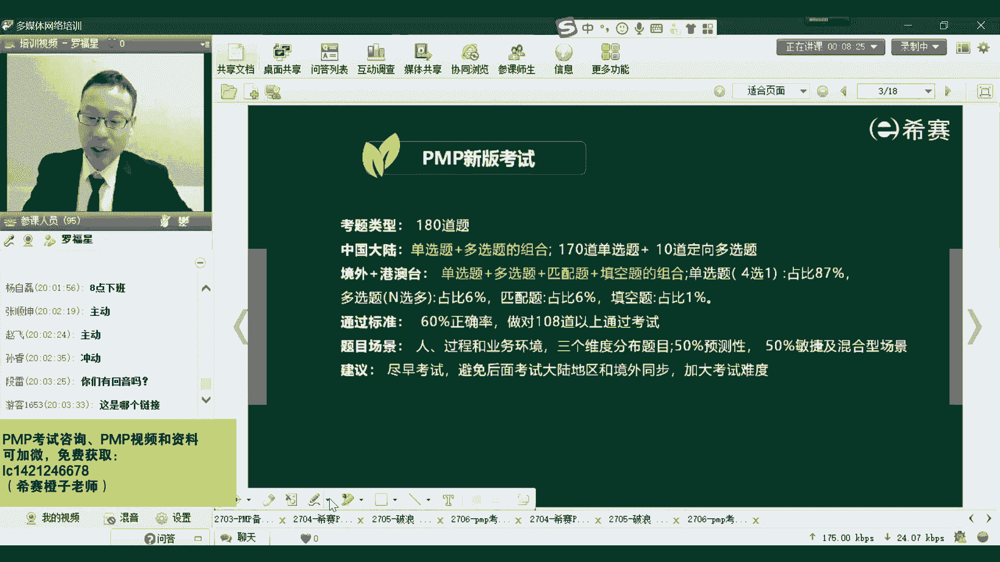

这个题目可能是有4个选项，他会告诉你有4个选项，一般往往在新改版的时候他刚开始他不敢搞太难。所以目前它的这个难度还是处在一个比较可控的状态。还好，但如果说有同学在海外。目前在听直播课的估计没有。

但是估计看回放的会有。如果有同学在海外或者是在香港、澳门、台湾，如果在港澳台或者说是海外的话呢，那考试的难度可能比在国内的还要再麻烦一点点。它会除了有单项选择题会有十来多道那种多项选择题。

还会十来分的这样一个匹配题，也是年限题，就年年看的那种年限题。然后还有少量的那种填空题。当然了，这个填空题其实不是让你随便填，它其实是一种变相的选择题。所以但是总体来讲。

至少说在海外它难度会比在国内的还是要还更大一点点。

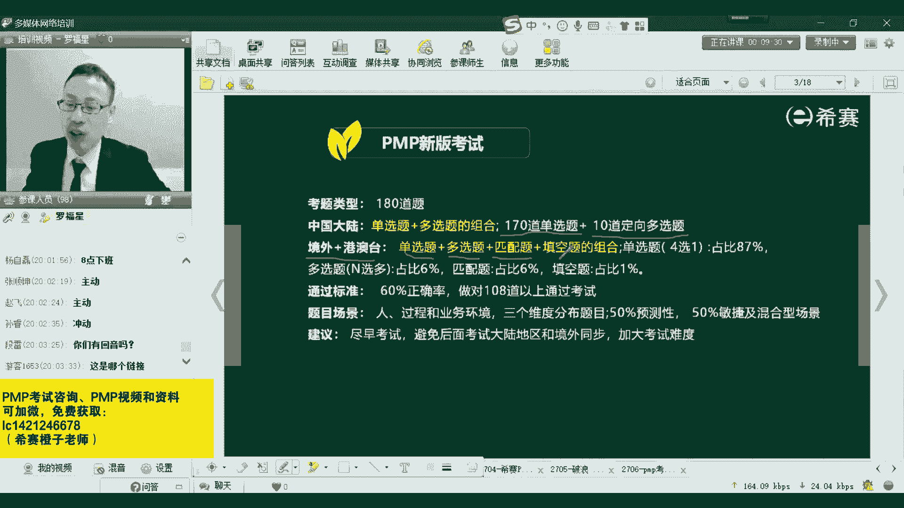

还更大一点点。但它有一个好处是什么呢？它至少这个偏僻的考试，它是有中文翻译的。就如果说你在你在港澳台或者在海外的话，它是有中文翻译。所以这一点还好。因为有一些科目的考试，它是目前还没有中文的翻译。

这就更麻烦一点。而大家都会关心的这样一个通过标准，通过标准什么？达到60%以上的正确率就可以通过了，就可以通过偏僻的认证。它的也就是说你做对了108道题目以上，那就可以拿到偏僻的证书。

所以这个难度其实对于我们呃从小考到大的这种考中考办来讲的话，应该不难，是不是同学们是同意吗？对于你这个从小考的大的这样一个考办来讲，应该没太多问题吧。然后他整个考试呢，它是这样来讲。

它是会分到三个大的板块，一个板块是关于人，一个是过程，还有一个呢是业务环境。那这个人其实我们包括说咱们呃做项目的这样一些相关方呃，在现在新的版本中呢，又会把它翻译改到了那个干系人。

就是所有会影响这个项目的人团队组织，以及所有会被这个项目所影响人团队组织，它都叫人，对吧？呃至于过程呢也是过程和过程组五大过程组，就是启动规划执行监控收尾，这样的五大过程组。

这个板块而这两个板块呢占到92以上，占到92%以上，剩下的还有一点点这种业务环境。业务说是商业说的 businessiness，就说是跟商务商业或者是这个项目在开始做之前。

我们其实要判定这个项目要不要值得去做，一定要会去考虑这个项目它的这一个商业价值，它能够为企业带来什么样的商业价值呢？当然商业价值会分到有形的和无形的。在这个板块下呢是会稍微有一点点题目。

可能会有占到8%左右的试题来去考这一个业务环境。

呃，海外的多选题它也是对，也是定向多选。是的，海外的多选题它也是定向多选。它目前还因为是刚刚要改一个新的版本，他不敢搞，它太难，所以都是定向的选择。他会告诉你说，这个题目有两个选项，有三个选项。

有4个选项，他会明确告诉你。呃，所以目前来讲的话，其实呃关于这个点呢，其实都还不是最关键的，最关键什么呢？最关键的是它的那个改版对我们所有人来讲最大的一个影响。其实这一条就是呃事例的分布情况。

50%会是预测型的项目管理，而50%的是敏捷以及混合型的这样一个项目管理。

他是什么意思呢？给大家去解释一下，其实我们都会希望说做事情是有一个明确的范围，然后有一些明确流程和步骤，一步一步的往下面去做，能够去按部就班的来进行。那这样的话，我管控起来其实也是有流程有依据，对不对？

如果在项目执行的过程中有变更请求的话呢，就是有一些客户发生了一些变更。他说啊我原来想要黑色，我现在表变成蓝色，我也想要再换成一个黄色，然后最后经给改清六五彩缤纷的黑色，它可能会有很多变更请求。

但然变更的原因有很多啊，有可能是因为需求本身就不清晰，它也有可能会是因为你执行的不到位，所以导致要发起变更。但然还有可能是外部环境发生影响。那当在过往的这种是像预测型的生命周期中去做项目的话呢。

它的这种变更，我们都会有一个词就是六字增严，叫有变更走流程。

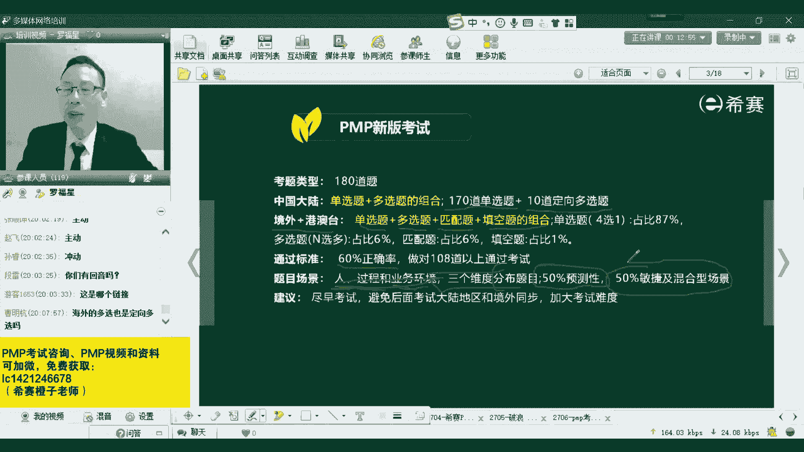

但是现在这个社会它稍微会有点不一样的地方，就是它现在是一个乌卡的时代，就是。

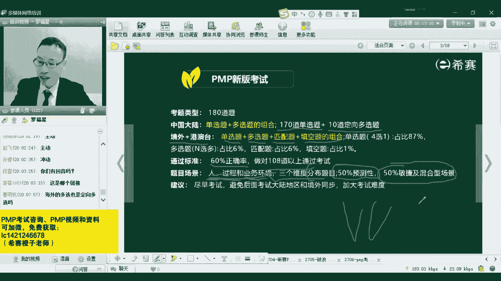

大家应该都多多少有听过，是不是？或者你要没听过的话，你可以去在网上去搜一下。他说是关于有这种不确定性啊、复杂性啊，然后嗯那种啊不稳定啊等等这样一些信息。就是其实也就是说外部的环境有太多的变化。

当外部的环境有太多变化的时候，你完全按照原来所确定的这样一套方式来去做项目，可能会受到很大的挑战。

所以基于这个大环境的变化呢，所以新的这样一个偏僻，它会采纳了一个新的内容，就是加了很多关于敏捷和适应的这种方式。敏捷混合，也就是有敏捷，有迭代，有增量，有适应型的这种方式来去做。这才是他一个最大的变化。

加了很多敏捷内容进来。但是这些内容的话对你有造成多大的困扰呢，其实也没有那么夸张。

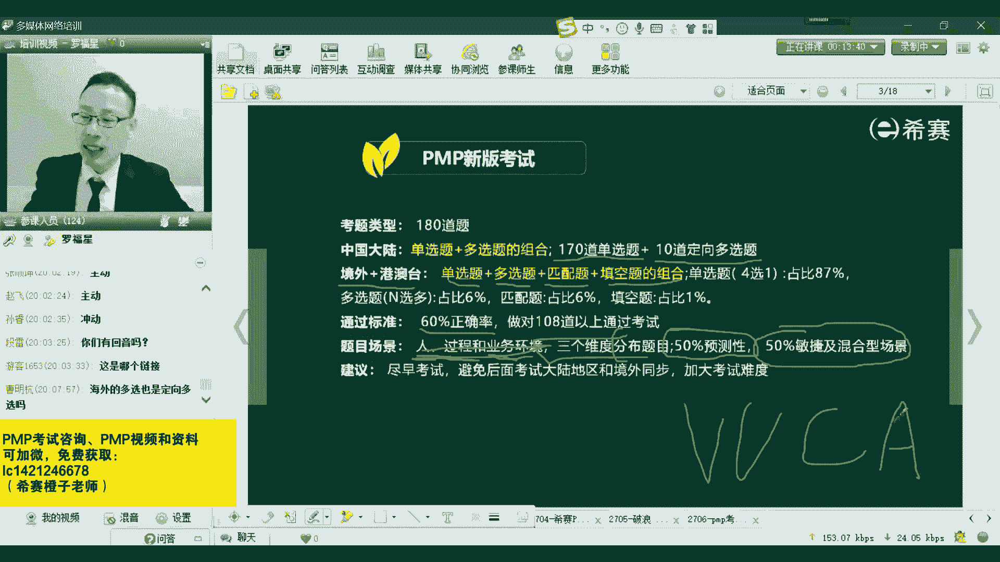

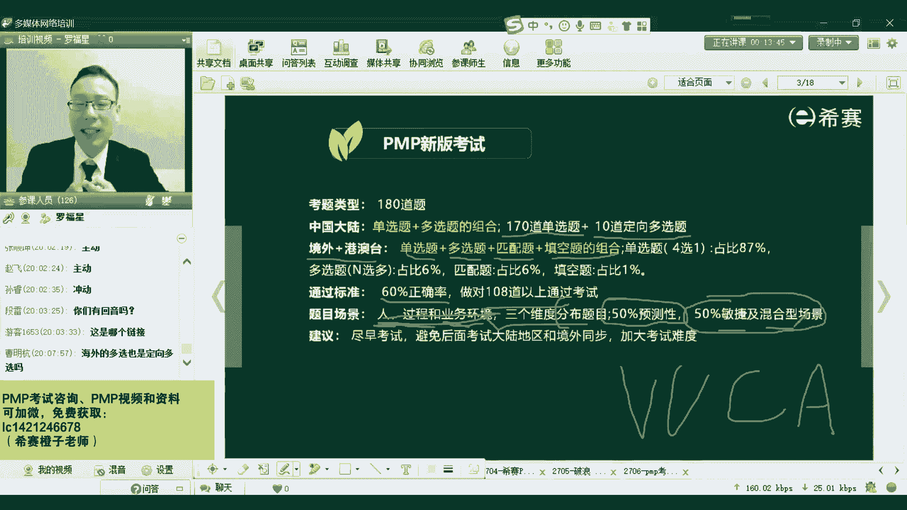

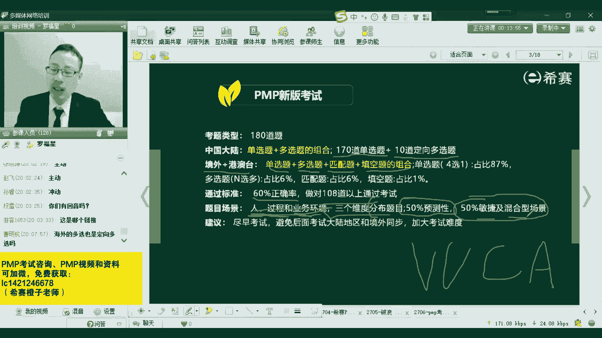

目前来讲的话，应该说国内的那个考试难度，他应该是会控制一下它比国外的难度还稍微小一点点。所以你要加油，等到呃不要等到后面难度越来越大的时候，你再去搞就麻烦了。但他但他目前到底什么情况呢？呃。

这是之前有在海外去学习的一个学员给的给的那个分享，给小志老师一个分享。然后另外还有一个学员他给我答，就是我跟他发了一个视频的，就是那个微信的语音视频，其中一个是考了3A，一个是考了2A。

也就是说新的考试中是会按照这个。

按照这个人过程和环境这三个维度来去考。那一个是A是什么概念啊，直接给大家看一下那个A是什么概念吧。

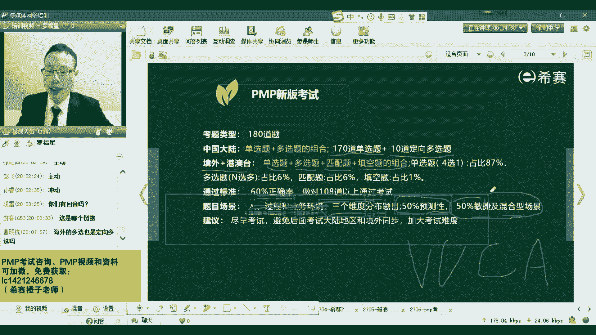

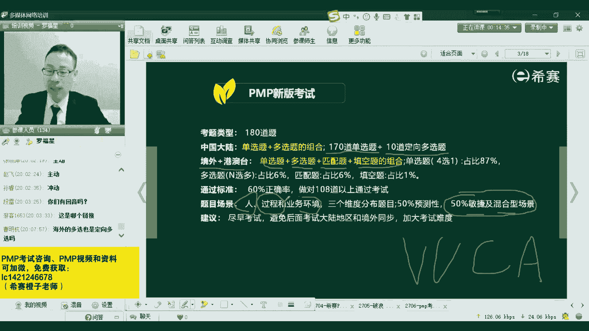

就一说是人员过程和这种商业环境。

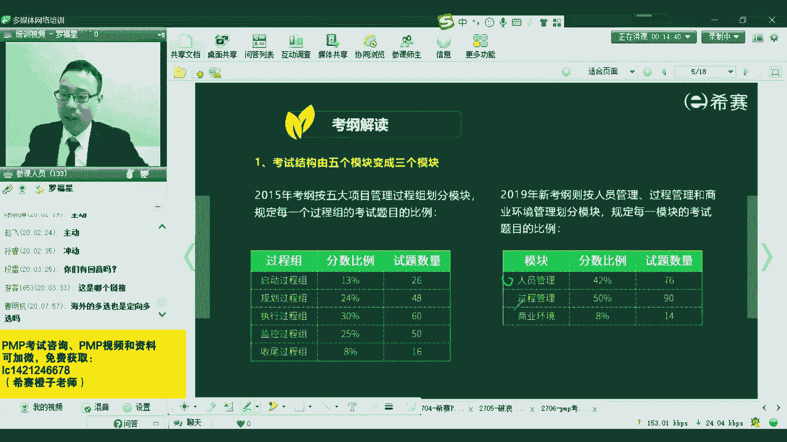

然后考三个，也就是三个方面都是拿到了优秀。然后考两个呢是两个方面拿到了优秀，是这个意思啊，是这个意思。但是他最后算通过还是不通过呢，他怎么算？他其实是按照你通过了60%，就是有60%的试题是做对了。

就算是通过。所以是这样一个情况。所以大家不用太担心，我们包括因为在现在目前已经考考过了同学他们其实都还没有来得及上很多这种敏捷相关的课程，都可以通考，是说明什么？所以说明我们现有的教材。

其实也基本上足够应付。当然呢呃就是我们后面其实加了很多敏捷内容啊。就是整个如果说你是9月份的考生，你如果说已经报名的话，你会发现呃罗老师录了1个880的视频，就是正好是就穿了今天这一身衣服。

就穿正装打领带来录了一套视频。他其中第14章就是敏捷项目管理，就跟你讲了很多敏捷的一些知识，让大家去提前了解一下。

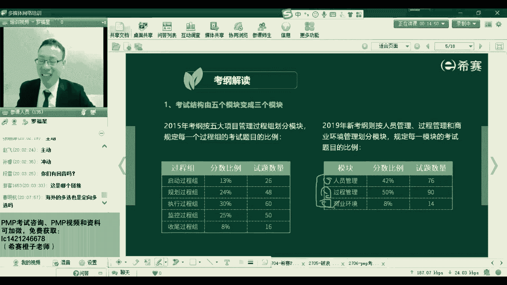

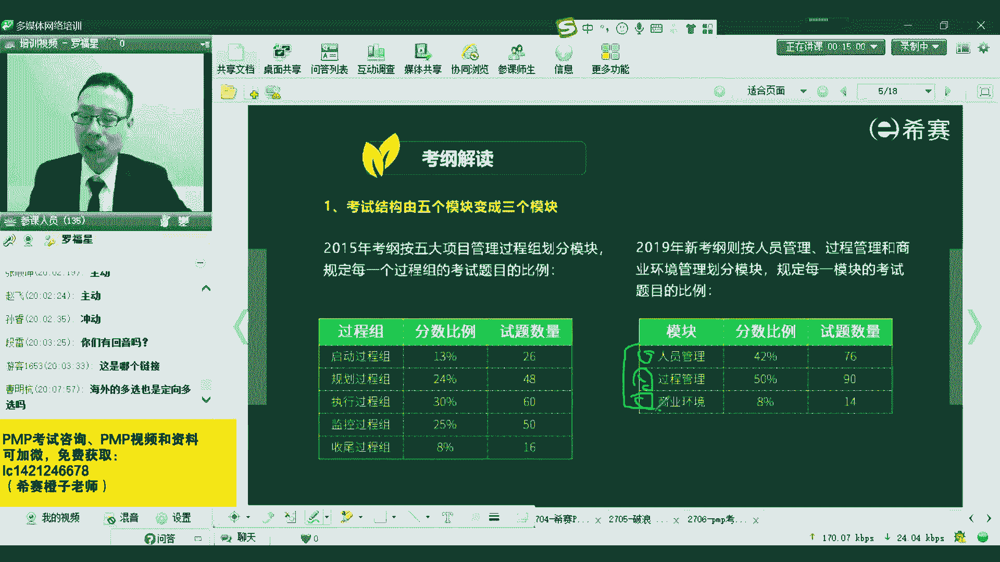

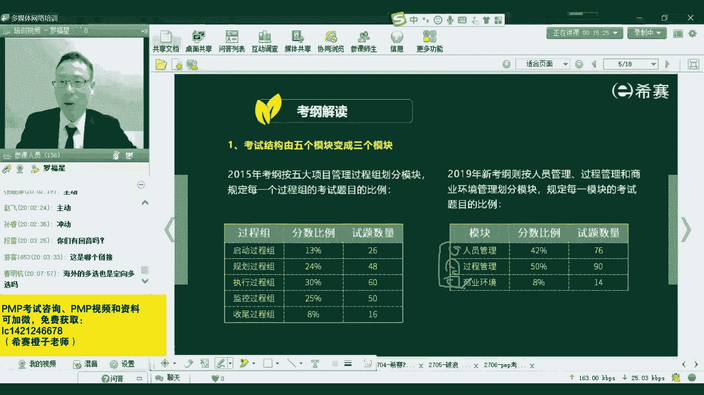

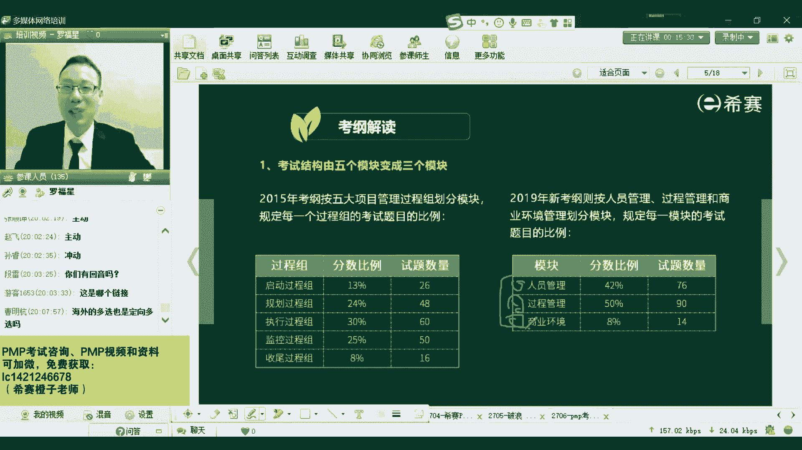

