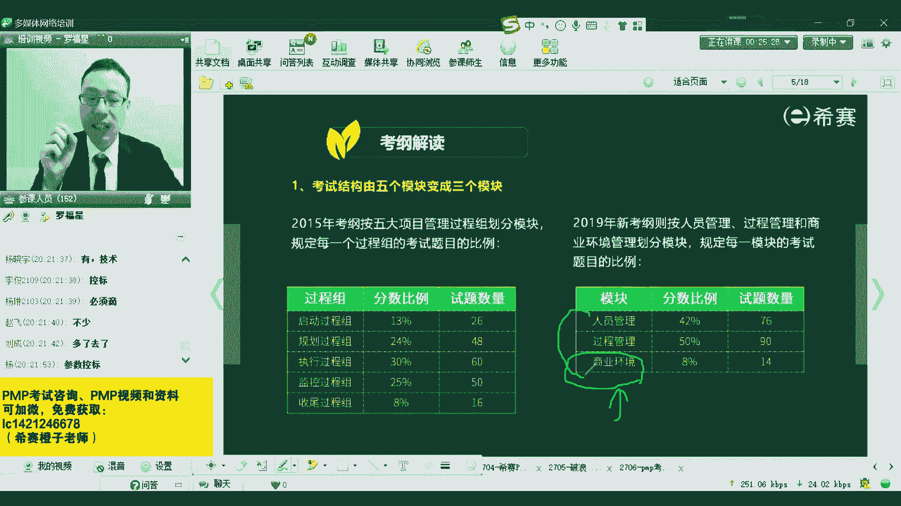
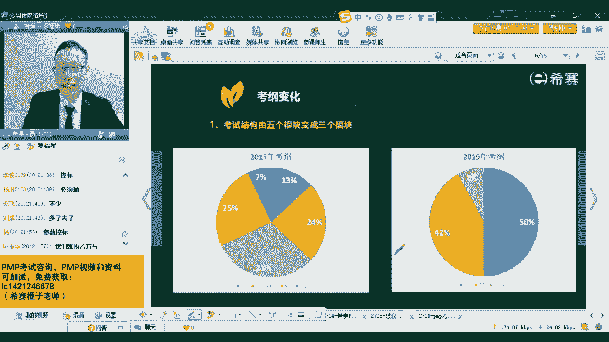
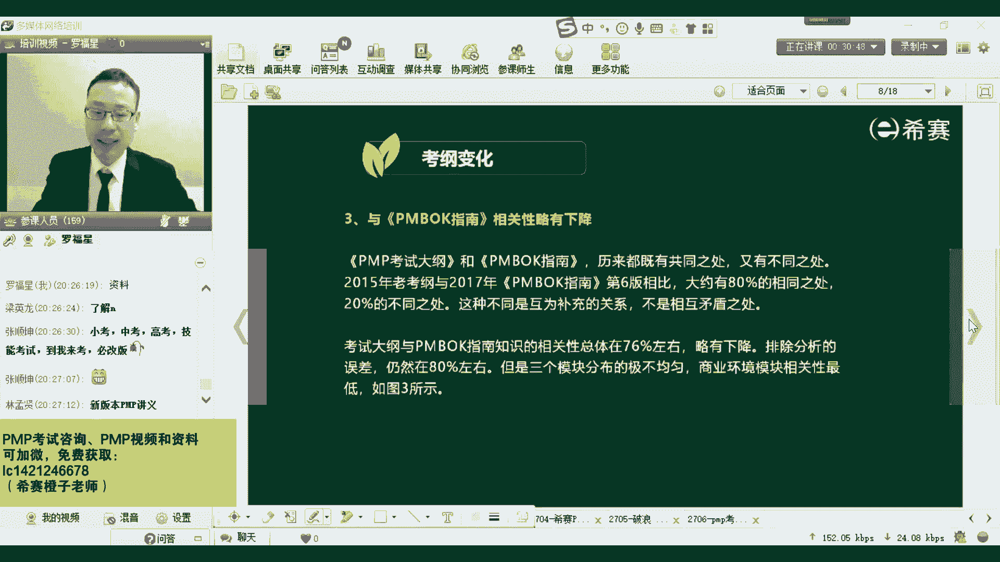
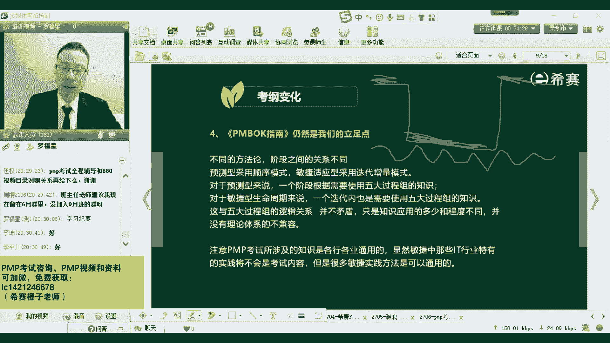
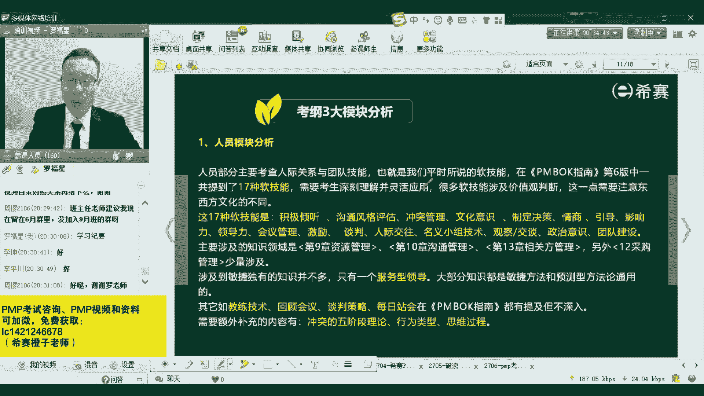
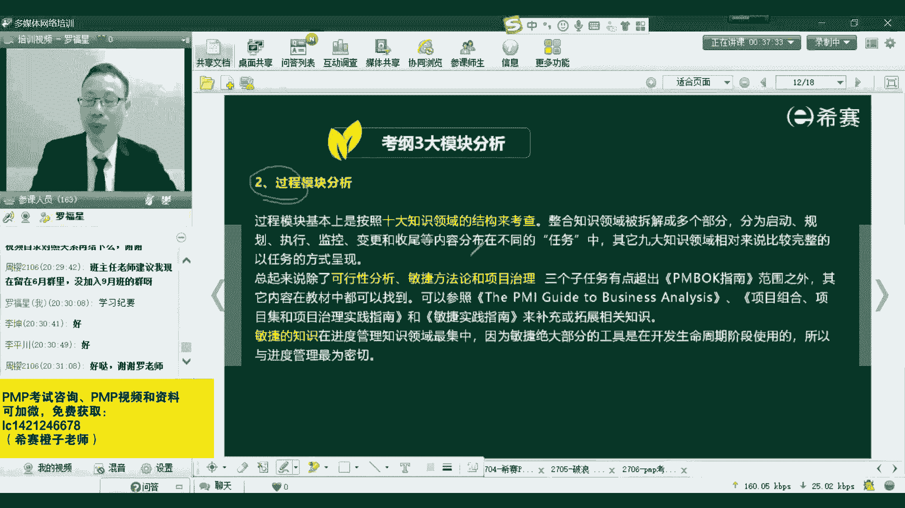
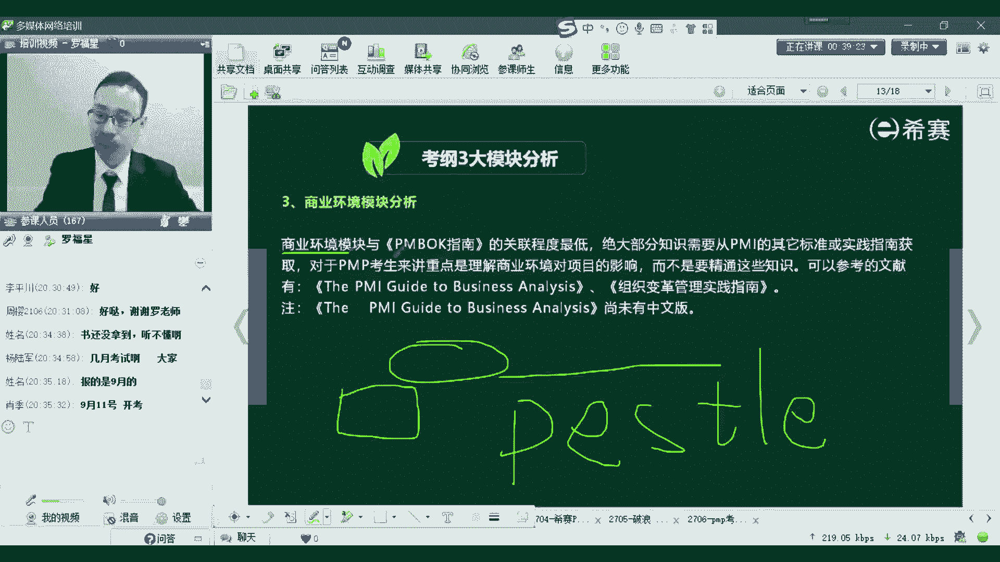

# （24年PMP）PMP项目管理认证考试零基础自学，精讲视频合集！ - P6：06PMP新版考纲解读 - 冬x溪 - BV1CL411f7BM

所以接下来我们就直接来到第三个板块来去分享一下关于考纲的解读。我们会先来分享考纲的解读。然后最后一个板块呢是分享一下苹le指南第七版，它的这一个基本性的一些信息，好不好？你们都不给我回应。

然后我都会担心我的网络是不是有问题，还在吗？还在听吗？同学们。😡，呃，是这样的。就是说整个这一次改版呢，它最大的最大的一个区别就是说它首先从表面上来看，就是发生了一个翻天覆地的变化。

真的可以说是发生了一个翻天覆地的变化。它是什么个变化呢？首先我们在扩完做项目的时候，其实从tablele指南的第三版第四版到第五版到第六版，它几乎是接近于每四年会更新一个版本。

但是从第六版到第七版的时候，他做了一个巨大的一跳跃。他从原来的那个项目管理的五大关主十大知识领域，449个过程，然后一下子突然就变了三大模块，一个模块是人员，一个模块是过程，一个模块是商业环境。

但是基于这样一个点的话，其实你也不用太过于关心。为什么呢？因为它的这些内容啊，它其实都揉在了原来的这样一个五大关主实代知识领域中。我等会儿会有一个页面来去给大家去讲解。它是什么情况呢？就是这五大过程组。

它其实就相对应的，也就是我们的这样一个项目管理的这样一个过程组的内容。同时我们有十大知识领域，对吧？其中十大知识领域中会有一个关于项目资源管理的内容。项目资源管理会涉及到团队资源。

也就说我们要去组建团队建设团队管理团队，这是不是跟人打交道，同时我们在第三章会一个项目经理角色。那项目经理角色是不的是是不是你要具备一些技能去跟人打交道，需要有领导力，有影响力，有管理能力，对吧？

同时我们还会在后面会有一个内容是关于项目的相关方管理，那相关方管理，他其实是说所以会影响这个项目的人团队组织和被这个项目所影响的怎么想呢？打个比方，在欧洲踢了一场球赛。然后因为有你很喜欢的球星。

踢的不太理想，所以你很生气，就一一路之下把那电视机给砸坏了。那你是不是这一场球赛的相关方是还是不是是打一个一，不是打一个2。如果说有那么一场球胜，你很喜欢，结果你最喜欢的这一个。你球员他提的比较臭。

然后让你很生气。你把这个电视机打砸坏了，你是不是这个项目的相关吗？是打一个一，不是打一个2。哦，我看到有很多同学打来啊啊啊。😊，呃，所以呢你们才需要来学习，对不对？我们所有会影响这个项目的人。

以及所有会被这个项目所影响的人，他都是相关方。那你是不是被这个球赛所影响了？有没有被他影响你被他影响了，你甚至是做出了一个非常很夸张的行为，你都把这个电视机给砸坏了。所以你很典型。

你就是这个项目的一个相关方，只是说你不是一个特别特别重要的相关方，你是一个你是一个不写的那么重要的相关方而已。但你是相关方，所以不管是什么咱们项目团队的人员，还是说跟这个项目相关的所有的其他的相关方。

他这个内容那都是我们的人员管理，而涉及到人员管理。我们通常说有人的地方就是什么呀？我们通常有一个词，咱们说有人的地方就是啥？来告诉我。对，肖继说的啊，一般来讲，有人的地方就有江湖，对不对？

有人地方就有江湖，有人的地方就有是非，有人的地方就有冲突。所以呢我们人员管理中会涉及到这种冲突管理。那对于冲突管理一般要怎么办呢？我们后面还会有很多冲突管理模型啊什么之类的东西。

他其实会告诉我们说怎么样去跟项目团的成员相处，以及怎么样去跟各路相关方来相处，来去做这一些事情。所以这是跟人员相关。所以你你会发现其实它原来的内容还是这样些。呃，对，叶振华，你问的问题是对的啊。

只要是跟只要是被这个项目所影响的，都是相关方。也就是说呃打个比方，我以前在高德，那高德地图，他如果发布了一版新的新版的地图，他会发布了一个新版的导航。那林志玲杰的声音一出。

要后就很多人会想要去使用它的这样一个导航。所有使用这个高德导航的人，他都是这个高德导航这个产品的相关方，只是说你可能不是一个那么重要的相关方，你是一个很普通的相关方。而，对于相关方，我这里特别要说一下。

有可能相关方会特别特别多。那如果说对于相关方特别多，我们要怎么样去管理。来想一想，对于相关方特别多的情况下，我们一般来讲我们会怎么样去管理会比较好一点。有没有一个思路来想到怎么样帮你来管理这些人员。

有没有好的方式？想一想。啊，特别棒啊，就是李坤说的，我们可能会对相关方进行分类，对不对？对？是的，李坤和那个陈小成说的，我们会对相关方进行分类。就是分到类以后，这一类人很重要，那我就会对他重点管理。

然后这一类人呢，他可能是啊也比较重要。那但是呢他对于这个项目的利益他不是很看重。那我们就是第二个维度的重要性来去管理。还有第三个部分的人群，他虽然很关心这个项目，但是他没有什么权利。

这一部分人我们用第三种方式来管理第四种人他没有什么就各方面都比较弱一点。那我们呢就是另外一种方式来管理。因为为什么要这样做呢？因为我们的时间资源精力都有限，你在有限的时间精力下。

你要去管理那么多相关方例，其实管不过来。那我们就会采取一定的策略，就是把它分堆分成类别，这一类人我们怎么样去用一个策略来管理他。另外一类人要怎么样策略来管理他。所以这都是人员管理里面的内容。😊，了解。

我们开始还说过，我们说有人的地方就有江湖，对吧？有人的地方就就会是非，那有是非，我们要不要去好好的沟通，要不要去跟人好好的沟通。在你们的工作中有没有那种勾了没通的情况，有没有？

就是你你想要好好去跟他沟通，就是怎么就像对牛弹琴一样的，就是聊通就沟不通，有没有出现过这种情况。有的是不是所以我们在这面还会讲到一些关于沟通模型啊，沟通方法呀，沟通的分类方式啊，沟通的障碍呀。

他都是跟人员有关的这样一些内容，所以其实都是一样的。所以他内容其实还是这样。你跟甲芬爸爸吵架，前面网络上面有个段子，他说你不要把爸爸当爸爸，你要把爸爸当你要把那个甲芬爸爸当成啥？😊，谁帮我把那块说出来。

我不好意思说。对，就是梁云龙说的啊。😊，就是只有那个谁，他才会说我要什么我要什么，对吧？就随便随随便什么时候都想要，是不是？所以你会发现，其实他讲这套内容还是跟原来这些方式有关系。所以这是第一个方面。

就是虽然说从5个模块变到三个模块，但是本质上它影响不大。而至于商业环境这一块的话呢，我们在做项目之前，这一块倒是新加进来。就是我们以前去讲项目管理，一般怎么讲？讲以前讲项目管理是这项目已经开始了以后。

然后我们开始去启动规划执行监控收尾，会这样来去做。但是其实在项目启动之前，来我想特别想问一下同学们，你们在一个项目启动之前，你有没有去参与那个项目。有那个经验吗？就是项目还没有完，还没有敲定下来。

还不知道这个项目会不会敲定下来之前就已经参与到这个项目中有没有过啊。杨晓宇说有参加的啊，李坤也有。所以其实你会发现在现实生活中，我特别想告诉大家啊，在现实生活中，在很多公司他都会是这种情况。这才是真实。

虽然我们在那个拼le指南中会说到项目经理是被项目章程中所任命的，但其实你在这个项目拿下来之前，你作为一个公司的一个项目经理，一般就是前期就去跟客户接洽呀，然后去招投标啊，然后内部来去做一些论证呢。

都需要你参与进来。这才是真实情况。那就完完全全。如果说一个公司特别特别大，那是另难别论啊，就如果一个公司特别特别大，然后专门有一些售前部门，有一些解决方案中心，他把所有事情前前后都给你搞好了以后。

只让你开始去做那种也会有，但是相对的比较少一点。大部分时候是项目经理对，在很早之前就切入进来。对，还没有立项的时候就已经介入了，这才是正常情况。叶正华说那个论证的报告都写了无数个。

然后对这才是真实情况啊，这才是真实。所以商业环境中他就会把这一块内容讲进来，就是我们以前呢是没有考虑这一点，以前是没有把这一点纳入进来。以前是说项目经理，你就是一个单纯的项目经理。

你就是项目已经敲定了以后才开始去做项目。但真实情况是这一方面你也需要。所以呢是在早前就接洽，就是还没开始八字门一撇的时候，你就已经开始去接洽。后来甚至你们有没有这种情况。

客户的那个投那个投那个招标文件都是你们帮帮他写。一部分有没有过？就是客户的一些招标文件，你们都帮他来去捉刀来帮他写了一些。有没有赵飞说是的，所以一看你们都是。都是老油条，是不是都是老江湖啊。

都在江湖上面混的，这才是真实情况。同志们，这才是真实。所以你会发现这种情况其实目前来讲的话，它的这一套新的方式呢，它会更加符合真实情况，它会更现实更贴合更贴合一些。啊，这是这样一个情况。

OK这第一个内容啊，然后第二个内容，啊，这是第一个内容。😊。

这就没有什么好说的了啊，已经是已经是给你简单讲了一下。第二个内容是什么呢？第二个内容就是大内容。第二个内容就是说敏捷的部分，敏捷的内容在以前的版本，也许是在今年6月份考试啊，以及去年12月份考试啊。

去年9月份考试啊啊。😊。

这几次考试中，敏捷呢他都只考的很少，可能就考个三道题、四道题、五道题、六道题这样子就考的特别特别少。而从现在开始。目前来看的话，9月份是改的呀改的呀，他官方没有发完整通知，但是它。目前发的通知。

9月份是启用新的版本，也就说是9月份会完全启用新的版本，但是它后面到底会不会再有又把它重新回到原来，就不好说了。因为这个。嗯，怎么说呢？他其实在2020年的3月份的时候，就说呃是要启用新的考纲。

但是一直拖拖。因为就果2020年就疫情产生，就一直拖到9月份，9月份就不能够启用新考纲。然后到12月份，因为好多人9月份没有考没有考成，所以12月份也没有启用，后来就是到2021年启用。

结果2021年的6月份还没有启用。目前是说2021年的9月份会启用新的考纲。它不管启用不启用，我们就奔着新考干去就好了。但是新考干，它其实跟现在的这样一个第六版的考干的这种方式没有什么特别。

就是说它不会影响你这一次考试，就是万一它最后没有改变，它还按照之前的方式来进行，对你来讲没有影响，你现在只是多学了一东西而已。你只是多学了一点东西而已。你赚到了同志们，可以吗？是赚到了啊，那新的内容呢。

它里面就最大的一变化，其实是这个就是加了大量的敏捷，加到了将近一半，也就是说180道题目中可能会有90道题目会涉及到这种适应型啊，就种敏捷型啊这种方式来去对待。他也是告诉我们说呃，这个世界是变化的。

我们需要去拥抱变化，这是一个乌卡的时代。我们需要去响应变化，来帮助客户创造价值。所以这才是目前新的版本中，它的一个重要内容。是这样一个情况啊。

然后至于说它的那个跟Pmo指南相关性，你想原来的内容本身它有肯定是跟就是以前的考试，它跟Pmo指南的第六版肯定是更相关，对吧？呃，但是现在加了那么多的敏捷的内容。

同时又加了一点点这种其他一些7788的这种模型，肯定那种相关性稍微会差一点。但是差了这一点的内容呢，你也不用担心，作为培训机构，他是干什么吃的，作为培训机构，他就是帮助你们的，对不对？

就是帮助你们更好去通过考试。所以那种没关联上的那些内容，我们会帮大家去补上，我们都会帮大家去补上。所以你会发现你现在手上所拿到的奖义。你们是不是手上都已经拿到了奖义了。有拿到没有？拿到打个一。

没有拿到打一个啊，就是目前手上已经拿到了我们新发的那个讲义，就是一个一个蓝色封面的。我们以前的都是那个红色封面的。我们这一次改版改了一个蓝色封面的。呃，还有很多同学是没拿到是什么情况，是是才报名的。

或者是还没报名的，是吗？谁谁说逢考必改版什么情况？千万明，你是什么情况？什么叫逢考必改版，最就牛逼了啊。😊，高考的时候也碰上改约啊，是刚刚才报名。没关系。呃，正常来讲的话呢。

蒋义他在快递小哥哥奔向你的怀抱的路上会很快的啊会很快的。然后有少部分同学是之前的班级，然后来就是转到这个班级的。呃，没关系，我们其实已经给大家提供了电子版，我们已经给大家提供了电子版。

就是班主任老师在群里面有发过，就你可以直接在那个下面去去去对，直接去看到，就是已经给了大家电子版了，就完整电子版都已经有了。呃，电子版在哪里？电子版你这样走，我跟你说一下啊，电子版是什么说呢？

就是呃登录西夏网登录西赛网，然后呢呃用你账号和密码登录，然后有一个我的。然后是个人中心，然后还有一个什么什么学习中心，然后有个资料。你从这个路径里面去看，如果你看不，如果你没看到的话。

你就在群里面去艾特一下值班小哥哥。你在这里面去艾特一下值班小哥哥，也能看到他里面会有一个资料。在那个资料下面就会能看到一个呃完整的讲义，一个完整的讲义。想要考中考高考技能考试，你只要你来都改版。

这说明你是一个拥抱人才，拥抱变化性的人才啊。😊，好炫呀。并且你想你是第一波，你以后可以帮别人，你你可以跟别人吹牛。你说哎呀这个东西没什么好难的。你看我随随便一搞就通过了，是不是？😡。

所以没有那么其实也没有那么难啊，但是我们还是要学习，要花时间，就投入时间，这一条是必然的。不管是雷总考试，它不管是变化还是不变化，我们都需要去投入时间，这是毫无疑问的O。

所以它的相关性呢稍微会有一点点有一点点下降。

所以您目前已经是找到了一个是吧，是在跟大家说那个那个讲义的名字叫新版本PP讲义，是不是O。但是不管怎么说，它其实还是依然是我们的立足点。就是这个内容它本身没有变化。因为正常来讲。

我们即便说用这种敏捷的方式用拥抱变化的方式来去做项目，它需不需要有一套规则，要不要规则，它一样的是需要规则的啊。很多时候我们用那种预测型的方式来去做项目，它也是可能只是一个大的坑。

就是我们在前期去收集需求，然后呢，后面去。做设计啊，然后去实施啊，然后去测试啊，做这些事情，然后最后去交付。而敏捷的方式呢，它是把这个过程把它分到一个很小的一个。分成很多段分成很多段的这种方式。

所以它本质上每一小段你做的方式，你还是需要有一些计划，需要去就执行，需要去监督与控制，对吧？呃，孙玉平是这样的，这种情况呢，你我告诉你怎么处理，就是你直接去问一下，找一下销售。或叫课程顾问。课程顾问。

一般是课程顾问，他来负责改改你的权限，修改你的学习权限。但他给你修改完学习权限以后，你就可以看了。海外同学准备6月初来考试，那新的80视频够了吗？够了。就是你如果说是海外同学，你准备在6月份才考试。

你就直接联系班主任老师，特殊情况会特殊处理。你直接联系班主任老师，特殊情况，他会特殊处理，他会给你一些给你一些另外的资料。呃，那个周英同学OK。你直接单独联系班主任老师会更好一点。

这样的话确保就不会嗯就避免有一些重要的信息，你没get到，这样会更好一点，好不好？对，是是这样一个情况啊。然后整个它其实虽然说有了这样大的改版，但它其实依然还是启动规划执行监控收尾，对吧？

依然是关于人员这一块的话，我们就刚刚说过，不管说是相关方管理呀、资源管理呀、沟通管理呀、项目经理角色呀，它都是这还有冲突管理呀，所以它都是跟人相关的这样一个内容。呃，这个内容比较很比较容易给。

你直接在群里面去呃艾特一下，让我想象，明天吧，你明天艾特一下那班主任老师，然后让他发更好一点。因为今天晚上值班小哥哥他不一定有，或者你可你可以直接在群里面搜一下那个说一下叫什么叫重点。呃，呃。

重点文件还是什么对的，找了我一下忘了名字了，就是我们之前有一个有一个名有一个。有一个文件叫重点文件还是什么之类，就是那个呃咱们新的班级雷霆班雷霆班的第一那个学习。那叫什么学习纪要学习纪要。

雷霆班的学习纪要中的最后面，它会有关于呃考试偏僻考试全程辅导和咱们视频所对应的这些目录，会有这样一个内容。或者如果说你找不到，你就明天在群里面去艾一下班主任老师，或者我今天晚上讲完课以后。

我把它发出来好吗？我今天晚上讲完课以后，我会再发一遍这个文件发到每一个班级群里面，这样可能会更好一点，可以吗？啊，周英队，你现在你如果说是本身6月份考试的话，你肯定是留这个群里面会更好一点。

因为这个群它那个学习氛围会比较它会比较直接，它是比较冲着最后的冲刺来的那个氛围会比9月份的班级肯定要超前一些嘛，肯定会更好一点。是这样的，但是学习资料你可以去问询他，然后让他给到一些更多的东西。

好了，继续这个内容。然后还有一个点。

啊，这个我觉得这个没有什么特别好说的。我们直接来看新的版本的那个就是呃这个新的考纲他们这天考试内容啊，您看一下新的考干中的考试内容，它会什么说？他说有关于人员人员中有倾听，这是沟通的一个内容，对吧？

然后沟通风格的评估，这也是沟通，对不对？冲突管理，我们说其实也是跟沟通有关系，人和人之间打交道沟通有关系。然后呃至于说文化一时情商，还有那个什么谈判影响力，这些内容呢，他看见都还有领导力。

这些内容看着都很虚，但是我们需要去掌握一下，我们需要去稍微有所了解，能够知道说我们怎么样去更好的去跟别人来互动和相处会这些内容。另外还有是引导引导是跨职能团队人一起来开会，这样有什么好处呢？

就是能够去更快的来发现问题，解决问题，以及包括其他一些激励激励因素，这个呢都在那个啊项目沟通管理，项目人力项目资源管理中其实是有讲的。你如果说翻书的。

你翻照翻我们的讲义都会有这样一些内容。然后民意小组技术呢也是在几个内容里面有讲观察焦堂、政治意识，这些都是在还包括团队建设。

它都是在我们的资源管理、沟通管理、相关方管理以及在前面那个第三章项目经理角色这几章中都会有一些讲解。当然呢我们本身说人的话，其实除了这些人以外，还有一些很重要的人是什么人呢？就是我们在。

敏捷中会有一个叫s的这个框架。那s这种结构呢，它会给到有几样几个三个重要角色。一个角色叫PO一个角色呢叫呃srema叫敏捷教练，还有一个角色叫团队，就是自组织团队。那这些呢他也是人员。

那这些人员中他会现在开大量的会议，就是我们需要有这种交流开会。每一个迭代开始的时候要开会，然后过程中每天开站会，然后结束的时候呢，我们需要去开建个评审会，然后还需要去开一个回顾会。那这种迭代的方式。

他会把这些内容都给囊括进来。所以你会发现它的这样一些信息，其实大部分都有了。但是也有一小部分需要去补充的。比方说冲突的五阶段理论呢，还有什么呃行为类型思维过程。

这些这些是我们在拼搏质量中找不到的那找不到的内容呢，我们会去把它补进来。我们我们会去帮大家找到来去补进来。这是关于人员这样一个模块。而至于过程这个模块，这就没有什么好说的了。这近就大家都不用担心。

这已经是我们来来回已经搞了好些年。这是从我自己是从2014年开始，我从2014年开始到现在应该算是有7年的时间，有7年时间一直在搞这个都是按照这样一个五大关注视知识领域来进行的。

所以这一块的话基本上就是都都是OK的。然后台面就是加了一些敏捷这种信息。而敏捷本身呢我本身也考过了敏捷。然后我们给大家讲的内容中也加了一些敏捷相关的这些元素。所以你几乎不太担心这一块这一块内容。

就是正常的去学习就够了，经常去学习过了。至于还有一个板块考试考的比较少，考了将近是8%考8%的这一模块呢，大概是多少题。然后想一想啊。

12题十3题十4题左右吧。那这个内容呢就是我刚刚讲的说在项目还没开始之前，我们需要去考虑一下这个商业环境。包括说我们可能还会需要去了解更多的信息。

因为很多时候我不知道你们有没有了解过一个这样的模型PSTLE模型。他会说是我们要去做一个项目呀，会考虑到这种大的这种社会环境。就是政治啊经济啊文化呀、技术啊等这样一些方面的发展。

你做的项目如果说在这个领域中，目前整个全球的范围内，它的这个方式是在往上降的。那么你这个领域你再怎么努力，你可能都不太能够给一些好处。但如果说你整个这个行业是在往上升的这样一出趋势。

那么就有可能像雷军先生说的，说站在风口上猪也能飞。所以他这个点其实会给到一个叫什么点线面体的概念，就是我们如果说你刚好在一个上升的这样一个一个体上面的话，你就可以去一些红利。所以我们在做项目的时候呢。

需要去了解一些宏观的东西。需要了解大环境，大商业环境。这个商业是它其实通常是谁的事情，一般是领导以及这种商务商商业分析师这些群体要干的事情。但他现在是对于你作为项目经理要求会更高一点，那你也参与进来。

就像我开始问的问题说这个项目还没开始之前，你有没有去参与。有很多同学都说我有参与，对不对？都参与。包括说前期项目还没有立项的时候就开始参与进来。然后立项的时候啊，做这种可行初步可行性分析啊。

详细可行性分析啊啊，我们甚至说是帮客户去写招标文件呢，我们去写投标文件呢，这都是在项目开始之前要干的事情。那这都是我们这个商业分析商业模型这个板块里面需要去考虑的因素。

