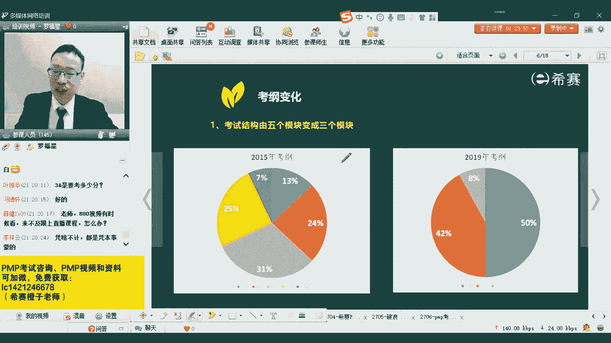

# （24年PMP）PMP项目管理认证考试零基础自学，精讲视频合集！ - P7：07《PMBOK指南》第七版简介 - 冬x溪 - BV1CL411f7BM

然后接下来我们就来讲一下关于那个新的呃新的那个呃新的教材，就是拼le指南第七版。这个第七版目前还处在一个保密的阶段。我特别说一下啊，目前它还处在一个保密的阶段。然后我自己也没有看到一个完整的。

我也没有看到完整的。所以我们看的都只是一个外围的信息，但是这个外围的信息用四个字来去表达，就是真的是翻天覆地。😊。

它的变化真的是会翻天覆地。你会发现你看一下啊。从原来的五大过程组，十大知识领域49个过程，从类似的信息从做事情按部就班的一步一步来进行，到现在是变成了什么叫12个项目管理的原则。

然后八大绩效率以及按照价值交付系统。也就是我们以前都是按照这样一个呃过程驱动的，就是以过程驱动来做事情。而新的版本呢，它完全是按照价值驱动的方式来做事情。呃。

我给大家简单解释一下怎么样按照价值驱动来做事情可好。😊，你就这样去想一想，打个比方，如果说你要去做一个你要去做一个项目，然后你如果按照原来的方式来去做的话，就是做到一半。结果因为资金链断裂。

这个项目就塌了就黄了。那如果说盖一栋大楼，你盖到一半的时候就还了，那么这栋大楼它能不能用？他就有可能会变成一个烂尾楼，同意吗？打个比方，如果一栋楼它盖到一半的时候，它就黄掉了的话。

就很有可能会变成一个烂尾楼。你能不能用一般情况下，我们可能不太能用，是不是？一般我们可能不太能用。但是用敏捷的方式，它是什么的呢？它是按照价值驱动的方式，但是它不它不是用于所有的行业。

我刚才觉得这个例子可能也有点极端，只想告诉你说，做到一半的时候可能不能用了，包括说做软件也是一样的。如果说你要去做一个软件系统，按照传统的方式按照瀑布模型。但是如果说你在做IT领域。

做软件相开发相关领域的话，你就懂我在说什么啊，如果说你还听不懂的话，没关系，后面我们有时间慢慢的去聊，我们后面有很长的时间慢慢去聊，我只想告诉你大概什么个意思啊，如果你用传统的方式来去开发这个IT项目。

如果说是做到一半，比方本来是一个一年的项目，你做到6个月的时候，结果因为种种原因，这个项目就咔掉了，它能不能用。这个这个这个已经完成这一部分，你会发现几乎是不能用的。至少说那个软件它是跑不起来的。

它是跑不起来的。可能有一些文档呢是可以留下来。但是那些代码什么之类的，它真的是作为一个半调子，就几乎运行不下来。而如果按照价值驱动交付的方式，它就会不一样，它会是什么样的方式。

他会是按照一个敏捷的方式来去对待，就是我们这个事情还没有开始的时候，我就把它分成很多个小块，小小小的那个你可以把它理解为小的阶段吧。我们简单的理解啊，加小的阶段，我把它理解会分成很多个小的阶段。

我可打个比方我四个礼拜也就是四周每四周来负的去做一个板块。那如果四周做一个板块，做完以后呢，我就要去交付，交付给他的东西呢，就是能够让他跑起来的，能够让他用起来的。那这样的话，我到第六个月的时候。

我是不是已经交付了几个周交付了几个模型，交付了几个版版本，我都可能已经交付了6个版本。那这6个版本其实每一个版本我交付了以后，他是不是要用一用。他用的时候是不是要给我一些反馈，他给了我反馈以后。

那些好的东西，我是不是要去发扬起来。然后那些不够的不够的地方，我是不是要去做一些调整和改进。所以这才叫价面向价值驱动这样一个交付，就是面向价值交付的这样一个驱动方式来去做事情。

所以我总是会做他最关心的东西，总是会做他最。😊，需要的东西，然后我每一个月我都要去交付一次。这样的话如果说做到6个月的时候，它黄掉了，现在他手上东西他能不能用？他至少肯定是有一些是可以用的，对不对？

他有一些是可以用的。因为我每一次交付，我都是按照正常的一个结束项目的这种方式来去交付的就是。以这这一个月的时间，这4个礼拜的经营时间，我作为一个完结，完结的时候我要去交非些什么东西能够去运行起来。

我以这样一个逻辑来进行。所以这种方式来去做事情的话，它就是可以即便终止的话，他也有也也有可用，这是一方面。还一方面是什么呢？还有一方面很重要。你想一想，你我我我我相信你们都会用word和excel表格。

以及用PPT是不是会不会用会用打个一。你会用word exccel表格。以及那些什么PPT这些东西会不会？我相信你肯定是会的对吧？还有人不会答案的同学什么情况？😡，赵高新，你是真的不会用word吗？

谭俊什么情况？😡，是要引是为了引起引起我的注意力吗？但是我相信大部分同学应该都是还是会会一点，就不是都会一点啊。那个哲科生还会用project，这个就很厉害了啊。OK我们一般都会用一些自动西。

但是你用的时候你会发现你经常会用一些什么功能，是不是都用那种你特别熟悉的功能，就用那么几个功能，又能很定有限的功能。😊。

你你都没办没办法想象别人用那个excel表格可以去做出那种什么水彩画呀、水墨画呀什么之类的，可以做出那种很复杂函数啊，可以做出一些那种代码相关的东西。是不是？

但是我们在生活中我们用它就是只用那么一点点功能，只用那种最基础功能，就是敲文字进去啊，然后统计一下表格的那个总和呀，都只会干一些这种简单事情。所以你会发现有什么特点呢？就是任何一个产品拿到你的手上。

你通常都只会用它其中的很少的一部分功能，绝大部分时候只用其中的一小部分功能，这个特点我们有一个原则，有一个模型叫阿尔巴法则。叫二8法则。也就是说我们有80%的时间在用20%的功能去使用去工作。

或者我们80%人都在用这个20%的功能去用。那些复杂的功能几乎没有什么太多人去用，只有很少很少人去用。甚至你那些教PPT的老师，教excel表格的老师，他也不会定用的那么多，他也只能用其中的一小部分。

所以你会发现这个软件它即便说是只做了一半的时间。但是他目前交付了些你最重要你最关心的东西，是不是基本上其实已经把你生活中绝大部分所需要的东西都已经满足了，会不会？所以这也是它的一个价值。

OK这是很有意思的一个点，对吧？呃，先简单过一下，我后面会把它展开，我后面会有几页来去把它展开。😊，然后除此外呢，他会给到说有11种模型，然后还有若干的弓建和方法。呃，这个简单解释一下。

就是我们在新的版本中，你对于项目经理的要求，他会说你不仅仅只是去掌握了一套结构化的方式来去做项目，就是按部就班，先干什么再干什么再干什么，不只是掌握这些东西。你还要了解更多的这样一些模型。

了解什么模型呢？后面其实会给到一些模型，我直接给你翻到啊。

这个1一种模型，可以看一下，一个是领导力的模型呃，领导力。我简单说一些词，大家都看过那个战争片，对不对？在战争片中，一个军官，比方是一个国民党军官，他会怎么说，他说同志们给我上，这是不是一种领导力。

是的，他是一种领导力。比方说共产党共产党的军官，他会怎么说，他会说同志们跟我上，这个是他他是不是一种领导力，他也是领导力。不管是给我上还是跟我上都是一种领导力。

领导很多时候是能够去激发别人去完成一些事情。当然呢，相比而言的话，那肯定跟我上比起给我上的那个那个强度，那种那种那种影响力更大，是不是你会更愿意跟谁，你肯定是更愿意去跟那个跟我上的那个那个那个老板。

他说你跟我上，所以他自己在身先士卒，我们会更愿意去跟他。所以你会发现模型中会有一些哎像领导力模型，这是一个。然后另外一个关于沟通模型，沟通，我们是不是有一些基本模型。我们说我要去跟你沟通。

我首先要去编辑一下我的这样一些信息，然后去跟你分享。然后信息我本来讲的是语音，然后最后传递成各种呃这种什么啊这些就是我现在传递过去的东西可能会转成0101的这种信号，然后到你那边再去解码。

解码又变成了我的声音，所以它中间会有这样一个过程，是不是9月份的考试它是9月份的考试呢，它说是第六版，因为第七版还没出，但是你从考纲来看的话，它其实跟第七版是更贴近。其实跟第七版是更贴近。明白。

只是因为第七版它还没有出来，但是他说的方式其实会发现跟第七版更接近，跟跟跟这个东西更接近。但是他是按第六版来考。因为第七版没出，但它是按照第六版以及按照新的考纲来进行的，它是这样的O啊，所以沟通模型中。

首先我们是要去编辑一个信息。然后要要去编码以后发出去，然后信息交付出去以后呢，你要去解码，然后你要去给我一个反馈。所以我我开始在问说哎，大家还有没有在听，也是想要去获取一个反馈，来确认这个网络没有断掉。

对吧？然后沟通模型中，其实我们还会知道说沟通有很多这种障碍呀，然后又沟通有很多这种方式呀，有很多分类，比方说正式沟通和非正式沟通，书面沟通和口头沟通，然后包括口头中有言语的沟通，还有肢体动作的沟通。

有各种很神奇的东西，对吧？呃，会有很多很多这些东西。然后这里还有一些叫激励模型。那激励模型。呃，我们其实如果说像之前的同学从3月份过来来到现在的同学，你看过你一定也看过，对吧？

我们在前面有讲过什么讲马斯洛需修城次理论，赫兹伯格的双因素理论，然后讲了那个就是呃呃什么嗯让我想一下啊。一下子给我一下子给让我给忘了。啊，比方说还有一个激励理论，就是我们可可能有些人会亲和需求比较旺盛。

可能有些人会想要有一些这种成就感，也有些人会有权利欲这些东西它都会给到这些内容。就是我们作为项目经理，你需要去掌握。呃，至于还有一个变革模型变革，它是什么概念。它会给到一个信息，就是。😊。

我们其实你想一想，我们说做事情，你为什么会需要去做一个项目，一定是有一些需求，对吧？而而这些需求是什么呢？我们说堵则痛痛则变变则通。那堵会有痛，而痛就是我们的一个需求。有了痛以后呢，我们会想要去变化。

想要去呃改变。而且改变就是我们的项目。而通过这样一些项目能够去改变现有的状况能够去解决大下的痛点，这是一方面还一方面是可以通过这样一些方式能够去驱动组织的变更，就是你的E公司，你想任何一个公司。

它是不是从一个小公司开始，从一个小公司通过一个又一个项目，然后去可以变成一个大的公司。所以他会驱动这一个组织变更。至于说复杂性模型，就是我不知道大家有没有听说过一个叫y的这个人。斯泰西。

他是一个专门一个就是不确定性做决策的一个专家。如果说很多东西它是确定的那我们要去做一个决色，就比较好比较好判断，对吧？但是为什么有一些人他能够做出一些英明的决策？他做了一个决策以后。

你你为什么去会觉得他很英明？其实是因为他做的那个决策，很多人做不来。而他为什么能够做得难呢？可能是因为他对于这一些不确定性，对于这些这样一些信息的这些把控，他会更有感觉，他会更敏锐。

他会捕获到更多的信息。但然呢呃我们其实还有一个模型，关于那个叫66。4毫的个模型。他会告诉我们说我们要去真的要去做决策的话，其实你应该是要延值决策，你应该要去获取足够的信息。

你定要去知道像如果要去做这样个决策，你需要什么信息，你已经有了什么信息，你还缺什么信息，你可以通过什么样的途径去获取你所缺的信息。哎，这样的话我们能够去更好的来去知道怎么样去做这个决策。除了这点以外。

还有叫OPV叫 view，就是其他人的观点。所以你会发现这些模型它都是很很有意思的一些东西。这些东西呢坦白说。对菜鸟是不友好的。他对菜鸟对这些新手项目经理其实不够友好，他对谁比较友好呢？

对你们这些老江湖老油条会比较友好一点。就是你可能因为这个新的版本呢，它有一个最大特点，就是你会发现对于新手项目经理来讲的话，你会发现新手项目经理要去学项目管理，我更希望是按部就班的来进行，对吧？

可是现实生活他就是一个很复杂的一个过程，它是一个很动态的一个过程。现实生活他就没有办法说按照让你安安静静的去做在这个地方去安安静的去学习，它就会有很多这种跟人和人之间呢。

然后内部之间呢还有我们和外部之间的这种互动交流，有很多这种变化。那你要怎么样去处理。你需要去知道很多很多东西能够去帮助呃去支持你的决定，以及去帮助影响别人。所以这里面会告诉你很多很多模型。

包括说团队发展模型。那团队发展的话，大家应该也都听说过一个人，叫塔格曼。塔格曼是一个心理学家，他会一个叫塔格曼团队建设的5个阶段，说是从行成期到震荡期到成熟期。😊。

到衰退的到到震荡期到晨到那种呃那个就是就呃让我想想第三个阶段叫什么？成熟期到表现期，然后最后是衰退。所以你会发现这些内容，它其实你知道的越多，你就越知道说那来了一波新人，你要怎么样去管控他。

你要怎么样去带他们，你可能会怎么样对待他们是比较合适的，在什么阶段用什么样的方式来去处理和管理。所以你你当你知道这么越东西越多的时候，你越好去处理，对吧？包括说跟他有冲突。

那产生冲突这别要你顺便我问一下，你跟你跟甲方爸爸或者你跟你的同事之间产生冲突的时候音，一般你是怎么处理的。你一般处理方式是什么样的？你会发现他这些东西它都是让你有一定的历念，有一定的这种经验。

有一定的种社会阅历的方式来去做，会更好一点。或者我接来说几个吧，你你挑选一下，你觉得哪个更好一种方式。一种方式，当你跟他产生冲突的时候，或者说有两个人产生冲突来去给你报备的时候，你说我觉得张三比较对。

李四不对，我说了算，这是第一种方式，你觉得这种方式好不好？第二种方式呢是来3304，你们坐下来一起来好好聊一聊。我们大家一起来聊一聊，聊开了就没事了。对，这种方式。😊，然后还有第三种方式呢是。哎。

如果说碰上你自己就是一个张三，那你就离开我暂时不产不想参与这个冲突，我先离开。我先冷静一下。OK就这些东西的话，其实他都会我只想告诉大家，就是说这个新的版本中，它会有这些内容的话。

会能够让你知道就是你在生活中会更有用啊，就是它更贴近我们的工作，更贴近真实的一些情况，是这样的一个情况，就这些模型本身它会更贴近你的生活情况，更贴近你的工作情况，以及包括说谈判的模型，你跟客户去谈判。

你跟你的职能经理去谈判，去要人，继说规划就好说了，规划模型，我们说项目经理，你必须要干什么啊？做计划，做计划，做计划。我们说有一句话叫做房事预则利，不预则费，对吧？那做计划的能力很需要很重要。

所以他会加了这样一个模型，还有一个给了一个五大关主，这五大关主好不好理解，启动规划执行监控收尾，这是我们语言来那那一套方式，对吧？还有一个凸显模型，凸显模型是什么概念呢？我们刚刚有说过。

如果项目的相关方特别特多的情况下，我们要去怎么办？我们可能会对它进行分组，通过分组的方式来去管理？但是分组分成四组，如果不够用怎么办？有个凸显模型，它是把它按一般来讲是从两个维度可以分到四组。

但是如果从三个维度呢，就可以分到更多组，所以凸显模型它其实面对一个更复杂的项目，就面对更复杂更特别的项目。啊，其实本身呢我是。是这样的，我今天给大家去简单的去讲这些内容，只是想要告诉你说这个新的改版。

它会更贴近我们的工作和生活，它会更贴近我们的工作和生活，会让你就是对于新手的话，稍微会有一点点挑战。但是对于你已经是在职场上混的比较久的时间的人，你可能会发现哎真的还是这样一个情况。

它会跟人相关的东西更多啊，这是这样一个模型，然后第二呢是弓建弓建是什么概念呢？弓建其实你可以把它理解为说是文件，就是我们在做项目的过程中，比方说我有一个需求规则说明书，概要设计说明书，详细设计说明书。

这都是我们的弓建，都是我们一些具体的东西啊，包括像呃问题日志风险登记册，然后呃像这样一个。😊，呃，比方说范围基准进度基准成本基准这些东西呢它都是你的一些工建。所以这些工件你会发现它它新的版本中。

它会列了很多很多弓箭。除此以外，还有个很多方法。而这些方法呢，它其实对比我们以前的方式来讲，它就是我们的一个ITTO中的两个T叫techology tools就是那个工具和技术。

就你用一些工具和技术来去完成一些事情。你看他用了收集数据的方法和分析的方法，比方说我们可以用头脑风暴的方式来去做分析数据啊，我们可以用访谈的方式来去分析啊，然后焦点小组的方式啊，然后那种观察的方式啊。

啊，然后是引导式引讨会的方式啊，就好多不同的方式来去做，对吧？包括我们头脑风暴完了以后呢，我们可能会对外进行亲和的方式啊，用清和图的方式啊，啊，可能会用民营小组技术的方式，就有好多不同的方式。

所以这里面的方法，这一条呢，它就是会给到这样一些内容，所以它这里面给的这些信信息，就是有很多一些模型工箭和方法，这是一个这是一个内容的一个不同。除此以外呢，它还有就是一个重要内容，就是按照价值交付。

按照这个价值交付，其实也就是价值驱动的方式。那价值驱动我们怎么样才叫价值驱动？就是你能够去为客户创造价值。关于价值驱动这一块的话，有一个词你必须要去了解一下，叫消除浪费。

就除了像这个你你一定我相信你可能会听说过一个词叫什么呢？叫那个呃精益精益的思想或者精益的模型。精益开发方法，对吧？它会有这样一个消除浪费的这样概念。那我们在价值交付中。

你要能够去把所有浪费都给消除掉以后，只留下这些有用的东西，那它是不是价值，肯定才是价值，对吧？然后并且透过这样一些方式能够去让我们去交付价值。每每一段每一段我们都能够去呃给到客户那些他能够有用的东西。

并且用敏捷的方式本身就会涉到一个价值。OK这是这些内容，我们简单说一下，我们再来看，因为它还还有一个很大一个改版，改了一什么呢？

他会把所有内容分到两大块，一块叫12个原则，一一个呢叫8个绩效领域。看不到罗老师，没关系，能够能够听到就可以啊，能够听到就可以。刚刚好像卡了一下，刚好像是卡了一下。🤧嗯。呃。

这个12个原则其实我们也可以看一下。你会发现它跟我们这种生活中的东西会更相近。当然了也不完全，就是你看你在什么领域，在有一些领域中可能会比较相近一些。在有一些领域呢可能没有那么相近。

比方说他有一个叫什么成为一个。成为一个勤勉的，然后尊重的和关心他人的管家。这个呢有点像什么呢？在敏捷中会有一个词叫仆人市领导，谁帮我敲一下仆人市领导。嗯，嗯仆人是领导。

你讲那个仆人和领导这两个字他是不一样的概念，对不对？仆人是什么？就是你好，欢迎光临那种呃，还不是还不是就是你们家的仆人。当然我们现在是没有这个仆人这个概念啊，而领导是什么？领导是什来去领导你的人。

而现在他会要求你一个新的方式是你做一个仆人是领导，什么叫仆人是领导呢？😊，即实你是给他提供服务，你能够去帮助他，能够去更好的去开展这个项目的人员。所以你类似于一个资源库，他需要什么东西，他来找你。

你能够去帮助他的这样一种类型的领导。对他所以他是一种服务型的对，这个特别好啊，就是武权说的这个他其实一种服务型的领导，是能够去给别人提供服务，你是一个资源池资源库的这样个概念。

O所以他的他的这个新的原则中加了这样一条，就是你作为一个服务型的领导，你作为一个关心别人的管家。第二条呢，他说能够去创建协作的项目团队环境。这个也很有意思。什么叫创建一个协作的那个团队环境。

我想问大家一下，你们在工作中被打断的多不多？你的工作效率高不高？你的工作效率是不是跟被打断的关系，那个次数有关系，有没有感觉到一天到晚经常被打断？😡，有这种感觉的人吗？

有有没有同学是经常感觉到自己在工作中经常被打断，听没有？哦，对我看到有有好多同学说功能效率不高，然后天天是很多杂式，经常被打断。所以你因为你经常被打断，所以你才效率不高。

你想为什么有的时候我们在夜深人静的时候效率比较高？因为你在夜深人静的时候，没有人来打搅你啊。😡，是不是因为你在夜深人静的时候是没有人来打扰你的。所以这个时候你发现哎，怎么突然之间我怎么工作效率这么高。

怎么这么牛叉了，都崇拜自己了，要对着镜子去磕三个响头那种感觉。其实是因为在这个时候你是没有被打扰。而很多时候呢我们的氛围环境，就是这样一个情况。所以他说你需要去做一个事情。

就是说创建一个能够协作的这一环境，能够让团队能够更好的去工作，能够安心的工作，那些被打扰的情况。😊，那些中间这种交流的这种各种麻烦的事情，你能够去帮他去解决掉，你能够去把那些障碍给清除掉。哎。

这是你要干的事情。所以这是另外第二条原则。还真的是有的同学戴耳机是为了为了去解决这个问题。那我顺便问一下，你们戴耳机的时候会听音乐吗？😊，之前有同学有同学我们在讨论过这个话题，就是有一些人戴耳机。

戴耳机会听音乐吗？😊，还说其实也不听音乐，就是为了带着而已。啊，刘畅说不一定会听，但是有同学会听。但是我其实很好奇，那些听音乐的人，我特别想问一下，那些听音乐的人，你一边听音乐的话。

你真的是那个功效率会怎么样？就听音乐的时候，它会不会影响你的功效率，甚至是比较大的影响，会不会？啊，如果说是做一些重复性的工作，就去听音乐。OK这才是okK。所以我们带都是同样的人，是不是都是一样的？

罗罗家明罗家红说，不会影响，那这就厉害了。所以很多时候其实我自己的话，我是不喜欢听音乐的，我做事情我都是认真的去专注的去做，我就不喜欢那个听音乐。然后有的时候如果说不想让别人去干扰我，我会怎么样的？

我会来到这个直播间，我会来到这个直播间。但是有的时候的确是如果做一种很重复性的工作的话，就的确是可以听着音乐来去做，就是做那种很机械性的操作，对吧？但是它本身它会对于我们的思考肯定是会有干扰。

如果说你要去做那种编程的工作，你要去做一些那种要思考什么事情的一些工作，除非说你把那个音乐变成一个白噪音，那就另谈别论，你把它变成一个白噪音，他只是就是为了让你去处在一个安静的这个状态里面。

那是另一谈别论，否则的话呢，是就可能还是会有一些影响。O啊，就是这一条就是说我们在我们作为项目经理的话呢，你去做事的时候，你要去帮助同事帮助团队去隔绝这样一些个呃噪声隔绝这样一些影响，这是这样一条。

第三条是有效的去有效的让干弦参与进来。其实也是鼓励干弦参与，怎么样鼓励他们参与，我们去给他分成堆。这一堆人我们怎么样去影响另一堆人怎么样去影响分队的方式可能会用这样一个权利立一方格。

那也有可能会使用这样一个像凸显模型的方式来去分，对吧？除其外，还有一个展现你的领导力行为。你你怎么叫领导力，不是所有事情都你你得要亲力亲为，你可以让别人去做，你让其他团队成员参与进来去做这个事情。哎。

这是你的这个很重要的信息。你能够让团队激活，他是好事情。你想我们有一个有一个负面的因素，就是有一个负面的一个例子给大家分享一下，就有个同事他他们小组呢会都是就是销售小组。那销售小组中。

他一个人的那个销售业绩是他们整个团队的销售业绩的90%。也就是说其他几个人的业绩加在一起，是他的。不到他的一半的一半的一半。那这种方式的话，他作为一个领导，他其实做的做做的不太好。他作为一个销售员。

他应该是算是做的非常不错的。但他作为一个领导其实是不太合格。为什么？因为你没有去影响大家，你没有去带动大家，你没有去领导别人一起来去优秀。你如果能够让大家一起来优秀，那，这才是更好的一个情况。

还有一个说是识别评估和影响系统交互，就是。人机之间的这些互动。但这个的话会有一点点就是倾向性，会倾向这个IT领域，倾向我们跟系统打交道这种领域。就是你怎么样去知道我们跟这个系统怎么样打交道。

我怎么样去输入什么信息，要获得什么样的信息，这个呢它也是你要需要去做的。还有一条叫拥抱适应性和韧性。这个怎么说呢？就是因为这个外面的环境呢，实在是变化态度了，唯一不变的就是变化。所以我们需要去拥抱变化。

有很多这种弹性的情况，有很多这种弹性的情形，它不完全是按照你就说我们有个词叫计划赶不上变化，它不完全是按照你计划的方式来进行。那如果说有很多这种调整的方式，你也需要去拥抱拥抱这种变化，拥抱这种适应性。

拥抱这种弹性的东西，拥抱这种韧性。还有是驾驭复杂性。其实我们知道一般很复杂东西啊，比较容易扑街，就是容易容易黄容易做不成。而对于复杂东西呢，我们需要去研究怎么样研究，其实它里面会涉及一个词。要迭代。

不断用迭代的方式来去解决这一些复杂性的东西。同时这里还有一个叫优化风险异味。其实对于风险，我们风险首先有积极的风险，也有消极的风险。那对于这样一些积极风险和消极风险，你都是需要去考虑的。

所以这些内容里面，你会发现有一些是跟以前的版本中是相似的，相类似的，但是有些是完全显得比较陌生的。而那些比较陌生的是其实在敏捷中都会大部分都会说到，在敏捷中大部分都会说到，这里还有一个说根据环境的裁剪。

这个裁剪就厉害了啊，这个裁剪就厉害了。我们在拼那个以前的版本中其实也会说到裁剪裁剪用一个什么样的词来去表达。又什么样子来去替换一下裁剪，或者说裁剪是什么意思来告诉我。😡，通常来的话，裁剪是什么意思？

或者说用什么样一个词来去表达进行裁剪。我们其实就是说根据需要来去做取舍，对不对？就是根据需要来去做取舍。我到底用哪些东西？对，就是断雷水的要取舍啊。啊，对，程勇从程程勇，不好意思，看错了。啊，对。

陈勇说来用来去做取舍。那具体怎么取舍呢？其实我们在以前中就只是给了这样一个词说可以取舍可以取舍什么呀？你给取舍过程过程中的每一个输入工具和技术，可以取使它的输出，可以取舍这一次内容，但是在新的版本中。

他的这个取使他就厉害了，他加了很多东西，你看他说为什么需要去做做裁剪。我们裁剪是什么东西，我们裁剪的过程是怎么裁剪的，然后对于那个绩那个绩效率来进行怎么裁剪，然后还要去做一个诊断和总结。

他把裁剪这个事情做一大事情，他为什么要这样来去做呢？你会发现这种方式才更加贴合现实。我当时在讲关于裁剪的时候，我一般会怎么说，通常情况下，我们说有五大关主十大知识领域有49个过程。

有好多好多个工具和技术，对吧？但是如果你只是去请朋友来家里面吃一顿饭。

如果你只是请朋友来家里面吃顿饭，把这一顿饭来当做一个项目来对待的话，你需不需要考虑那些成本的因素？几乎不太需要去考虑成本，对吧？然后时间方面，你可能稍微考虑一下质量方面呢，你可能就考虑一些口味的东西。

然后其他很多因素你都不会太去考虑。所以你会发现那种材质材料非常的夸张。啊，对，项目章程是不能裁减啊，项目章程还要裁的话，这个项目都没有了，对吧？但是在新的版本中，他会把裁剪当成一很重要的事情。为什么？

因为在生活中真的是各方各面都能裁，裁到最后只剩了一个项目章程。😊，ううん。呃，所以它会有很多关于裁剪的这些内容需要去给大家分享啊，这是这一条。

还有呢将质量融入到管理的过程和成果中。这一条呢其实在我们的项目质量管理中有没有提到本身就有我们在项目质量管理中会有一个过程叫管理质量，还有一个过程呢叫控制质量。那管理质量。

你们公司有没有QA的这样一个角色？有QA的QA的这样一个角色吗？以及有没有QC的这样一个角色，有没有？他就是他就是。这个QA它其实是过程保过程中的这样个质量保证，它就是对于过程的质量管控。而QC的话。

它是对于结果来进行管控，所以就是这样一些东西。而这里面有一条新的原则，它说是。将质量融入到那个过程和交付过程中。OK。还有Q1，还有SQ1。Q一是什么？哎哇，这就厉害了。😊。

做制造业做制造业质量方面是不是有很大优势。你要看你是不是真的是在从事这个领域。你如果在从事这个领域的话，肯定是肯定是会有很多优势的。你对他的了解比我对他的了解会更深入。你对他的那个质量管理的了解。

对我比我对他了解会更深入一点。啊，然后呢还会有一些叫聚焦价值。那聚焦价值其实前面已经说过，就是关于价值交付。就是我们要去交付的东西是能够去帮客户来创造价值的。我们要去消除浪费。

把那些不创造价的东西都给咔掉，都给去掉。然后留下是有用的东西。哎，这是新版本中它的一个原则。还有最后一个原则。你看。为实现预期的未来状态而驱动变革，这什么意思？首先我们任何一个企业是不是有一个愿景？

任何一个企业，你通常是有个愿景，对不对？你有一个愿景，然后有你的使命，有你的价值观。然后接下你会制定一些战略，那些战略是为了去达到某个愿景所制定建一个宏观的一些大的一个面对变化这种计划。

然后有了这些战略以后呢，我们靠一个又一个项目来去实现这一些战略目标，从而去达到某个愿景。可是在做这些项目的过程中，你可能会根据你的需要来去调整，所以会引发一些项目的变革。呃，打个比方。

本身像以前反环境污染特别严重的时候哦，不对，像以前还没有涉及到这说环境污染的管控的这个时候，很多工厂它就是只要管产能就可以了，对不对？那产能拼命往上涨。但是这个时候可能会导导致大量的污染。

后来国家就可能会出了一个新的管控条件说不能够有这么多排污。你这些废弃的排放呢，废水的排放呢，都需要去经过一些什么处理后才能够排放。有很多严格的要求。那这时候你可能再去做项目的时候。

你就不会再去做那种巨污染的这种项目。你可能会稍微去综合考量一下，所以他会去做一些新的调整。另外呢，其实你做过很多很多项目以后，它会让你变到一个上一个新的台阶，会让你整个组织发生一个新的变化。

所以这些原则，你会发现它其实跟生活其实还比较的贴近，还比较贴近。同时他又讲了另外8个绩效域，这个8个绩效率是什么概念呢？也很有意思。他说这个事情我们需要去考虑的因素有很多，有一个因素叫干系人。

这个最最让我觉得我自己都觉得很搞笑的。以前的版本中，以前第五版第四版中都叫干系人。然后到第六版中，他把它翻译叫翻译叫相关翻。然后现在第七版他又把它重新又回到名字叫干系人。但他的英文其实没有动过。

它的英文就叫takeholder。也就是所有会影响这个项目的人，以及会被这个项目影响人，他叫干系人。所以我们这个八大八大绩效八大绩效育中首先有一个绩效率说是干系人说是跟这个项目相关的人员，这是一条。

第二条呢是关于团队。那团队的话，其实也就是咱们项目团队从成员，我们兄弟们，但其实团队它不仅仅只是咱们的这种传统的方式的团队，还包括敏捷的团队。而敏捷团队它有个词语。如果当然我们我们今天就是随便去说一说。

你能够记的东西能够有一点的印象是最好的，没有印象也没关系，后面会很长时间慢慢去讲。在敏捷中呢，他会有一个叫自组织团队叫seorgan team。😊，什么叫自组织团队呢？就是咱们自己。

你不需要去给我给张三李四王五来安排工作，你只需要去把这个工作分配给这个团队。那咱们自己来去决定怎么样去分配这些工作。咱们自己来决定这个事情怎么做。所以这是说团队的这个内容。

然后还有一呢是开发的方法和生命周期。那首先开方法，我们可能会有这种瀑布模型呢，然后面向对象的开发呀，然后面向结构的开发呀。然后我们有这样像一个就是预测型或叫瀑布型，可能会有争量型，呃，可能会有迭代型。

可能会有敏捷型适应型混合型。还有就混合型的话，现在现在很流行。我最近呢还在翻一本书，但是我觉得翻那本书翻的太痛苦了。他们就会大肆的去讲，我们现在的这个社会我们需要去做大量的是那种混合型的方式。

很少会用那种单一的方式来去做项目。很少会单一都是各种东西混到一起来。所以这里面巴拉基教育中有一个重要内容，就是关于这样生命周期和开发方法。还有一个呢是规划，这规划的比较好说。

就是启动规划执行中工所尾类个规划。就是我们需要去做好计划。就是我们有有一句英文叫if you fail to plan， you plan to fail。就是如果说你没有去做计划，你就会失败。

即是房事预则利不预则废，所的是计划。所以这个规划，它其实也是我们传统的计划。然后这一条项目工作，它说的什么呢？它其实说的是我们传统的一个执行。启动规划执行做了执行执行是要干什么？执行是要去组建团队。

建设团队管理团队，我们是要去管理质量，要管理风险。我们需要去指导与管理项目工作，我们就需要去管理知识，这些东西都是你执行要干的事情，这是关于那个项目工作的内容。然后还有一个呢是质量。啊，还有一个是测量。

那测量其实也就是我们那个监督与控制，就是我们的那个monitor and controltro，就监督与控制这干的事情。他把监督与控制单独拎出来。作为一个就是所以你会发现。计划执行监控这三个都在这儿了。

所以它其实本质上的差别没有那么大。然后除此外，还有一个交付，这个交付呢，它会把那个收尾放进来，除了正常收尾，但是它不仅仅是收尾，除了正常收尾，还包括说我们会有一个叫啊验收可交付成果，还有一个范围管理。

就需求管理范围管理。然后通过执行来产生可交付成果，然后到最后验收通过，然后移交，这都是交付要干的事情，同时还加了一个词叫不确定性，而不确定性会导致什么？来告诉我，通常不确定性。

如果一个项目中有很多不确定性，那么不确定性可能会导致什么？那些之前有学习过的同学来告诉我一下。😡，OK特别棒啊，特别棒，谢谢那个罗家红、武权，还有三用户这三位同学。对，通常不确定性它会导致风险。

它会导致更多风险。所以巴拉基教育中其实还有一个基教育说的是关于风险。所以你看你听我说完这些东西以后，可能只是说你们对于敏捷不太了解。如果你对于本身正常项目管理也有所了解，同时对于敏捷内容也有所了解以后。

你会发现这些东西啊它其实还是那么一些东西。它实际上看上去乍一看，真的是发生了一个翻天覆地的变化，但它本质上还是那些内容，它是换了一种形式。他对这一些信息，对这些知识内容进行了一个解构和重构。

可以 get到吗？他把改了一个形状，改头换面换了一些形状。他真正说要有大的变化是什么变化？他真正说有大的变化，其实就是加了很多敏捷的内容。所以如果说我们能够把原来这一个五大共主十大知识领域的东西。

搞好了，把敏捷内容给搞好了，基本上也就差不多了。

薛天你是刚刚才进来，是不是？对，现在的方式方式已经是从原来那个五大公主变了三大模块了，变成三大模块。三大模块是人员过程和商业环境。

所以已经是发生了一个巨大的变化，但是本质上没有本质上并没有。是不是现在按照过程组考按其他来分，它就是它那个内容还是很多都是这种过程组的内容。但是它是把它对把它分到类别的时候，分到这个模块的时候。

是按照新的方式来去分嗯。这里当然有很多第二次学习的了，你要知道6月份考试的时候，有很多人是没有报上名的。有好多同学没有报上名啊啊，不值当然了，这个没有报上名，有很多很多原因啊。

其中包括说像北京没有没有开考，整个北京市已经有两年没开考了。所以这是一个很很尴尬的事情。😊，你明白？所以咱们这一期的同学中有有好多同学是已经是学过，已经学了好几期，最最久的有多少？醉酒的同学有多少？

当然有好多好多，可能已经有两年了都有是吧？很夸张。😊，所以我们今天对我今天要讲内容差不多就是这么。其实其实其实我只想告诉你什么呢？我们再回顾一下这个内容啊。😡。

嗯，这。

どちゃ。我们再来回顾一下重点内容，就是。首先考试已经是9月份考的话，如果再不再变回来的话，他就明确已经告诉我们说会改版。改版以后的考试呢是考180道单项选择题啊，不是考180道题。

其中呢可能会有170道单项选择题有十0道多项选择题，而它的多项选择题它是明明确确告诉你有几个选项，他会告诉你这道题目是有两个选项，告诉你有三个选项，告诉你有几个选项，这样的话你其实难度没有那么大。明白。

但如果说有同学在海外或者是在港澳台考试的话呢，它难度稍微大一点点，它会有单项选择题，有多项选择题，有年限题以及填空题。当然填空题其是一种变相的选择题啊。呃，这样的话呢，它的难度稍微会大一点。

而考试通过一般来讲，它是会有达到60%通过就算是通过了。也就是做的108道题目，就算通过它考试从原来的5个过程组改到三个就是人过程和环境。但是么一个情况。而根据我今天晚上对这些的一些内容的解读。

我相信你应该已经是ge到。你会发现其实它整体来讲，真真真正有变化是什么？真真正变化其实就是这个东西。

这个东西才是真的变化，就是它加了大量的敏捷，加了有一半的敏捷，也说是可能会有。嗯，9十道题目可能会有90道题目是涉及到敏捷相关的，会是这样的一个情况，明白嗯。啊，刘成说的这些问题估计应该不会出现吧。对。

如果他告诉你四个学项都有的，这种，他应该是不会让你选的。这样的话他太尴尬了太尴尬了。对，所以其实呃大家不用太担心，你只要把我们现在已有的这样一个内容认真学好。另外呢，我们后面敏捷内容你也认真学好就够了。

并且你会发现现在这种情况他考的更灵活，他不想不再像以前那种方式需要背诵那么多东西，记忆那么多东西，你重在去理解。你重在去理解这些东西，你去理解一下关于这种冲突啊，人员呢然后沟通呢等这些东西就会好很多。

它就会好很多。啊，接下来我们对接下来这应时间，还有15分钟时间，我们就一起来去交流一下。我来回答大家问题啊。首先第一个魏小敏同学说呃，我们的模拟题按照新版来出题嘛，涉及到很多敏捷题。

我们大概会在7月份的时候，我们可能会在7月份的时候会出很多敏捷题。7月左右的时候会上很多敏捷的题目，你现在还在准备还在准备。因为有些东西如果没有准备好的话，会发现大量的bug和问题。

然后来了回就倒腾再去弄会麻烦。所以我们会准备好了以后就统一上线。呃，如果选定好准备好了以后，在上线其实是比较快的，大家会在7月份的时候上线。然后大陆的考试是只有选择题吗？对，目前来讲的话。

大陆考试就是只有呃170道单项选择题和那个呃十道多项选择题是定向的多项选择题。呃，金发亮同学说怎么学看书吗？看视频教程，因为你光是看书，你会发现很痛苦。我相信所有人都发现了这个问题，就是我们要去催眠。

你真的是发现咱们的那个偏僻的书超超级催眠。但是你可以看视频，看什么视频呢？我们有一个叫880的视频。就是罗老师穿真今天这一生录的录的这个视频，就是穿正装打领带来录的视频。呃呃，大概会有多少个视频。

我剧里面有去看，一共是有14张，一共会有14张去看视频。那个视频的话，你直接登录到西赛网。我的然后个人中心学习中心，然后找到那个视频教程。在视频教程底下，你就能够看到某某某某视频教程。

那个课程它为什么叫880的，是因为它的标的价格是880元，所以叫880。呃，其实另外还有一个就是我们后面还会有另外一个内容呢是900。900的视频，那900的视频呢它是用来做复习会比较好一点。

就是你们后续已经学过一轮以后去复习会更好一点。880视频现在是已经是更新的呀，现在已经是新版的，是是我最近才录的，是我在4月份才录的。呃，没有标注没关系。

你直接看标题标题中会告诉你说是视频教程杠罗老师版，就是视频教程杠罗老师版。那个呢就是880，然后有一个是重点讲解小智老师，那个呢就是复习。呃，我等会儿会发一个文件发到群里面，我会你们应该都在群里面吧。

我会发到那个学习交流群里面。等会发了以后，你一看就知道了，知道是怎么回事。OK是这样一个情况啊。对，108题是及格，你单是及格，你不要及格，你还有什么呢？😡，对，新版也是880。

新版的880已经跟老版的不相同。新版的是我最进入的。并且我们是换了一个白色的版本，换了一个白色的版本。他是不是21课时，我就不知道了，呃，没有了解，没关系，我等会会发到群里面，我发到群里面。

你们就看到了，好不好？会发链接，会有链接好。另外一个问题就是那个杨陆军问的这样一个说ITTO要不要背下来，要不要背下来呢？其实我觉得重在理解。咱们在新的版本中，他已经是把它弱化了，弱化了这些内容。

所以是重在去理解他，重在理解它。108是及格。是的是及格呀。呃，江书提问的哪个群就是我还没发呢，就是在学员交流群呢，就是我们的学员群，在学员群。在学员群中会发，如果说你如果说你自己想找的话呢。

你也可以很容易找到。就是你直接登录到西塞官网。西赛官网以后呢，登录进去以后，我的然后是那个学习中心，然后视频教程在视频教程你能够看到很多很多个。其中有一个叫做杠罗老师版，还有一个是干小志老师版就够了。

他这一次在新的版本中没有说不计分题，他没有讲不计分题，他直接就是给的是108道题。呃，及格就是V，没有说及格就是V啊，现在目前是3A，现在最高是3A。

A是最牛掰啊，我看一下啊。怎么说呢？就说我们通常计分是这样来记的，积分是A是bove target，就是超过平均水平，超过及格水平叫优秀。A是优秀。然后第二个呢是TT呢是tartge的时候是及格。唉。

刚刚好还有一个呢BB呢是below target，是是这个是不行啊，是或者说是是这个稍微差了点，没有及格。还有一个呢是N。

N是太差了，差的简直没没眼看这种情况。所以最牛的就是3A。我们改版以后，最牛是3A。在改版之前呢，最牛的是5A。为什么在改版之前最牛的是5A改版以后最牛是3A呢？是因为它现在新的版本，它已经是改了。

它已经是从那原来是按照这个5个过程组来计分，所以这5个过程组你全部都拿A，你就是5A。现在是按这三个模块来计分。如果你三个都拿A，你就是3A。

然后到底多少算是A呢？一般来讲应该是做到80%。就是你这个模块中做到了80%，也就是说这个76道题，你再乘以80%乘以0。8。等于多少？然后这个90道题，你再乘以0。8等于多少？这个题再乘以0。

8等于多少？就是乘以大概0。8左右，应该就可以拿到A。所以并不需要你满分啊，同志们没有满分的要求，它有可能是乘以0。8，当然它也有可能会是乘以0。75。

有可能是说你这个过程组或者你这个模块做到了75以上也就可以了，是这个意思。他是目前没有给具体的那个那个分值，但他只是给了通过分值，通过分值60%，你就是刚刚及格，是这样一个情况。好了。

接下来看大家还有什么问题。

我看一下啊，你等一下。看了880视频和小智老师没有看书，正确率60%，怎么加强刷题。就是如果说你都已经是如果说你都已经是看过了两个视频，然后做题也做的还可以的话，你就可以通过刷题。然后通过刷题的方式。

来去查漏补缺，来去看一下自己错的比较多的在哪里，就是稍微需要去分析一下。你稍微分析一下，分析，你发现你错的比较多了，这哪一个地方，你就集中去处理它，你就集中去处理它。呃，这个是说的9月份的考试。

9月份的考试6月份还是按照之前的，6月份还是按之前的。然后第二个是夏门飞说的是刚才的思维导图，能否共享，没问题。可以。然后最近学完几个章节，听明白了。可是一到做章的练习就废啊，这是正常的。

就是因为我们呃其实去呃怎么说呢？因为整个偏僻的考试，它跟传统的方式不完全相同。我们小的时候的很多题目它都是那种比较直接的，就是说啊我们要签了一个什么条约，每一年签订的，它里面包含了什么什么条款。

就是只要你去背一下就可以了，对吧？但是现在新的版本内容，你会发现它其实比较灵活一些，它会是问题的东西是一个场景，给到一个场景，以后怎么样去应对。所以它需要做一段时间，你要去熟悉这种新的方式。

然后有一些题感。第三个问题，考试是要去长沙吗？当然不是要去长沙，全国各地都可以在全国的绝大部分的省会城市以及沿海发达城市都有考点。兄弟们姐妹们。北京、上海、广州、深圳、福州、厦门呃。

江苏浙江就是那个什么呃那个苏州、杭州、南京、宁波都有考点的啊，都有考点的。然后有同学说做了2A1B能不能通过这个2A1B能不能通过考试，你要看是哪两个A呀？如果是最后一个过程是拿了A。

那你可能只对了十几个，对吧？然后然后是第一第第第二个过程拿了A，你可能是对了，对了，可能七八十个，这样加在一起，如果说还没达到108，那就没有通过。他最后通过不通过，还是按照个数来的，还是按照个数来的。

好好，然后刚刚有刚刚那个那个我看一下问答是不是。😊，然后李丁你点心问的说什么时候改版考试，9月份呢？9月份、9月份、9月份9月份嗯。呃，杨路军问说这个有没有录屏回放，有的有录屏回放。呃，第七版是啥情况？

第七版是目前还没有面试，但是你会发现第七版的内容，它目前还处于在一个保密的阶段，原则上应该是今年冬天会跟大家见面，原则上是今年冬天会跟大家见面。但是既然今天来讲这个内容所候就提前跟大家去分享一下。

就是你会发现其实第七版他跟我们的那个新版的考干是非常一致的。它是比较一致，它的这习内容会更有趣一点，会更加贴近工作。所以这个课程它对于新手项目经理来讲没有那么友好。但是对于老手项目经理，你会发现哎。

哎，可以啊，好像是这么回事，就跟你的生活会更贴近一些。电子版的资料在哪里取？电子版的资料在这里取就是呃。登录西菜网，我的个人中心学习中心，然后有个资料，你在资料下面就能够看到那个电子版的资料。

9月份180道题答对108道可以拿到证书。对呀，你答对好，就是只要是大于等于108道，就算是通过就可以拿到证书。但是我这里边特别要说一下，我们通常是求其上者得其终，求其中者得其下，求其下者必败。

所以你不能奔着108去，你要奔着180去，你奔着越高的目标去的话呢，那你就会越有机会能够拿到一个更高的分，拿到更高分，其实也不是说就就多么多么好。而是说万一你如果奔着最低目标去，结果挂了的话。

他就浪费你的时间和精力就可惜了，还浪费你的金钱。因为这考试报考费是3900块钱。西安肯定有考点哪，那么大的城市有有的啊有的有的有的。嗯。他是。它是这样的，就是现在这个新的就新的内容，它其实没有完全出。

但是目前看到的他没有没有说不计分，它直接就是直接就是按照10100180道题目，按照108分来进行。9月份的考试是启用新的考纲。9月份的考试启用这个新的考纲。而新的考纲会发现跟新的版本中有相似的地方。

所以它是用启用新的考纲啊，9月份启用新的考纲。但是今天通过今天解读，你会发现，其实新的考干中大部分的内容跟原来是一致的。你想一想管理学管理科学这种东西，它怎么可能突然之间有一个大的变化。

它不可能它不像是技术，如果说是技术的话，有可能说突然之间哎出现了一个区块链的技术，而做了一个大的一个新的革新，突然之间出现一个AI的技术做了一个大的革新，突然之间有个二维码能够让我们所有东西都扫二维码。

不用带钱包，突然之间出现一个什么新的这种什么呃，不用插电语源就可以充电。这种新的技术它是有可能会有革新。但是管理这种科学，它是很难革新的，它是很缓慢很缓慢的一个过程。

这这一次虽然它看上去是发生了一个翻天覆地的变化。它其实只是加了很多敏捷的内容。而敏捷这个内容，它在什么时候就已经有了呢？在2001年的时候。😊，在2001年的时候。

当时在美国的雪鸟滑雪场有17个人就呃一起在那个雪鸟滑雪场讨论一下关于敏捷项目管理的内容。说如果说面对这种有大量变更的情况，我要怎么样去管理项目啊，就给了一个敏捷宣言。然后这样的一些敏捷的基本原则。

那这些东我们都在其实都在后面第十四章有讲都有讲。所以大家也不用着急，你知道说这个东西它其实是一个循序渐进的过程，它没有那么夸张，不可能有一种断崖式的一个改变。它看上去暂眼会发现是一个巨大的一个挑战。

但其实本质上还是那么一点内容。OK有这个认识就够了，好吗？所以不用太担心你只要去加油，我相信这些事儿都不是事儿。你想全球范围内，它达到70%的通过率，然后西下的通过率达到95%以上。

所以你只要是真的是有有用心去投入，而不是在三天打鱼，两天晒网，不是一直在忙着加班，或者一直忙着在谈恋爱，你是能够去花一点的时间去学习，投入大概150小时到200小时来学习，考试都没有问题的。

真的都没什么问题的，都不是事儿。相信自己OK。

