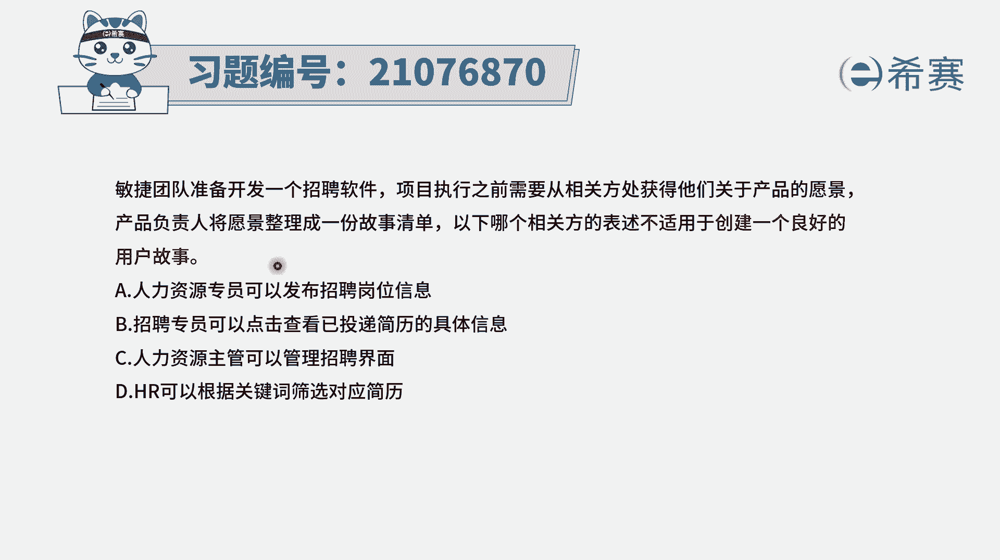
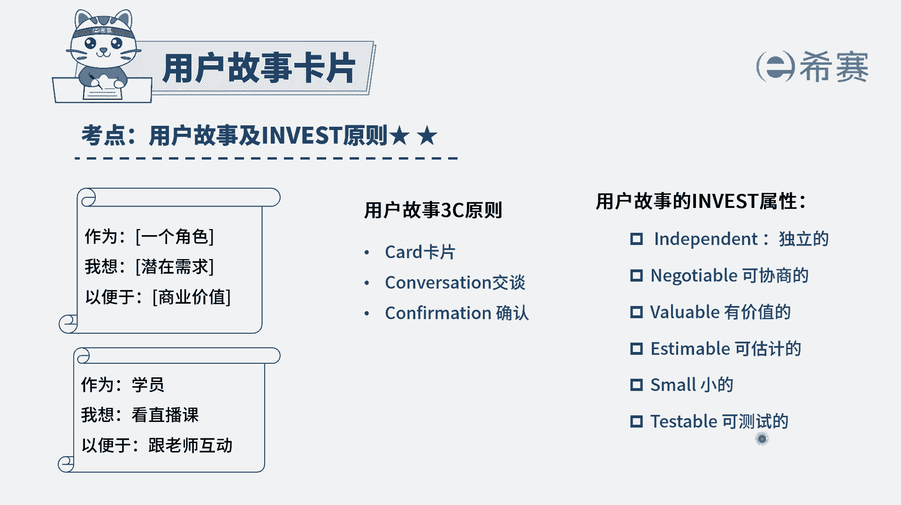
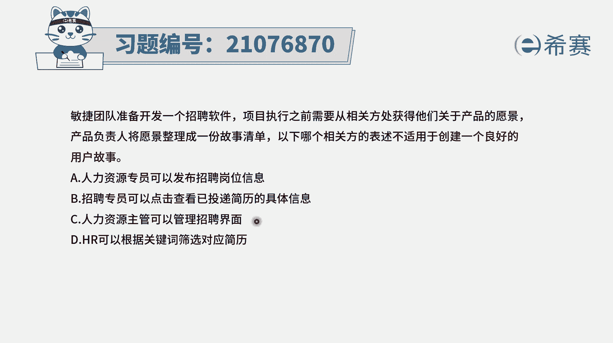
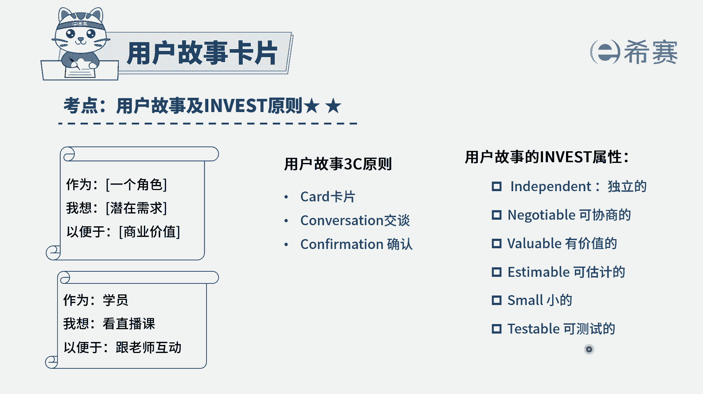
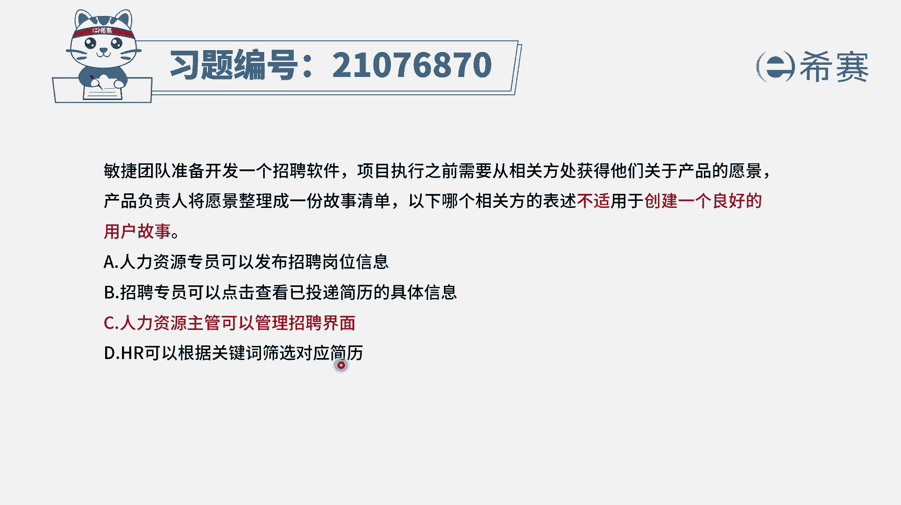
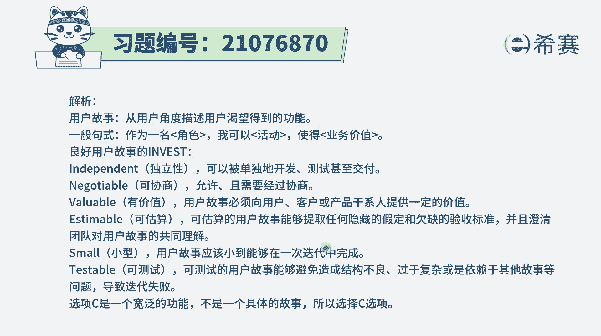

# （24年PMP）pmp项目管理考试零基础刷题视频教程-200道模拟题 - P100：100 - 冬x溪 - BV1S14y1U7Ce

敏捷团队准备开发一个招聘软件，项目，执行之前，需要从相关方处获取他们关于产品的愿景，产品负责人将愿景整理成一份故事清单，以下每一个相关方的表述，不适合于创建一个良好的用户故事，那么也就是说。

以下的四个表述中有三个呢都是比较好的，这样一个用户故事，哪一个是不合适呃，其实关于用户故事啊。

有这样一个基本的规则，就是有一个叫invest的原则，我们说用户故事一般来讲它是相互独立的，就是a故事和b故事，他们之间没有那么多的依赖关系，都是各自相互独立，第二个呢是这些用户故事是可以协商的。

我们是可以通过这种交流沟通探讨，可以把这一个用户故事的背景呢信息啊，呃然后他的需求啊有更深入的这个认知和了解，去细化选项，c是用户故事，最好是有价值的选项，d是可以估算，说是可以估算它的这样一个工作量。

可以是估算这一个用户故事的故事点数，还有一个是它是要比较小的，太大的话呢就是不太好去估算，也不太好去操作，我们应该是在一次迭代中可以完成，还有最后一个是可以测试的，这个可以测试。

你可以把它理解为说是可以去验收，有一个测试标准，有一个验收的标准，好认识了这样一个invest原则以后。

我们再来看一下这四个故事，选项一人力资源专员可以发布招聘岗位信息，那就是我可以有这样一个发布的这个动作，然后发布我的这个需求，这个肯定是没问题，选项比，招聘专员可以点击查看，已经投递简历的这些具体信息。

也就是说我有个具体动作，通过这种方式能够去看到我想看的东西，这个也没问题，选项c人力资源主管可以管理招聘界面，这个管理招聘界面呢，它其实是一个比较大的东西，到底什么叫管理。

我是可以定制化的去选择哪些东西展现出来，我是可以去调整哪些页面，还是要干什么，它可能里面还包含很多东西，所以这个故事呢它显得稍微大了一点，它不太具备这种可指导性，可能还要再拆分成很多。

具体的他的到底是什么样的，管理是可以去查看信息，可以去删除一些我不想要的信息，可以去对信息做一些标识呃，可以去调整整个显示界面到底是什么。

所以它还可以细化，它显得不够细，就它是跟这个关于小不太匹配，以及跟这种可测试，什么叫管理，它不太清晰，也不太匹配。

所以呢答案是选第三个，我们来看到最后一个，hr可以根据关键词来筛选对应的简历，哎这也是可以的，它是一个具体的动作，这个具体动作呢我们是可以去做测试的，所以这个题目的答案就是选c，他说哪项是不适合。

其实我们看完以后才知道，原来他说的是有一些用户故事，是刚好大小跟度是比较合适，也有这种可验证的标准，要有一些用户故事呢，它就是颗粒度太大了，没有一个具体的可以验证标准，我们应该还要把它再拆分再细化。

