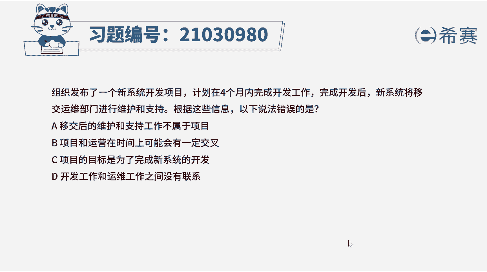

# （24年PMP）pmp项目管理考试零基础刷题视频教程-200道模拟题 - P11：11 - 冬x溪 - BV1S14y1U7Ce

组织发布了一个新系统开发项目，计划在四个月内完成开发工作，完成开放后，新系统将移交运维部门进行维护和支持，根据这些信息，以下说法错误的是，a移交后的维护和支持工作不属于项目。

b项目和运营在时间上可能会有一定交叉，c项目的目标是为了完成新系统的开发，d开发工作和运维工作之间没有联系好，读完题目，我们先找到题干关键词，新系统将移交运维部门进行维护和支持，问下列说法哪个是错误的。

运营管理是另外一个领域，它关注产品的持续生产和服务的持续运作，项目可交付成果移交给运营部门后，之后的维护和支持工作就不再是项目的范畴了，但项目与运营之间存在交叉，举个例子，在新产品开发。

产品升级会提高产量时，在产品生命周期结束阶段，在每个交叉点可交付成果及知识，在项目与运营之间转移，已完成工作交接，在这一个交接过程中，项目资源或知识会转移到运营中，或者将运营资源转移到项目中。

二者在时间上存在一定交叉，因此ab选项是正确的，d选项是错误的，项目和运营之间是存在一定联系的，再来看一下c选项，该项目的目标是为了完成新系统的开发，这也是这个项目的可交付成果，因此c也是正确的。

好了，我们此题就先讲解到这里，大家可以参考一下相关的文字解析。

整个题目讲解下来，我们可以知道，本题考察的知识点。

