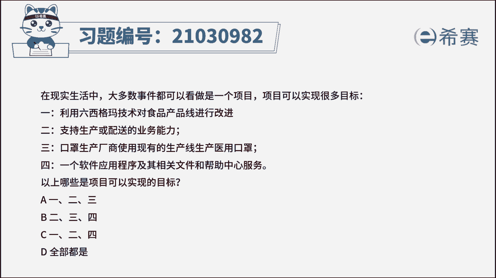
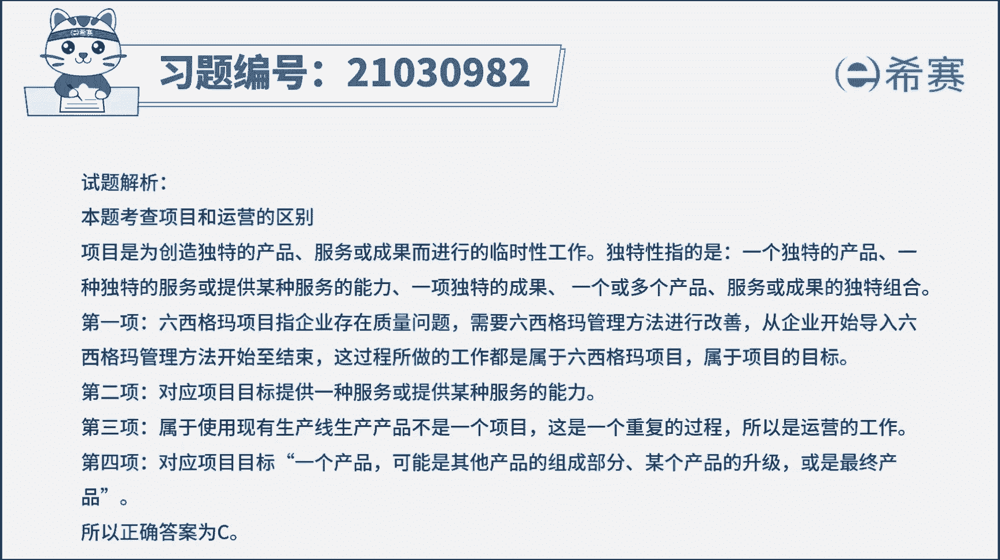
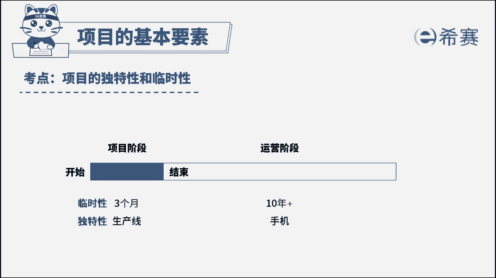

# （24年PMP）pmp项目管理考试零基础刷题视频教程-200道模拟题 - P12：12 - 冬x溪 - BV1S14y1U7Ce

在现实生活中，大多数事件都可以看作是一个项目，项目可以实现很多目标，一利用六西格码技术对食品产品线进行改进，二支持生产或配送的业务能力，三口罩生产厂商使用现有的生产线，生产医用口罩，四。

一个软件应用程序及其相关文件，和帮助中心服务，以上哪些是项目可以实现的目标，a123 b234 c124 d全部都是，读完题目，我们来看一下问题，题目问哪些是项目可以实现的目标。

本题其实考察的是项目与运营的区别，项目具有独特性和临时性，而运营具有持续性和重复性，他关注的是产品的持续生产和服务的持续运作，看到四个选项，一利用六西格玛技术对食品产品线进行改进，企业存在质量问题时。

可以通过六西格玛管理方法来进行改善，从企业开始导入六西格玛管理方法，直到结束，这整个过程所做的工作，都是围绕改进生产线这个目标进行的，这属于项目的目标，二支持生产或配送的业务能力。

这里的项目目标就是提供一种服务，或提供某种服务的能力，所以第二个描述是项目可以实现的，三口罩生产厂商使用现有的生产线，生产医用口罩，使用生产线生产口罩是一个重复持续的过程，并不能创造独特的产品或服务。

这属于运营的工作，不是项目可以实现的目标，四，一个软件应用程序及其相关文件，和帮助中心服务项目中，项目的目标可以是一个产品，也可以是其他产品的组成部分，某个产品的升级或者是最终的产品。

所以第四个的描述也是符合项目目标的，那么综上分析，本题的正确答案是c选项，124是项目可以实现的目标。

好了，此题我们先讲解到这里，我们可以自行参考一下相关的文字解析，整个题目讲解下来。

我们可以知道，本题考察的知识点就是项目和运营的区别。

