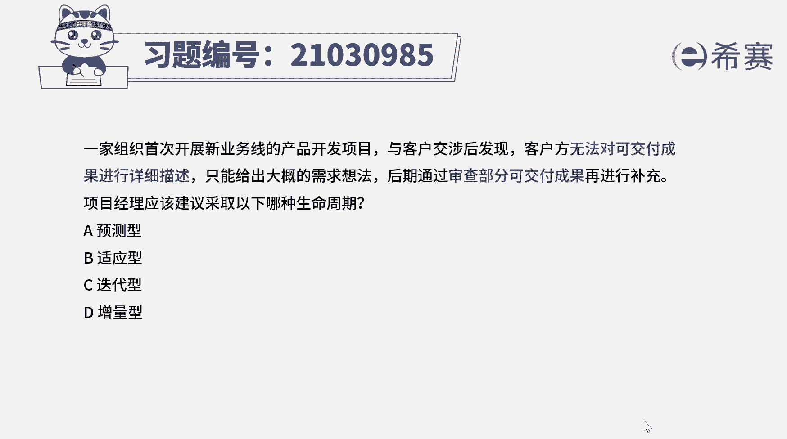
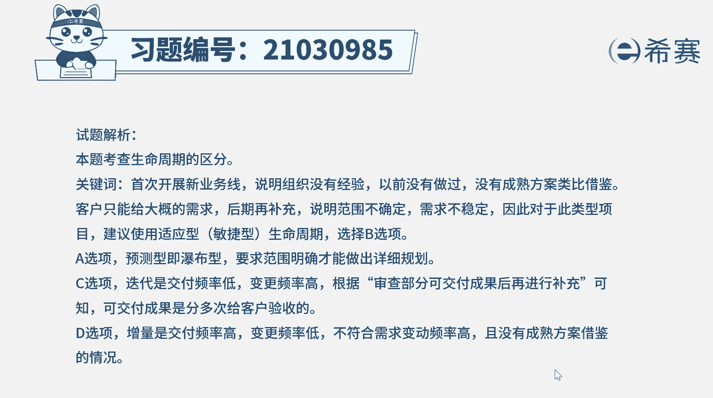
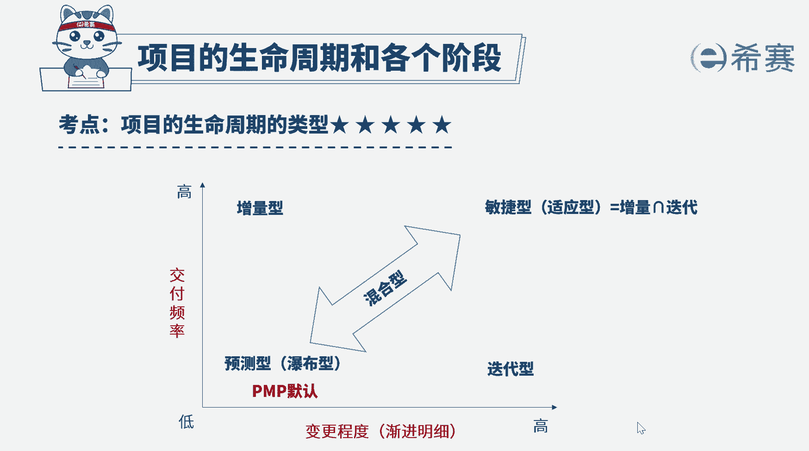

# （24年PMP）pmp项目管理考试零基础刷题视频教程-200道模拟题 - P13：13 - 冬x溪 - BV1S14y1U7Ce

一家组织首次开展新业务线的产品开发项目，与客户交涉后，发现客户方无法对可交付成果进行详细描述，只能给出大概的需求想法，后期通过审查部分可交付成果再进行补充，项目经理应该建议采取以下哪种生命周期。

a预测型，b适应性，c迭代型d增量型，好读完题目，我们找到题干中的关键词，客户无法对可交付成果进行详细描述，只能给出大概的需求想法，后期通过审查部分可交付成果再进行补充，应该采取哪种生命周期。

那我们再回顾一下生命周期的类型，主要有四种，预测型也叫瀑布型，在生命周期的早期阶段就确定好项目范围，时间和成本，对任何范围的变更都要进行仔细管理，适用于变更程度低，交付频次也低的项目。

那适应型也叫敏捷型，以用户的需求为核心，采用迭代循序渐进的方式进行项目工作，适用于变更程度高，交互频率也高的项目，迭代型，项目范围，通常与项目生命周期的早期就已确定好，但时间及成本的估算。

将随着项目团队对产品理解的不断深入而，定期修改，因此它适用于变更程度高但交付频率低的项目，那增量型它是指通过在预定的时间区间内，渐渐增加产品功能的一系列迭代，来产出可交付成果，适用于变更程度低。

但交付频率高的项目好，那回到题干，客户无法对可交付成果进行详细描述，只能给出大概的想法，那说明需求不稳定，后期易发生变化，后面又提到需求是审查部分可交付成果后，再进行补充的说明。

可交付成果是按阶段分批交付的啊，那这符合适应型生命周期的特点，因此本题的答案是b选项，要注意适应型也叫敏捷型，所以说有时候选项中给出来的是敏捷型，没有适应性，那也是一样的好。

那我们此题就先讲解到这里，大家可以自行参考一下相关的文字解析。

整个题目讲解下来，我们可以知道，本题考察的知识点，就是四种生命周期类型的区分，主要是看项目变更程度与交互频率进行判断，选择这个图非常的重要。

