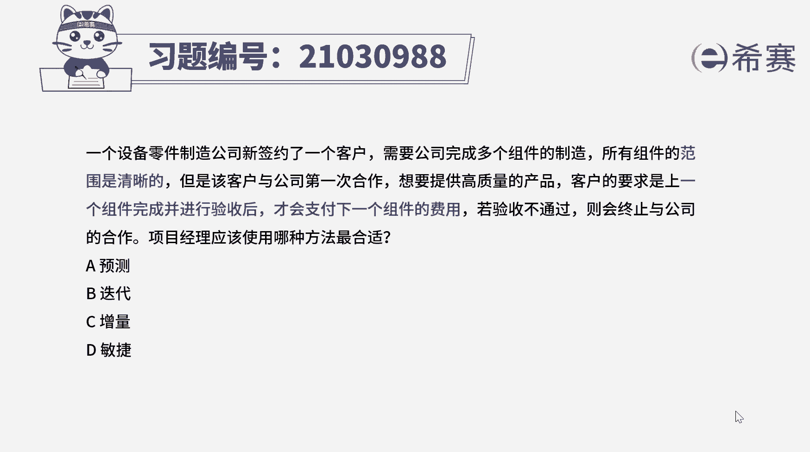
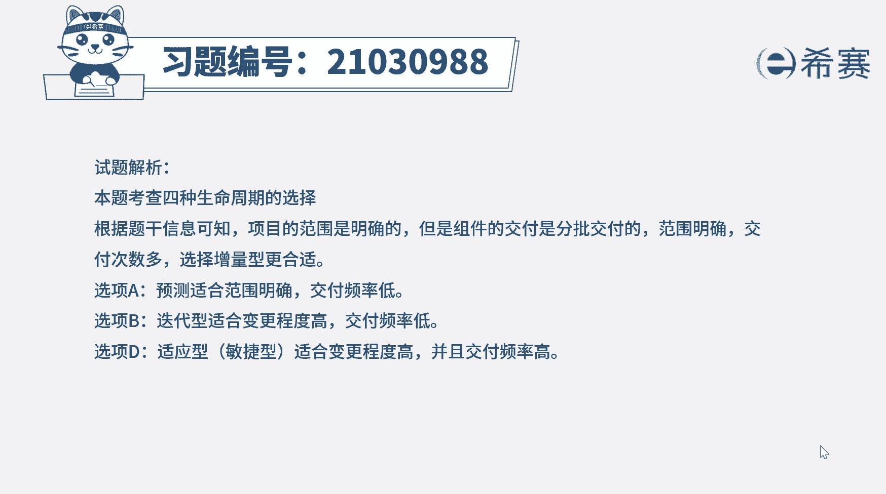

# （24年PMP）pmp项目管理考试零基础刷题视频教程-200道模拟题 - P14：14 - 冬x溪 - BV1S14y1U7Ce

一个设备零件制造公司新签约了一个客户，需要客户完成多个组件的制造，所有组件的范围是清晰的，但是该客户与公司第一次合作，想要提供高质量的产品，客户的要求是上一个组件完成并进行验收之后。

才会支付下一个组件的费用，若验收不通过，则会终止与公司的合作，项目经理应该使用哪种方法最合适，a预测b迭代c增量d敏捷好，我们读完题目，找到题干中的关键词范围是清晰的。

但客户要求上一个组件完成并进行验收后，才会支付下一个组件的费用，问应该选择哪一种生命周期的类型，判断选择哪一种生命周期的类型，主要看项目的变更程度和交付频率，我们先来回顾一下预测型也叫瀑布模型。

适用于范围明确，变更程度低，交付频率低的情况，迭代性适用于范围不太明确，变更程度高，交互频率低的情况，增量型适用于范围基本明确，变更程度低，交付频率高的情况，最后一种类型敏捷型也叫适应性。

它结合了迭代型和增量型的特点，适用于范围不明确啊，也就是变更程度高，交付频率也高的情况好，那本题中范围明确，那说明变更少，但需要多次交付产品，因此适用于增量型生命周期类型。

那本题正确答案就是c选项好了，四题我们就先讲解到这里。

大家可以自行参考一下相关的文字解析好了，整个题目讲解下来，我们可以知道，本题考察的知识点就是四种生命周期的类型，选择，主要是去看变更程度和交互频率，来判断哪种更合适，那这一块很重要。

大家一定一定要把这一块突破。