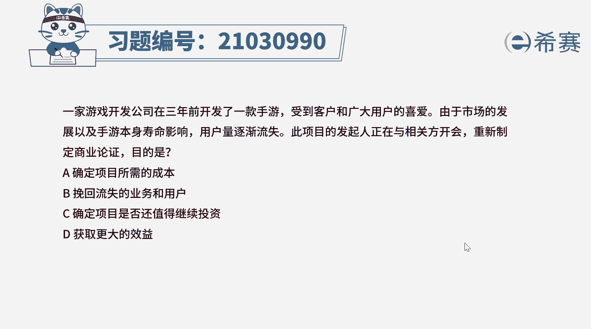
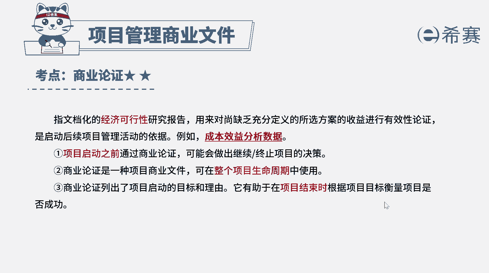

# （24年PMP）pmp项目管理考试零基础刷题视频教程-200道模拟题 - P15：15 - 冬x溪 - BV1S14y1U7Ce

一家游戏开发公司在3年前开发了一款手游，受到客户和广大用户的喜爱，由于市场的发展以及手游本身寿命影响，用户量逐渐流失，此项目的发起人正在与相关方开会，重新制定商业论证，目的是a确定项目所需的成本。

b挽回流失的业务和用户，c确定项目是否还值得继续投资，d获取更大的效益，好读完题目，我们直接看到问题问，重新制定商业论证的目的是什么，前面都只是背景介绍，考察的是商业论证的内容，我们复习一下。

商业论证指文档化的经济可行性研究报告，它用来对上缺失充分定义的所选方案的收益，进行有效性论证，是启动后续项目管理活动的一个依据，商业论证列出了项目启动的目标和理由，它有助于在项目结束时。

根据项目目标衡量项目是否成功，项目启动之前，通过商业论证，可能会做出继续或终止项目的决策，因此本题的正确选项是c选项，重新制定商业论证，能够确定项目是否还值得继续投资，再来看一下其他选项选项。

a商业论证是从项目的效益出发，判断项目的可行性是否值得投资，它不会估算项目所需的成本，估算成本是在成本管理中进行的好选项，b和d，商业论证只是项目可行性的一种理论分析，用来确定这个项目值不值得做。

有没有投资价值，但它不能作为项目带来实际的收益，也不能挽回业务和用户，所以a b d就直接排除了好，我们十道题就先讲解到这里，大家可以自行参考一下相关的文字解析。

整个题目讲解下来，我们可以知道，本题考察的知识点就是商业论证的内容和作用。

