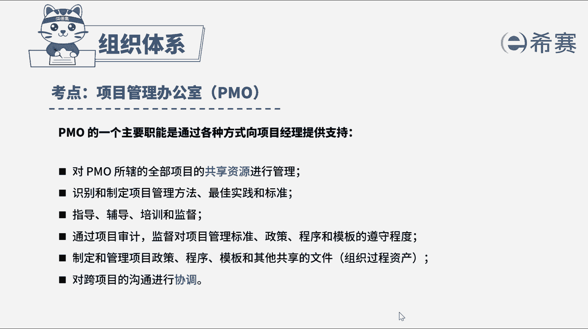

# （24年PMP）pmp项目管理考试零基础刷题视频教程-200道模拟题 - P20：20 - 冬x溪 - BV1S14y1U7Ce

一家总部位于亚洲的全球性跨国公司，中标了一个欧洲某国的一个项目，该项目被分配给总部公司的一个项目团队，负责，该项目团队在出发欧洲前去咨询，项目管理办公室，pmo，项目管理办公室可以提供一下哪些支持。

选三项，a在该国开展项目的最佳实践，b提供该国的当地习俗文化法律的培训，c提供类似项目的项目管理计划模板，d提供该项目的风险登记册，好，我们读完题目来看一下题干关键词，要管理一个欧洲的项目。

为项目管理办公室可以提供什么支持，项目管理办公室，pm是对与项目相关的治理过程进行标准化，并促进资源方法论，工具和技术共享的一个组织机构，它分为支持性，控制性，指令性po，对项目的支持。

体现在对pm所辖的全部项目的共享资源，进行管理，识别和制定项目管理方法，最佳实践和标准，提供指导辅导，培训和监督，通过项目审计监督对项目管理标准，政策程序和模板的遵守程度，制定和管理项目政策程序。

模板和其他共享的文件，对跨项目的沟通进行协调，因此本题的正确选项是abc选项，再看一下其他选项，选项d项目的风险登记册，是项目经理根据该项目的特点一一识别出来的，具有特殊性，因此片模无法提供该文件。

并不太对，我们这道题就先讲解到这里。

可以自行参考一下相关的文字解析。

整个题目讲解下来，我们可以知道本题的考察知识点。

