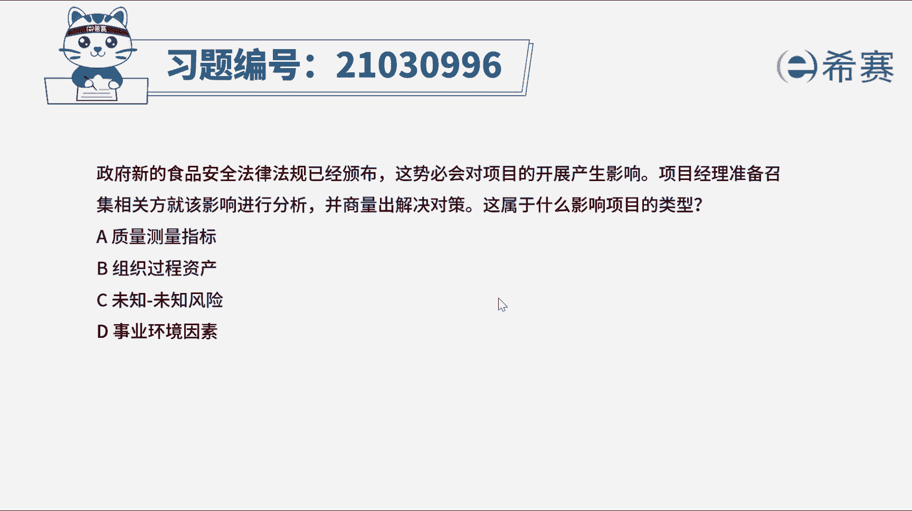
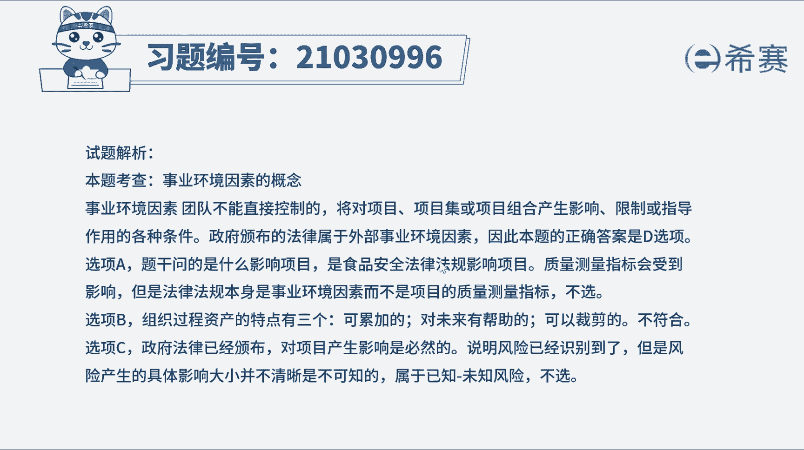
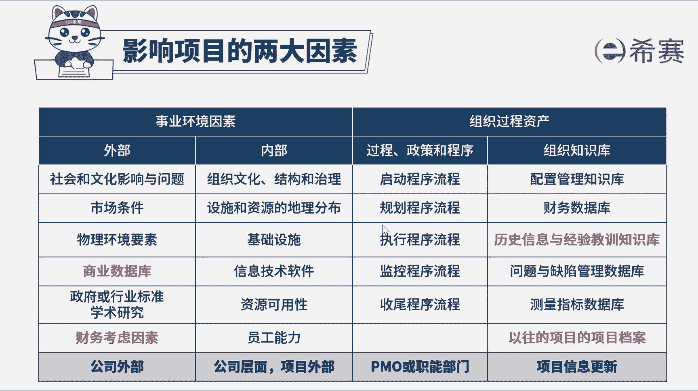

# （24年PMP）pmp项目管理考试零基础刷题视频教程-200道模拟题 - P22：22 - 冬x溪 - BV1S14y1U7Ce

政府新的食品安全法律法规已经颁布，这势必会对项目的开展产生影响，项目经理准备召集相关方案，就该影响进行分析并商量出解决对策，这属于什么影响项目的类型，a质量测量指标，b组织过程资产。

c位置位置风险b事业环境因素，这个题干信息比较简短，我们直接看关键词，题干问新的食品安全法律法规，属于影响项目的什么因素，项目所处的环境，可能对项目的开展产生有利或不利的影响。

那这些影响我们主要把它分为两个主要来源，一个是事业环境因素，还有一个是组织过程资产，事业环境因素是指项目团队不能控制的，但又会对项目产生影响，限制或指令作用，而组织过程资产是执行组织所特有的。

并且能够使用到的，比如一些计划程序或知识库或者是过程等等，也将影响对具体项目的管理，在题干中说的是食品安全，法律法规是政府颁布的，项目团队他就无法掌控，当然对项目也会产生影响和限制啊。

所以它属于事业环境因素，本题正确答案选d选项，那固然b选项就不对，接下来我们也分析一下其他选项，选项a质量测量指标，新的食品安全法律法规，会影响项目的质量测量指标，但这条法律法规本身。

并不是这个项目的质量测量指标，所以a排除选项c位置位置分线，这条法律法规已经颁布了，也知道他会对项目产生影响，既然能识别到这个风险，说明它不属于位置位置风险，而属于已知未知风险。

关于风险那一章节第11章会讲到，因此c选项不正确，好了。

那几道题我们就先讲解到这里，大家可以自行参考一下相关的文字解析。

整个题目讲解下来，我们可以知道本题的考察知识点，就是事业环境因素的概念，要正确区分。

