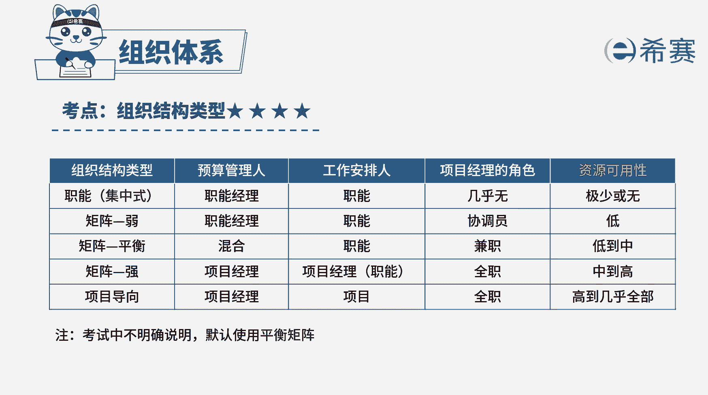

# （24年PMP）pmp项目管理考试零基础刷题视频教程-200道模拟题 - P24：24 - 冬x溪 - BV1S14y1U7Ce

项目经理带领团队正在进行一个质改。

项目项目经理和职能经理，对资源有着一定调配权，完成一个阶段的任务后，对于后续工作任务的取舍，职能经理具有最终决定权，这描述的是哪种组织类型，a不举证b强矩阵d平衡型矩阵d职能型好，读完题目。

我们找到题干中的关键词，项目经理和职能经理对资源都有着一定调配权，但职能经理拥有最终决定权，问这是什么，组织结构类型，组织结构类型有多种，它们主要区别在于权力的大小，以及对资源进行支配的权限大小。

选项a弱矩阵中，职能经理比项目经理权力大，对资源完全拥有支配权，项目经理充当协调员的角色，职能经理是项目预算管理者，选项b强举证中，项目经理权利比职能经理权力大，对资源完全具有支配权。

项目经理是项目预算的管理者，平衡矩阵中，职能经理与项目经理权力大小相同，对于资源的调配往往是共同协商处理，共同管理项目预算，选项d职能型职能经理权力大，对资源完全具有支配权，几乎不存在项目经理这个角色。

职能经理是项目预算管理者，本题中资源的调配最终由职能经理做决定，说明职能经理的权利比项目经理大，所以bc不合适，而在职能型组织中，几乎没有项目经理的存在，但此题题干中项目经理也有一定的权限。

所以题干描述更符合弱矩阵的组织结构特点，本题的正确答案是选项a若矩阵好了，我们此题就先讲解到这里，大家可以自行参考一下相关的文字解析，整个题目讲解下来，我们可以知道，本题考察的知识点。

就是几种组织结构类型的区分，可以通过权力的大小，对资源的支配权。

