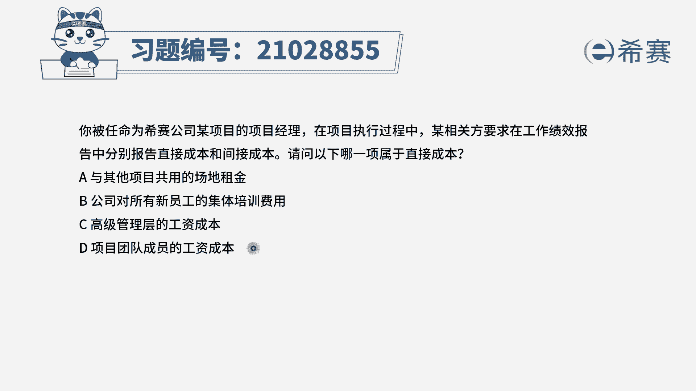
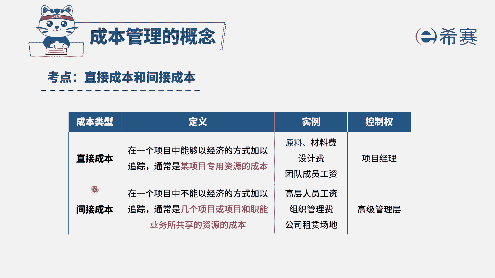

# （24年PMP）pmp项目管理考试零基础刷题视频教程-200道模拟题 - P31：31 - 冬x溪 - BV1S14y1U7Ce

已被任命为西塞公司某项目的项目经理，在项目执行过程中，我向官方要求，在工作绩效报告中，分别报告直接成本和间接成本，请问以下哪一项属于直接成本选项，a与其他项目共用的场地租金选项。

b公司对所有新员工的集体培训费用选项，c高级管理层的工资成本选项，d项目团队成员的工资成本。

我们先回顾一下直接成本和间接成本的区别，我们直接看关键词，直接成本通常是指项目的专用资源成本，比如说你项目的一个材料费，原料费，你项目的设计费，团队成员的工资，那么它的控制权是直接掌握在项目经理手中。

它是属于项目的直接成本，而项目的间接成本呢，它通常是几个项目或者项目和职能业务，所共享的资源的成本，比如说你高级层的一个工资，它不能全部算到你项目中吧，还有你组织的一个管理费，你公司租了一个场地诶。

今天我来用一下，明天那个项目用一下，那么这个钱能直接只算到你项目中吗，当然是不可以的，那么这种类型的成本我们就叫做间接成本。

在了解完之后，我们再回过头来看题目，提高问的是哪一项属于直接成本，我们刚刚说了，直接成本是指可以直接算到项目内的，那么是不是只有d选项是属于直接成本，其他几个选项，不管是跟其他项目共用的一个场地租金。

还是所有成员的一个培训费用，以及高级管理层的工资成本，都是属于项目的间接成本，因此这一题选择d选项。

