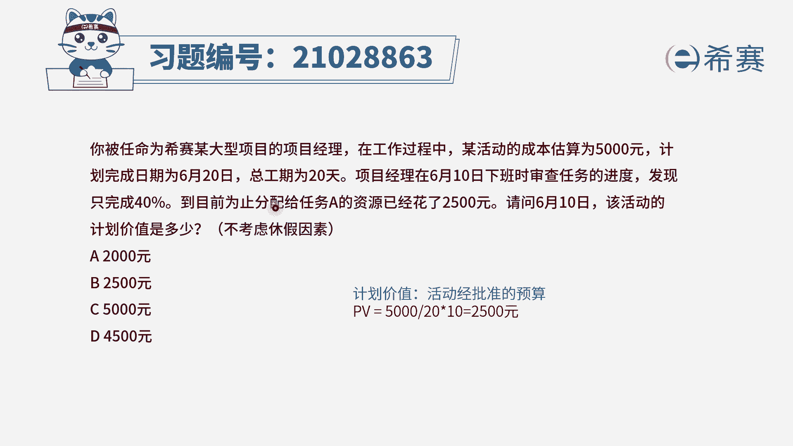
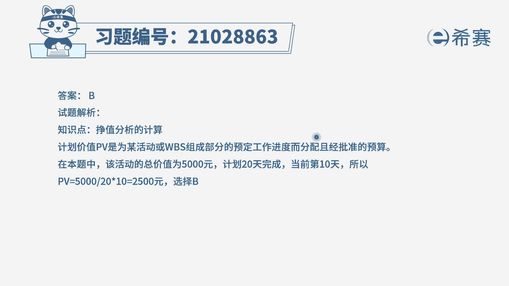
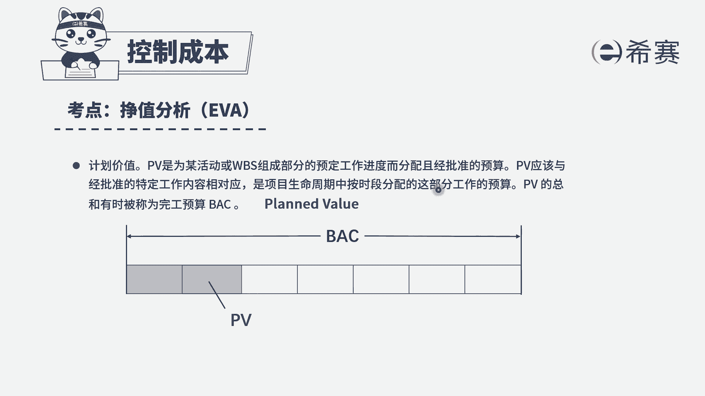

# （24年PMP）pmp项目管理考试零基础刷题视频教程-200道模拟题 - P32：32 - 冬x溪 - BV1S14y1U7Ce

已被任命为西塞某大型项目的项目经理，在工作过程中，某活动的成本估算为5000元，计划完成日期为6月20日，总工期为20天，项目经理在6月十日下班时，审查任务的进度，发现只完成40%，到目前为止。

分配给任务a的资源已经花了2500元，请问6月十日该活动的计划价值是多少，不考虑休假因素，选项a2000 元选项，b2500 元选项c5000 元选项d4500 元，好读完题。

先注意一下他问的到底是什么，问的是计划价值，什么是计划价值，计划价值，它指的是你一个活动批准的预算是多少，他跟你实际花费了多少钱，也就是它的一个实际成本是没有关系的，我们只看他计划是多少。

那么看一下题干说，这个活动它的成本估算是5000元，说明我们计划要花5000元，那么你选5000吗，当然不是，不仅仅要看它的总的一个计划价值，我们还要看一下题干的时间节点，现在问的是6月十日。

那么题干说了，这个计划完成的总时间是6月20，总工期20天，那么说明一到10号的时候才做了一半，原计划我们在十天的时候应该是完成一半，这个时候一半的成本估算是不是5000÷2，所以是2500。

因此在6月十日时完成一半时，这个活动，它的计划价值等于5000÷20x10，这个是天数，相当于是一半等于2500，选择b选项，再强调一点，计划价值，他跟你实际的完成了多少。

以及实际花了多少钱是没有关系的。

好大家可以看一下解析部分。

