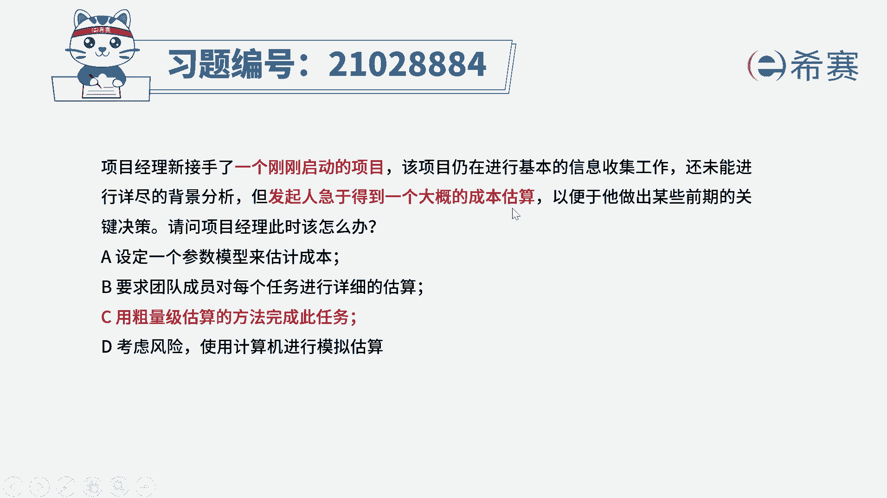
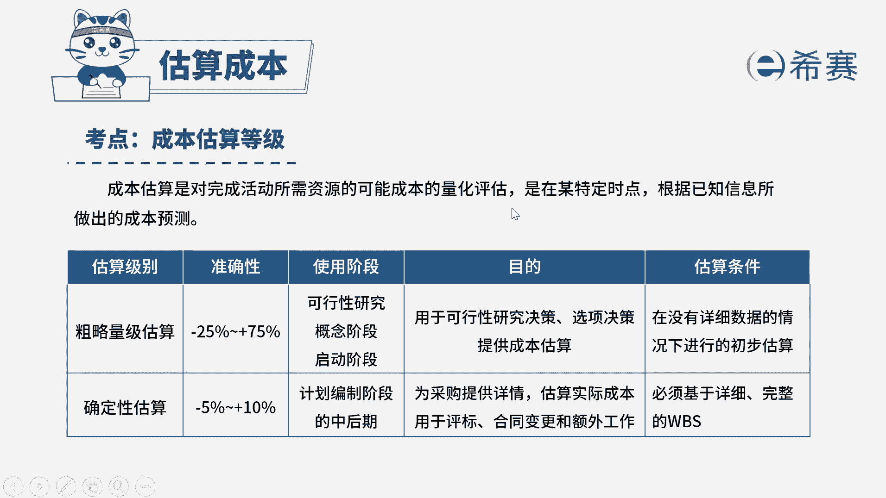

# （24年PMP）pmp项目管理考试零基础刷题视频教程-200道模拟题 - P33：33 - 冬x溪 - BV1S14y1U7Ce

项目经理新接手了一个刚刚启动的项目，该项目仍然在进行基本的信息收集工作，还未能进行详尽的背景分析，但发起人急于得到一个大概的成本估算，以便于他做出某些前期的关键决策，请问项目经理此时应该怎么办。

选项a设定一个参数模型来估算成本，选项b，要求团队成员对每个任务进行详细的估算，选项c用粗量级估算的方法完成此任务，选项d考虑风险，使用计算机进行模拟估算，没问题，我们先来看题干的关键词。

现在是不是一个刚刚启动的项目，并且发起人他要求你得到一个大概的成本估算，那么在这种情况下，我们既要快速的进行估算，并且他也没有要求一个准确度，这种情况下可以使用粗略量级的收集方法，进行一个成本的估算。

因此c选项是符合题意的，粗略量及物算，它是适用于早期我们信息不足的时候使用的，它的准确性比较低，但是它可以用于你早期，比如说可行性研究启动阶段的一些关键决策，是符合题干说的，做出某些前期的关键决策。

这一点的，再来看一下其他选项，a选项设定一个参数模型来估计成本，题干说了，这是一个刚刚启动的项目，能够收集到的信息是有限的，但是参数模型它要求你能够收集到历史的数据，并且有一个成熟的参数模型。

但这个题干中是没有体现的，再来看b选项，要求团队成员对每个任务进行详细的估计，他是不是跟题干说的，大概的成本估算是冲突的呀，并且你这个项目刚刚启动，你还在进行基本的信息收集。

而b选项是基于每个任务进行详细的估算，我们现在有什么任务都不一定清楚呢，所以b选项是不合适的，最后看一下d选项，考虑风险，使用计算机进行模拟估算，模拟它是基于不同的活动假设，制约因素。

基于不同的风险问题或者情境，我们使用概率分布和不确定性，这种方式计算出的是多种可能性，它的最终结果是一个概率分布，像一条曲线图，比如说20%的概率需要多久，30%的概率需要多久。

因此它并不能给出一个固定的成本估算的结论，并且它确实也不符合咱们说的，早期快速估算的特点，因此综合分析下来，最符合题意的选项就是c选项。

大家可以看一下文字解析，本题考察的是项目成本管理。

