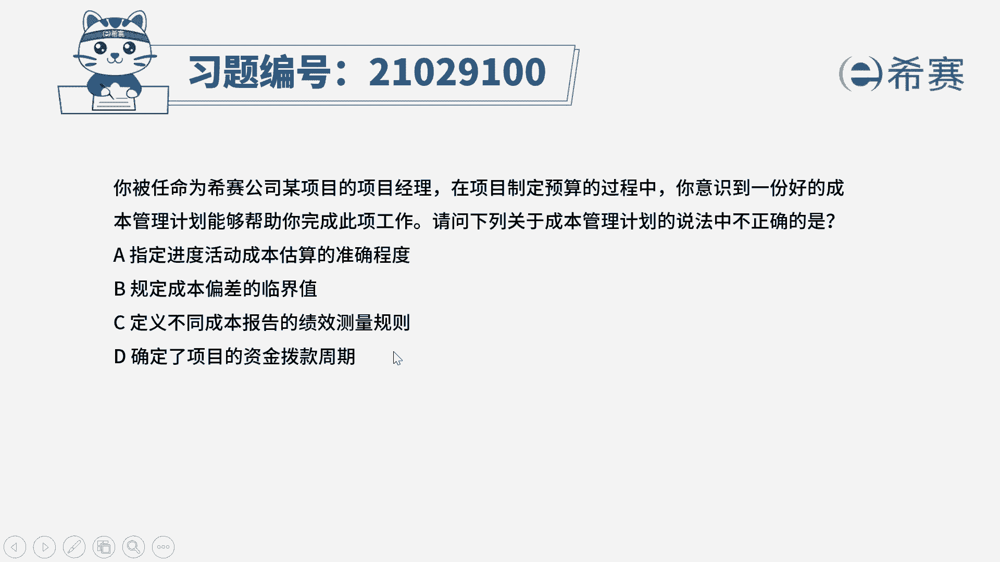

# （24年PMP）pmp项目管理考试零基础刷题视频教程-200道模拟题 - P38：38 - 冬x溪 - BV1S14y1U7Ce

已被任命为西塞公司某项目的项目经理，在项目制定预算的过程中，你意识到一份好的成本管理计划，能够帮助你完成此项工作，请问下列关于成本管理计划的说法中，不正确的是选项a，指定进度活动成本估算的准确程度。

选项d，规定成本偏差的临界值，选项c，定义不同成本报告的绩效测量规则，选项d确定了项目的资金拨款周期。

读完题，我们来简单的回顾一下成本管理计划的内容，成本管理计划，它是项目管理计划的一个组成部分，它主要是针对成本如何进行管理，给出了一个指南，比如说计量单位到底是人民币还是美元呢，精确度准确程度。

比如说精确到小数点后几位，它还包括一些控制的临界值，比如说有的小项目1万块钱就算很大的偏差，有些大的项目可能10万块钱偏差也是很小，那么到底本项目的一个偏差控制值是多少，它是成本管理计划给出的。

其中还有一些绩效的测量规则，报告的格式等等，我们可以看到，不管是规则格式单位等等，这些东西，他们都是像说明书一样的东西，对不对，有同学问老师，这些东西我们都要记下来吗，当然是不需要的考试他会怎么考察。

他会考察你能不能区分清楚，管理计划和基准的区别，为什么这个计划叫做成本管理计划，因为成本管理计划是告诉我们如何去管理成本，而不是告诉我们这个项目可能要花多少钱，所以里面是没有具体的一些资金相关的数值的。

再回过头来看一下题目，他问的是不是成本计划中说法不正确的，是就是不包含哪一项，哪一项是错误的，看到a选项准确程度，b选项成本偏差的临界值和，c选项绩效的测量规则，这三者都是指男性的一些标准。

只有d选项确定资金的拨款周期，它是实际的一个资金需求，因此d选项它并不是成本管理计划中的内容，我们选择d选项。

