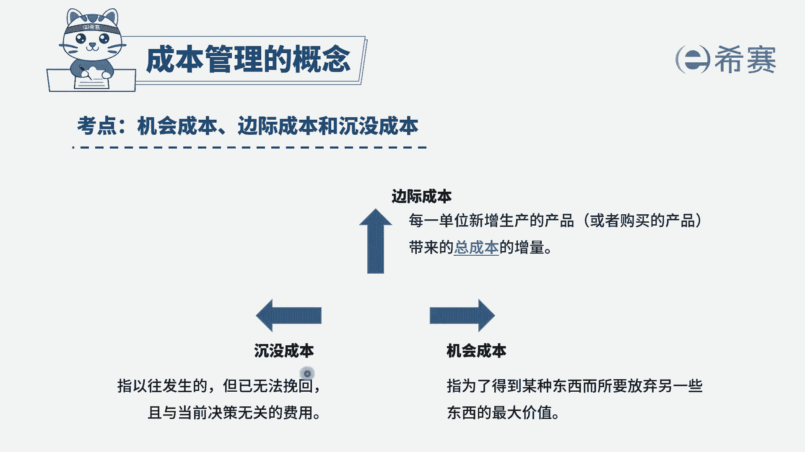

# （24年PMP）pmp项目管理考试零基础刷题视频教程-200道模拟题 - P39：39 - 冬x溪 - BV1S14y1U7Ce

项目已经完成95%，这时候因为意外需要追加50万资金，对此项目发起人和高级管理层进行了评估，截至目前，项目已经花费累计300万，最终他们决定终止项目，请问发起人和高级管理层。

做出此决定的原因可能是选项a，此时实际成本为项目的机会成本选项b，此时实际成本为项目管理储备的一部分，选项c，此时实际成本为项目的可变成本选项d，此事管理层决定不考虑沉没成本，我们先来看题干的关键词。

是不是经过评估，发现项目已经实际花费了300万，最终发起人和高级管理层决定终止项目，那么他们做出这个终止项目的原因，可能是什么呢，项目是不是已经花了300万，我们把这300万定义成什么了。

看一下几个选项，a选项，他把此时的300万实际成本，定义为项目的机会成本，机会成本是指我们为了得到某种东西而放弃的，另一些东西的最大价值，并没有说是因为我们选择了另一个项目，题案没有信息体现，对不对。

而b选项，此时实际成本为项目管理储备的一部分，现在项目已经被终止了，之前的花费的所有的成本，是不是都是不可挽回了，因此它并不能作为管理储备的一部分，再看c选项，此时实际成本为项目的可变成本。

可变成本是指数额可以发生改变的成本，而现在项目已经被终止了，你花费的这些钱是没有办法挽回的，因此肯定不能说，现在已经花费的成本是一个可变成本，最后看一下d选项，此时管理层决定不考虑沉没成本。

什么是沉没成本，沉没成本是指已经发生了，但是无法挽回的，与当前决策无关的费用，相当于说我们已经花了300万，但是你如果一旦终止项目，你前面300万是不是白花了，因此这300万我们把它定义成是沉没成本。

管理层他决定去终止这个项目，就说明他不再考虑我花费了这300万，花了就花了，因此这一题我们选择d选项。

大家可以看一下文字解析部分。

本题考察的是成本管理，成本的分类。

