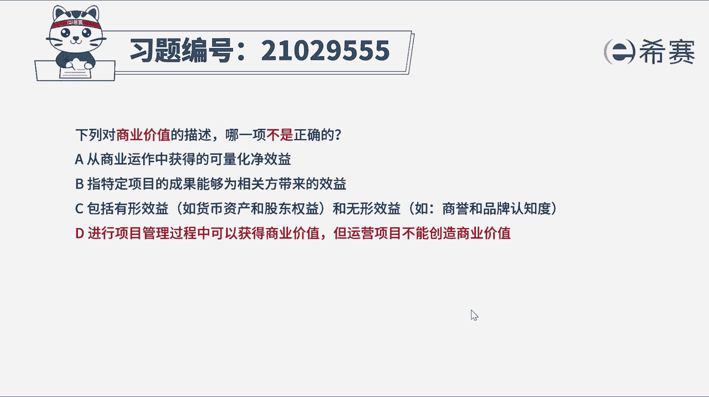
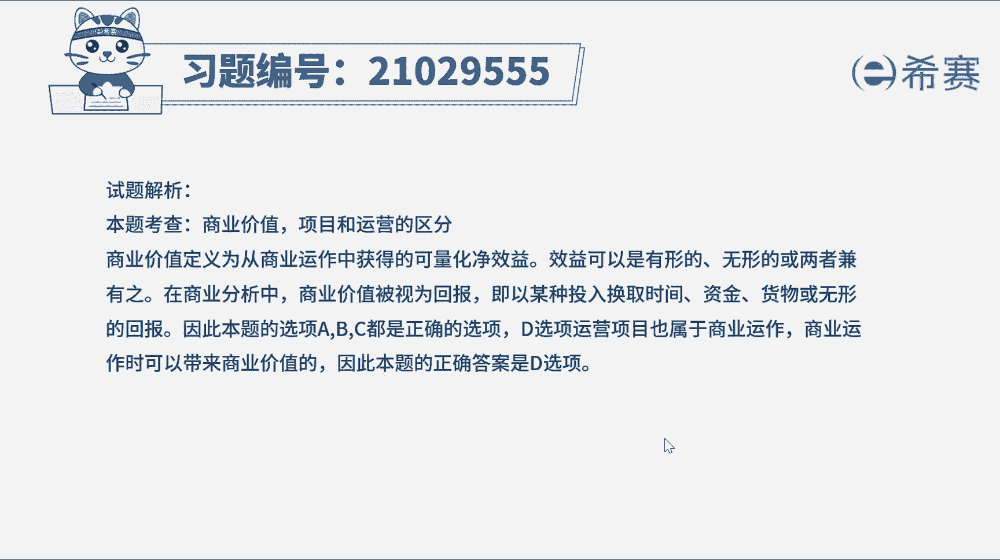
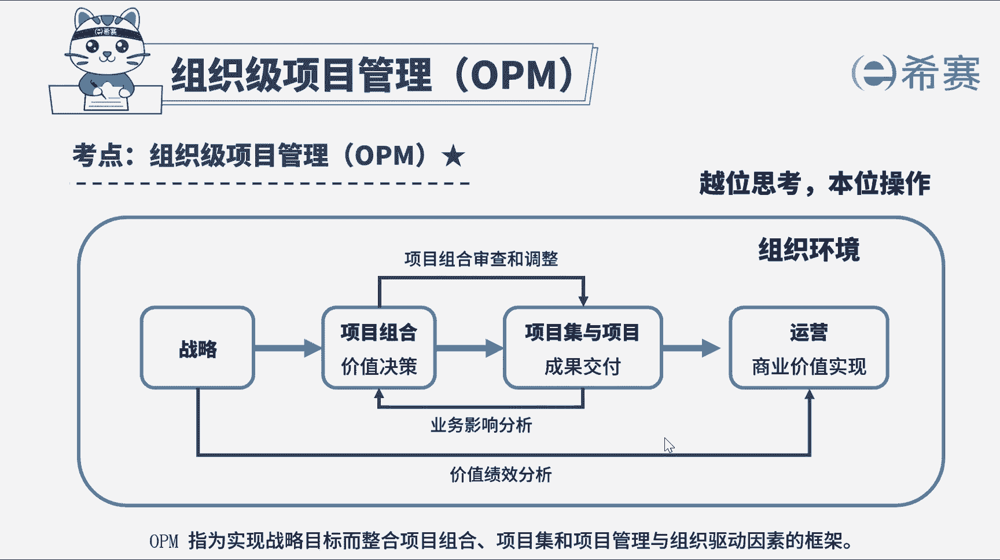

# （24年PMP）pmp项目管理考试零基础刷题视频教程-200道模拟题 - P3：3 - 冬x溪 - BV1S14y1U7Ce

在你对商业价值的描述，哪一项不是正确的，a从商业运作中获得可量化净收益，b指特定项目的成果能够为相关方带来的效益，c包括有形效益，如货币资产和股东权益和无形效益，如山芋和品牌认知度。

d进行项目管理过程中可以获得商业价值，但运营项目不能创造商业价值，这个题目描述很简单，问商业价值的理解哪个不正确，pmi加商业价值定义为，从商业运作中获得的可量化净收益，项目的商业价值指特定项目的成果。

能够为相关方带来的效益，效益可以是有形的，无形的或两者皆有之，在商业分析中，商业价值被视为回报，即以某种投入换取时间资金，货物或无形的回报，因此a b c的选项描述都是正确的，再来看一下d选项。

为什么错误，项目运营阶段也属于商业运作过程，因此也可以创造商业价值，那本题的答案选不正确的，所以正确答案就选d选项，a b c都属于描述正确的，大家做题的时候不要看错题目好了。

我们此题就先讲解到这里，大家可以自行参考一下相关的文字解析。

整个题目讲解下来，我们可以知道。

本题考察的知识点。