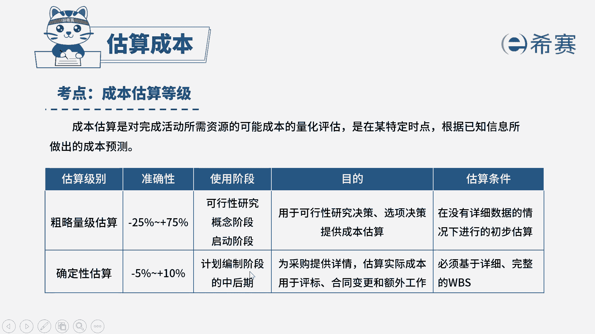

# （24年PMP）pmp项目管理考试零基础刷题视频教程-200道模拟题 - P42：42 - 冬x溪 - BV1S14y1U7Ce

一家大型it公司的项目经理，刚收为一个复杂的软件项目，此时项目经理又接手了一个类似的项目，该项目来自一个合作了很多次的大客户，当前该项目的w bs已完成，ceo需要知道项目的成本是多少。

又要给ceo一个准确的金额，项目经理应该使用什么估算等级，选项a确定性估算选项，b抽象估算选项，c粗略量级估算选项d参数估算，我们先来看一下问法，题目问的是项目经理使用的是什么估算等级。

那么在我们当前教材版本中，估算等级是分为两种的，分别是确定性估算和粗略量级估算，因此我们会排除bd选项，b选项抽象估算是完全没有这种说法的，而d选项参数估算它不属于估算等级，它是一个具体的估算工具。

好我们再来回顾一下这两个估算等级。

它们之间的一些区别，粗略量级估算其实就是字面意思，它肯定是粗略的，它是在我们早期的时候用到的，如果没有详细的数据，我们可以进行一个初步的估算，而确定性扩散，它已经是基于详细的w bs去进行估算。

它是必须要处在计划编制的一个中后期。

那么回过头看一下题干，现在是不是w b s已完成，并且我们需要给的是一个准确的金额，而不是粗略的，所以是完美对应确定性估算的选择。

