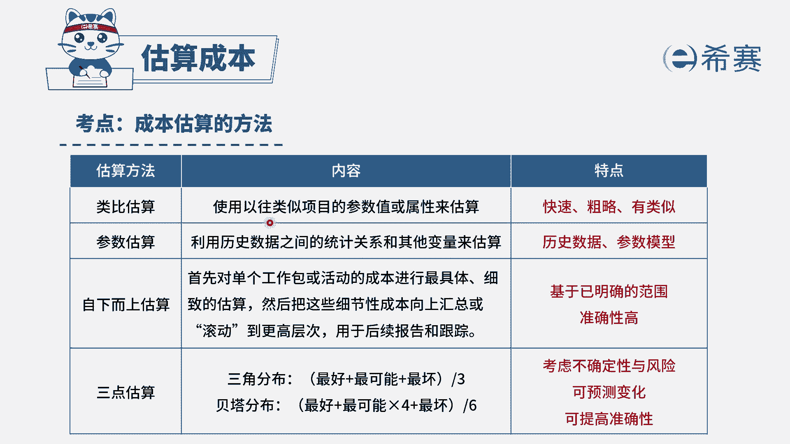

# （24年PMP）pmp项目管理考试零基础刷题视频教程-200道模拟题 - P43：43 - 冬x溪 - BV1S14y1U7Ce

已被任命为西在某大型项目的项目经理，相关方要求你提供尽可能准确的成本估算，项目经理应该使用什么技术来进行估算，选项a类比估算选项b，三点估算选项c自下而上估算选项d参数估算，这题的关键词。

是不是就是要提供尽可能准确的成本估算，哪一类成本估算是比较准确的呢，对应的是自下而上估算，因为我们是从最底层的工作包开始，一步一步的向上滚动，是基于我们现有的一个准确的范围，因此它的准确度是非常高的。

这题选择c选项，再简单看一下其他几个选项，a选项类比估算，他是我们早期的时候，参照一些以前做过的类似的项目，进行了一个粗略快速的估算，b选项三点估算是基于不确定性和风险，我们才使用三点估算。

最后d选项它是基于历史数据和参数模型，参数估算的准确性，是取决于你的历史数据是不是准确的，以及你的模型是否使用的恰当，因此这一题答案为c选项，大家可以看一下文字解析。

