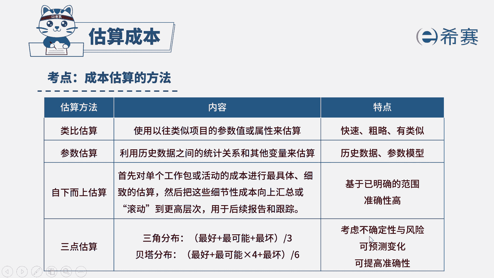

# （24年PMP）pmp项目管理考试零基础刷题视频教程-200道模拟题 - P45：45 - 冬x溪 - BV1S14y1U7Ce

已被任命为西塞某大型项目的项目经理，该项目的事业环境因素，正在快速且持续地发生变化，你应该使用下列哪一项来完成项目的成本估算，选项a因果图选项b，三点估算选项c成本效益分析选项d，自下而上估算。

读完题我们可以找到题干的关键词，该项目的事业环境因素，正在快速且持续地发生变化，事业环境因素它是属于客观存在的，我们必须遵守的，因此肯定会被他影响到，现在问在这种情况下，应该如何去完成项目的成本估算。

由于事业环境因素一直在变化，那么说明这个项目，它就具有一个极高的不确定性，对应的成本估算方法是三点估算，三点估算它是考虑到了不确定性与风险，可以预测变化，可以提高预测的准确性。

因此四个选项中b选项是最符合题意的，再来看一下其他选项，现在看a选项，因果图，因果图是发生问题后，我们如果要找原因的话，可以使用因果图是一种数据的表现形式，但是现在题干问的是你如何去完成成本估算。

a选项是属于干扰选项，再来看c选项，成本效益分析，成本效益分析是考虑投入和效益比，跟题干的关联性也不大，最后d选项自下而上估算，它是必须要基于一个明确的范围分解来做估算。

你现在项目受到事业环境因素的影响，并且不断的在变化，那么不确定性是过大的，因此d选项自下而上估算不太合适，综合分析下来，我们应该选择b选项。

大家可以看一下文字解析。

本题考察的知识点是项目成本管理，估算成本时我们使用到三点估算法。

