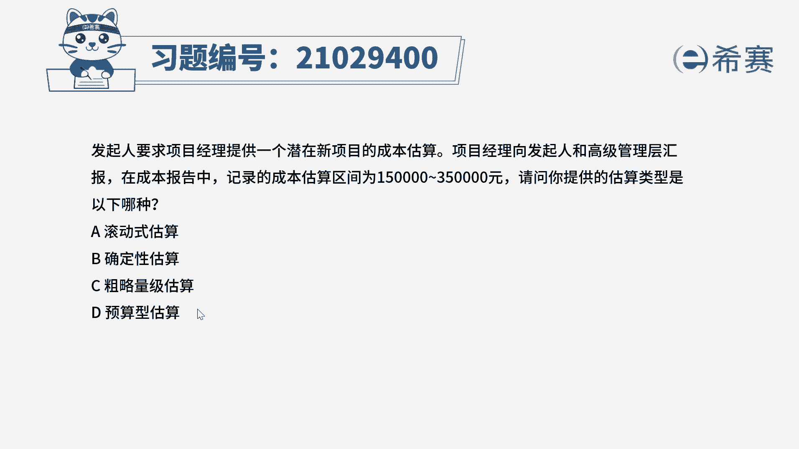
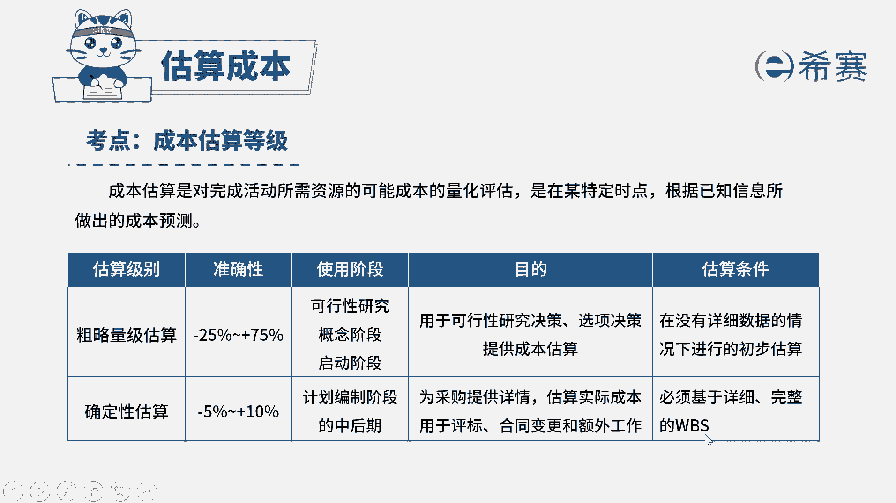
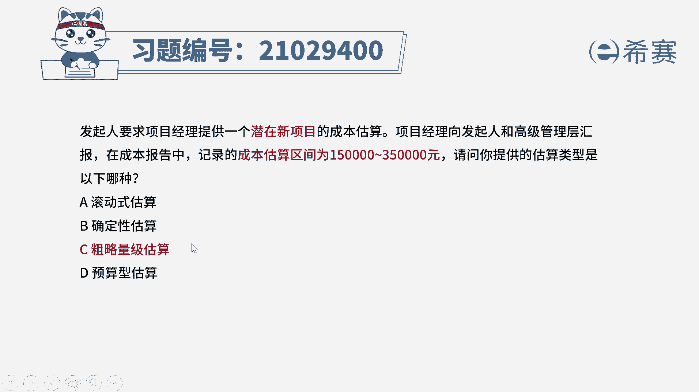
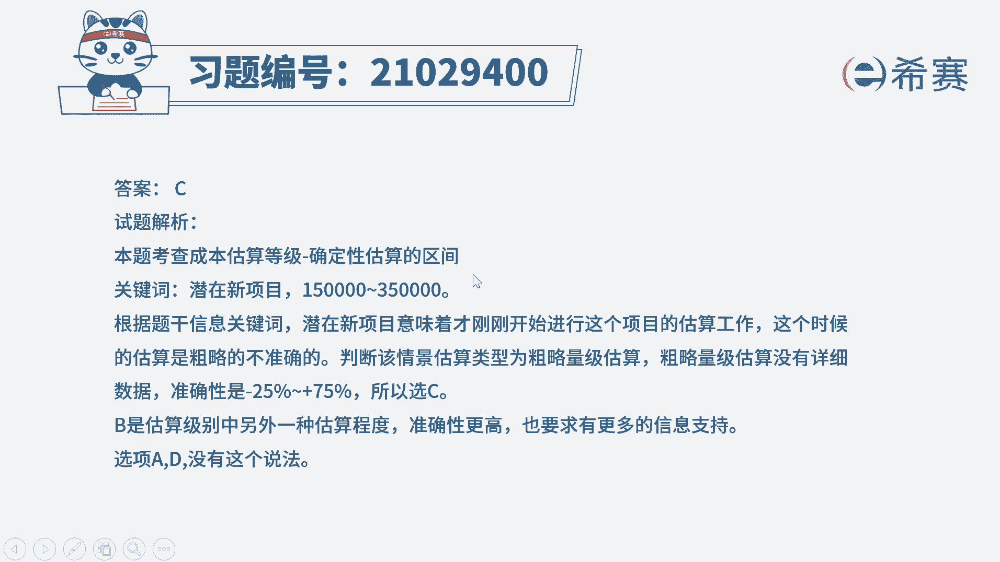

# （24年PMP）pmp项目管理考试零基础刷题视频教程-200道模拟题 - P46：46 - 冬x溪 - BV1S14y1U7Ce

发起人要求项目经理提供一个潜在的新项目，的成本估算，项目经理向发起人和高级管理层汇报，在成本报告中记录的成本，估算区间为15万~35万元，请问你提供的估算类型是以下哪种选项，a滚动式估算选项，b。

确定进行估算，选项c粗略量级估算选项d预算型估算，我们简单看一下题目，首先可以排除掉d选项，a选项滚动式估算，它是指循序渐进的一个渐进明细的进行估算，在题干中没有体现出这样一个渐进明细。

那么d选项预算性估算，在我们现在使用的教材版本中。

已经没有预算性估算这说法了，我们来回顾一下在现行的考试版本中，成本的估算等级是分为两种的，一个是粗略量级估算，粗略量级估算它的准确性较低，在-25%到正75%之间，当然这个也不是绝对的。

我们主要是看它的一个使用阶段，它是在可行性研究概念阶段启动阶段，我们可以看到这三个是不是都是属于一个早期，他的目的只是为了提供一个大概的估算，去做一些重要的决策，因此它是在没有详细数据的时候。

我们早期进行了一个初步估算，再来看确定性估算，那么它的误差就会比较小，在负的5%到正的10%之间，它使用的阶段是计划编制的中后期，也就是你范围已经估算出来了，我们可以明确知道要做哪些东西。

对应的就可以估算出需要花多少钱，因此它必须要基于详细完整的w b s。

这是这两种的区别，那么回到这个题目中，我们看到这是一个潜在的新项目，潜在的说明还没有正式开始做，它是属于一个可行性研究的，早期，对应的应该是我们刚刚讲到的粗略量级估算，因此这题选择c选项。

对于这个成本估算区间，大家也可以做一个参考，但是它并不是完全靠这个数据组定的，你看一下15万~35万，他们中间差多少，是不是差了20万呀，20万的误差相对于我们估算的这个15万，35万来说。

已经是非常大的误差了，所以它不可能是确定性估算，所以也只能考虑粗略量级估算。

因此这一题选择c选项。

