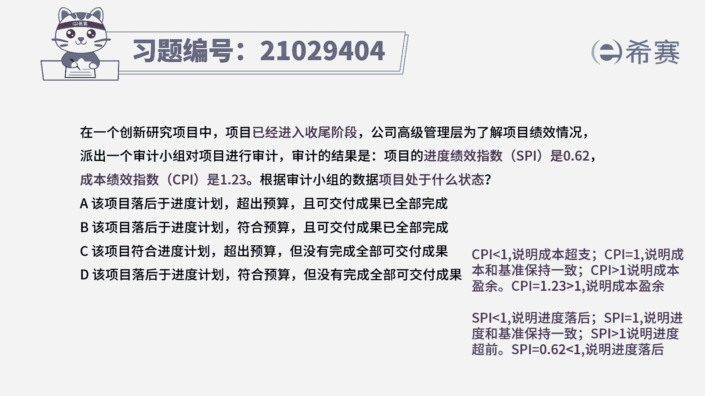
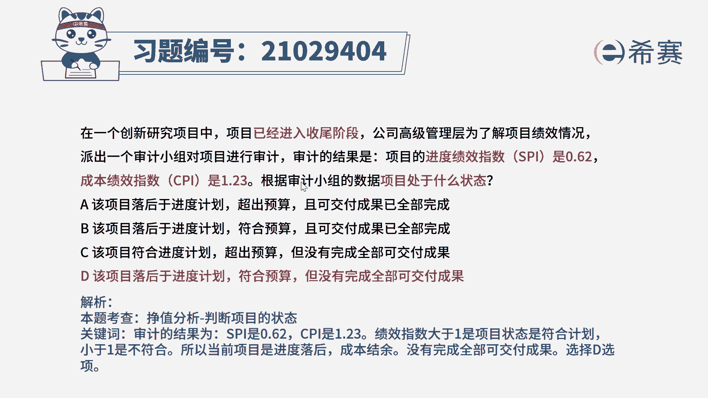
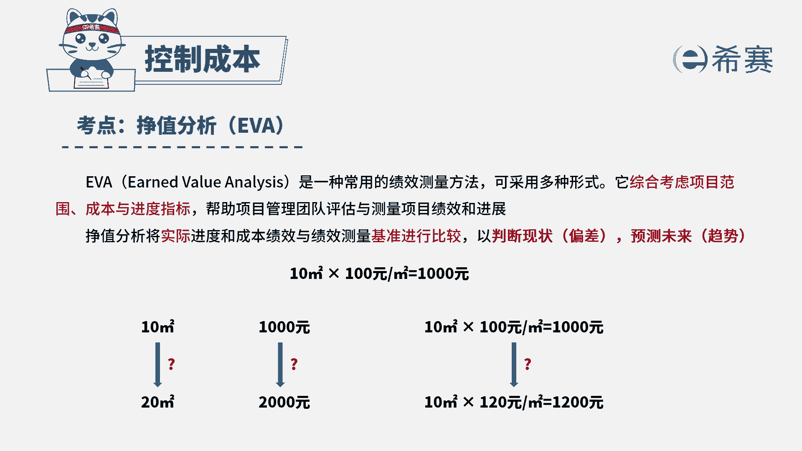

# （24年PMP）pmp项目管理考试零基础刷题视频教程-200道模拟题 - P48：48 - 冬x溪 - BV1S14y1U7Ce

在一个创新研究项目中，项目已经进入了收尾阶段，公司高级管理层为了了解项目的绩效情况，派出一个审计小组对项目进行审计，审计的结果是项目的进度绩效指数，s p i是0。62，成本绩效指数cpi是1。23。

根据审计小组的数据，项目处于什么状态，a该项目落后于进度计划，超出预算且可交付成果已经全部完成，b该项目落后于进度计划，符合预算且可交付成果已经全部完成，c该项目符合进度计划，超出预算。

但没有完成全部的可交付成果，第一该项目落后于进度计划，符合预算，但没有完成全部可交付成果，首先我们看到题干的关键词，项目已经进入了收尾阶段，且精度绩效指数spi是0。62，成本绩效指数cpi是1。23。

题目问项目处于什么样的状态，由成本绩效指数公式我们可以得知，当cpi小于一时，说明项目成本跟基准相比就是超支的，当cpi等于一时，说明成本和项目基准保持一致，当cpi大于一时。

说明项目成本与基准相比是盈余的，根据题干cpi等于1。23大于一，那么说明项目成本跟成本基准相比就是盈余的，同理由进度绩效指数公式，我们可以得知，当spi小于一时，说明项目进度跟进度基准相比是落后的。

当spi等于一时，说明项目进度和基准保持一致，当spi大于一时，说明进度与基准相比就是超前的，根据题干spi等于0。62小于一，那么说明项目进度跟进度基准相比是落后的，因此我们可以首先判断出。

项目的状态是落后于进度计划，且符合预算，已经进入了收尾阶段，还落后于进度。

那么说明目前没有完成全的可交付成果，因此本题的正确答案就是c选项，其他选项的描述都是与题干不相符的。

本题的考察点是成本管理，控制成本政治分析的内容，政治分析是将实际进度和成本绩效，与绩效测量基准进行比较。

