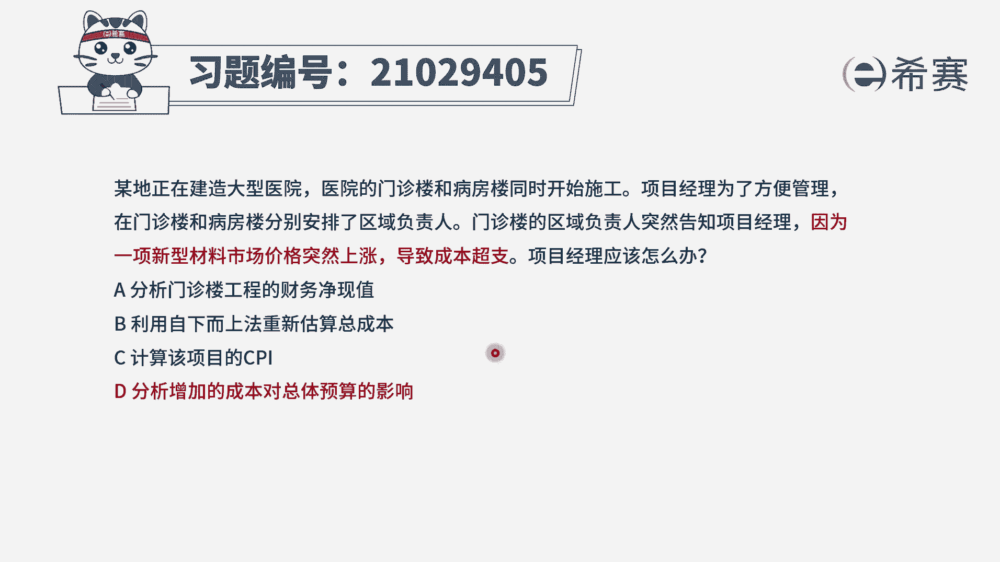
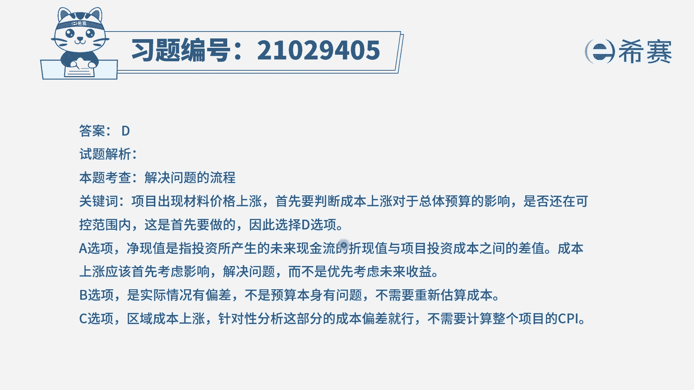
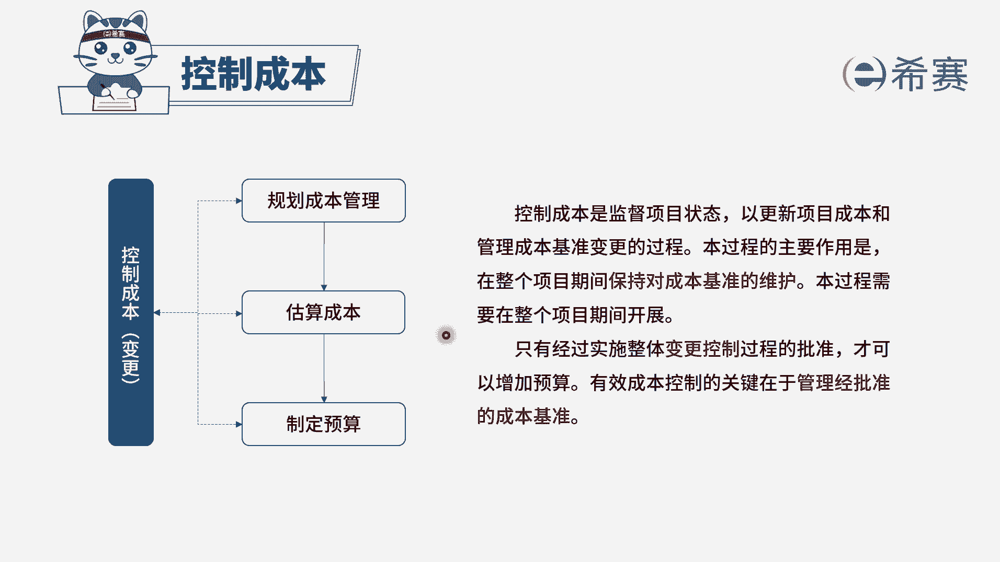

# （24年PMP）pmp项目管理考试零基础刷题视频教程-200道模拟题 - P49：49 - 冬x溪 - BV1S14y1U7Ce

某地正在建造大型医院，医院的门诊楼和病房楼同时开始施工，项目经理为了方便管理，在门诊楼和病房楼分别安排了区域负责人，门诊楼的区域负责人突然告知项目经理，因为一款新型材料市场价格突然上涨，导致成本超支。

项目经理应该怎么办，选项a分析门诊楼工程的财务净现值，选项b利用自下而上法重新估算总成本，选项c计算该项目的cpi选项d，分析增加的成本对总体预算的影响，我们先来看题干的问题。

我们是不是分成了两个部分进行施工，其中一个区域的负责人告知你，材料上涨导致成本超支，那么这种情况下应该要怎么做呢，那么成本它有一定的偏差，我们是不是要先考虑成本偏差，它对于项目总体的一个影响。

是不是还在可控的范围内，所以d选项是可选的，再来看一下其他选项，a选项分析门诊楼工程的财务净现值，前半句对象是正确的，但是财务净现值，净现值，它是指我们投资所产生的，未来的现金流的折现值。

和你的一个投资成本之间的差额，相当于是说我们会赚多少钱，你现在成本上涨肯定是考虑你现在的一个影响，有问题先解决问题，而不是考虑这个项目未来我们能赚多少钱，所以a选项它这个描述是不合适的。

b选项应用自下而上法重新估算，现在的问题已经很明确，就是材料上涨，我们不需要对整个项目进行一个重新的估算，最后看一下c选项，大家也是比较纠结的，计算该项目的cpi。

那么这个项目的cp i它是拿整个项目的成本，以及整个的时间花费去进行一个比较，现在只是一个区域的负责人给你报告，我们不需要花时间去计算整个项目的成本，绩效指数，因此综合分析下来，d选项会更加的合适。

我们来看一下解析部分。

本题考察的是项目成本管理。

