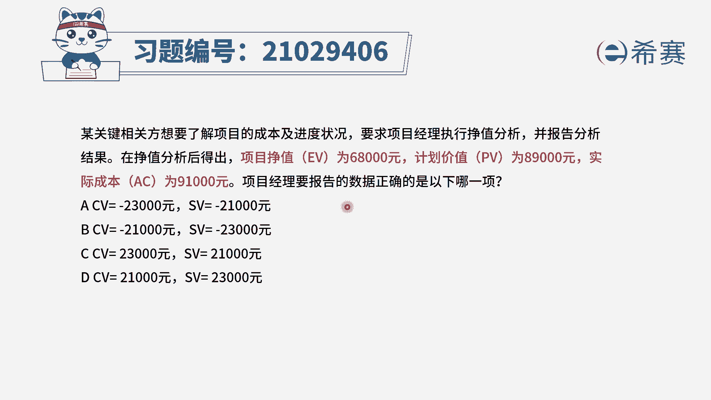
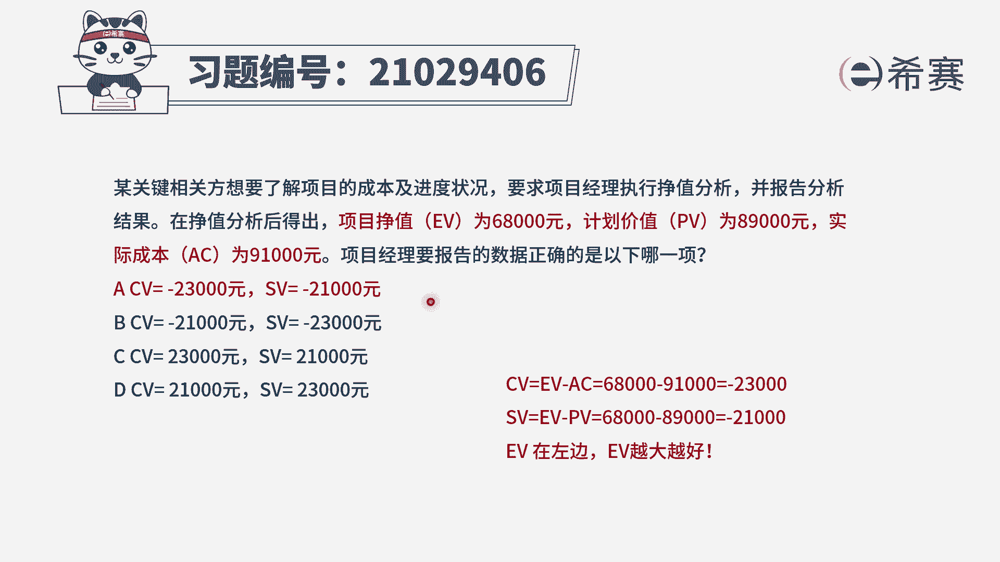
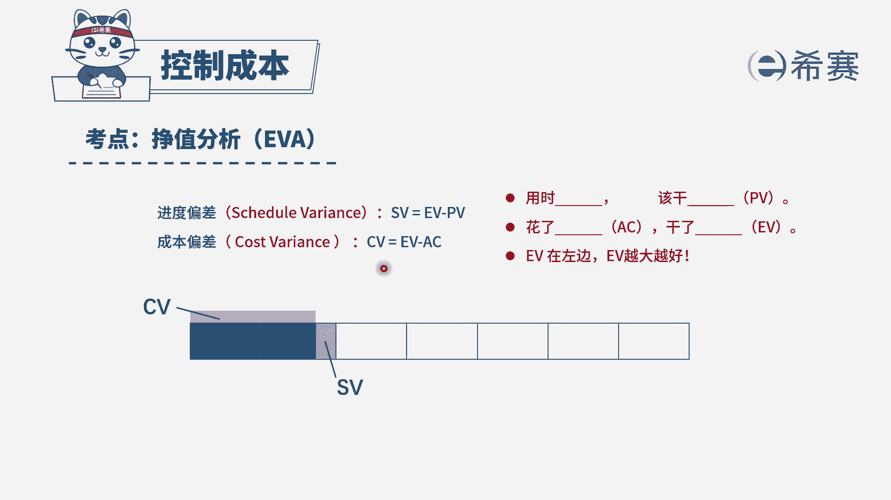

# （24年PMP）pmp项目管理考试零基础刷题视频教程-200道模拟题 - P50：50 - 冬x溪 - BV1S14y1U7Ce

某关键相关方想要了解项目的成本及进度状况，要求项目经理执行政治分析并报告分析结果，在政治分析后得出项目的政治ev为68000元，计划价值pv为89000元，实际成本ac为91000元。

项目经理要报个数据，正确的是以下哪一项，我们看一下四个选项，有同学可能觉得哎这个a c选项不是一样的吗，大家一定要注意这个数据之前是有负号的，一定要看清楚，那么具体我们就不再读了。

我们直接来算一下到底应该怎么做呢，现在题干是不是给出了ev pv和ac 3个数据，这时候就要求大家一定要记得公式。

我们来看一下计算公式，cd cd它指的是成本偏差，它是用正值减去实际成本，而sb是进度的偏差，它等于正值减去计划价值，这两个公式大家一定要记住，那么怎么容易记呢，记住下面这句话，ev在左边。

ev越大越好，因为ev它指的是正直，正直是我们实际做了多少东西，是不是做的越多越好，那么我们来计算一下cv成本偏差，是等于做了多少，减去实际花了多少，等于68000，减去91000，等于负的23000。

而suv进度偏差，他也是b在左边用实际做了多少减去，我们计划打算花多少，减去pv等于68000，减去89000，等于负的21000，所以在四个选项中，只有a选项是正确的。

大家可以看一下文字解析。

本题考察的是政治分析中。

