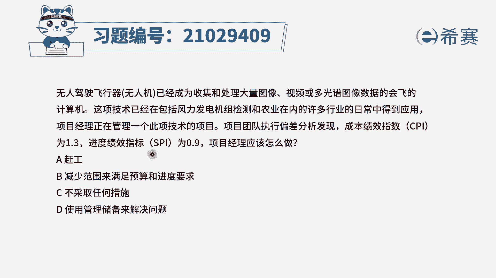
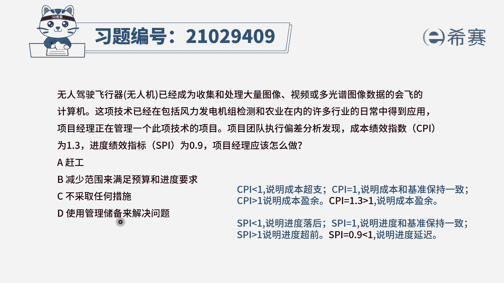
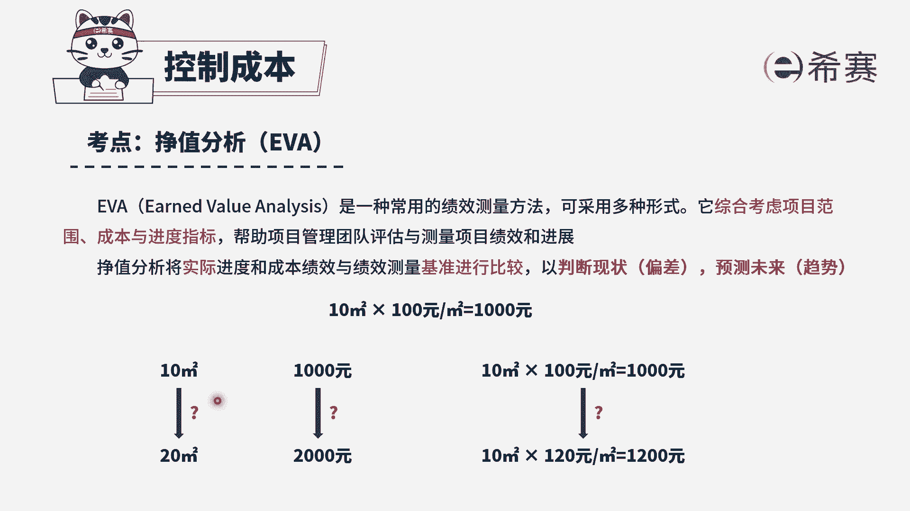

# （24年PMP）pmp项目管理考试零基础刷题视频教程-200道模拟题 - P51：51 - 冬x溪 - BV1S14y1U7Ce

无人驾驶飞行器，无人机已经成为收集和处理大量图像，视频或多光谱图像数据的会飞的计算机，这项技术已经在包括风力发电，机组，检测和农业在内的许多行业的日常中得到应用，项目经理正在管理一个此项技术的项目。

项目团队执行偏差分析时发现，成本绩效指数cpi为1。3，进度绩效指标s p i为0。9，项目经理应该怎么做，选项a赶工选项b，减少范围来满足预算和进度要求，选项c不采取任何措施。

选项d使用管理储备来解决问题，我们先来看一下题干的关键词，是不是成本绩效指数以及进度绩效指标，这两个数据给出来，我们需要去判断它的一个状态，并且对应的采取措施，我们先来回顾一下s spi和cpi的数据。

说明了什么，这个是大家需要记住的，cpi指的是成本绩效指数，我们说越大越好，它以一为分界限，如果小于一就是不好，说明我们钱花多了，成本超支，如果等于一，说明它和基准是保持一致的，按照计划来大于一。

越大越好，说明成本是有，剩下的是结余的，那么在这个题干中，cpi是1。3，是不是大于一，越大越好，因此这一题中成本是结余的，再来看进度，绩效指数，spi同样的是以一为界限，越大越好，进度如果越大的话。

说明我们进度是超前的，如果小于一，就说明进度是落后的，spi是0。9，0。9的话，说明它是进度落后的，那么综合判断下来，在这个题干中，项目的技巧是成本结余，而进度延后，那么进度延后我们需要去解决的话。

是不是要使用进度压缩工具，我们来看一下选项，只有a选项，赶工是进度压缩的工具，并且赶工是需要增加成本的，这里成本有结余，刚好是适合使用赶工的，再来看一下其他选项，b选项减少范围来满足预算和进度要求。

那么项目经理，他是无权直接去减少项目的范围的，因为涉及到了范围基准，c选项不采取任何措施，这肯定是不行的，现在已经是进度延后了，我们不应该不采取任何措施，没有体现项目经理的一个积极性。

最后d选项使用管理储备来解决问题，同样的项目经理他也没有权限，直接使用管理储备，应该走流程，获得管理储备的批准之后，然后才可以使用，所以综合分析下来。

这一题只有a选项是正确的，大家可以看一下文字解析。

