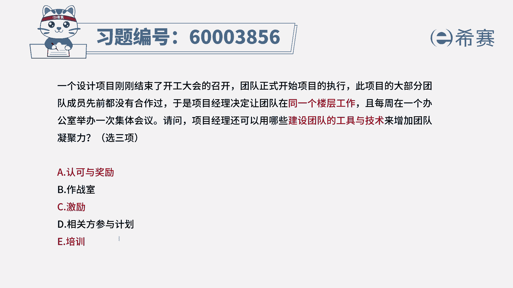
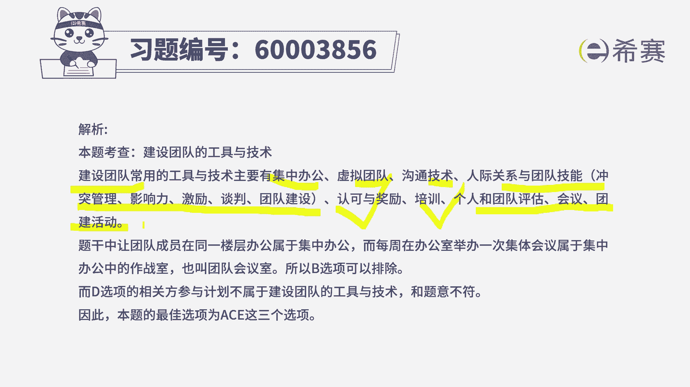

# （24年PMP）pmp项目管理考试零基础刷题视频教程-200道模拟题 - P52：52 - 冬x溪 - BV1S14y1U7Ce

一个设计项目刚刚结束了开工大会的召开，团队正式开始项目的执行，是项目的大部分团队成员先前都没有合作过，于是项目经理决定让团队在同一个楼层工作，且每周在一个办公室举行一次集体会议。

请问项目经理还可以用哪些团队建设的工，具与技术来增加团队的凝聚力，那么这其实说的是关于团建的这种，或者是建设团队的这样一些工具和技术对吧，他告诉你说要选三个选项，其中呢团队建设工具有很多。

包括像集中办公啊，然后像呃这种认可和奖励啊，激励啊，然后培训啊，然后是团建啊，这些方式都是可以的对吧，而其中首先他已经告诉我们在同一个楼层办公，并且是经常会举行这种集体会议。

所以关于作战室war room这一条就可以去除掉，因为这一条已经是写明了作战史，其实就是说我们在一站，一起去集中办公的这样一个意思啊，所以这一条可以去除掉，那么剩下里面调三项。

那认可和奖励肯定是其中的啦，然后激励团队成员，这肯定也是其中的了，然后培训呢也是其中的对吧，所以呢答案就是选a c e，至于相关方参与计划呢，它是属于相关方管理中的一部分。

而现在我们更多的是管理团队成员，相关方会是一个更大的，就是包括团队成员，也包括我的领导啊，客户啊，客户领导呀，供应商呢，还有用户群体等等，而关于团队成员管理的话呢。

更多是在资源管理这样一个知识领域的内容，所以d选项也不选，答案选a c e那关于团队建设的工具。

这里还有更多对吧，集中办公，虚拟团队沟通技术，人际交往技能啊，各种冲突，管理啊，影响力啊，团建啊，谈判啊，还有认可和奖励培训，然后呃评团队评估会议，团建活动。

