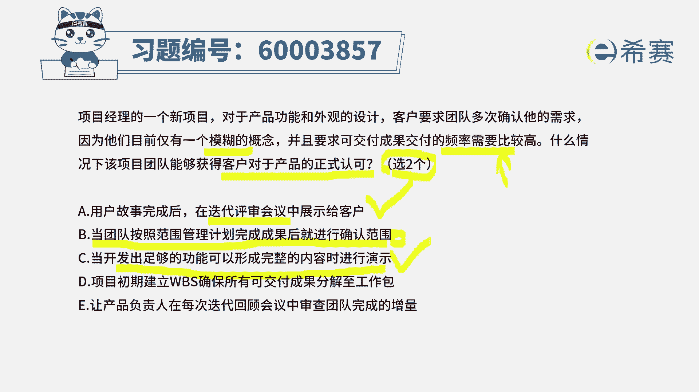
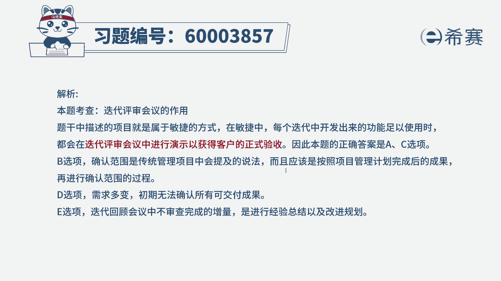

# （24年PMP）pmp项目管理考试零基础刷题视频教程-200道模拟题 - P53：53 - 冬x溪 - BV1S14y1U7Ce

项目经理的一个新项目，对于产品功能和外观的设计，客户要求团队多次确认他的需求，因为他们目前仅有一个模糊的概念，并且要求可交付成果，交付的频度需要比较高，什么情况下。

该项目团队能够获取客户对于产品的正式认可，那这里有几个词需要你去关注啊，首先第一个他们的需求已经清晰了吗，没有清晰还是模糊的，然后呢他要求交付的频度比较高，说明这是用什么运动方式来去进行，用迭代的。

用增量的，其实也就是用敏捷的方式来进行啊，有了这些框架，知道大概是用敏捷的方式来去做项目的情况下，再来看到底怎么样，可以去获得客户对于产品的正式认可呢，啊答案是有两个正确选项a，用户故事完成了以后。

在迭代评审会议中来展示给客户，请注意哦，迭代评审会议他要干什么呀，干的重要事情之一就是去演示展示来获得评审，获得认可，通过对吧，获得盖章获得签字，所以呢它就是一个正确答案选项b。

当团队按照范围管理计划完成可交付成果以后，进行确认范围啊，这一个词语你看到以后觉得好像也很对，但是它是属于哪一种项目管理方式，它是属于预测型的方式，而不是属于敏捷型的方式。

而题干中的这个画很红色线的部分，已经告诉你它是属于敏捷的项目，所以呢他就不能选，不能选二选项，c，当开发出足够多的功能，可以形成完整的内容时候来进行演示，那么因为我们做软件项目啊。

敏捷的方式呢一种是spring的方式，那还有一些别的方式，比方说看板的方式，像看板呢它就没有一个特别明细的这种时间线，当你完成东西达到一定量的时候，其实就可以来进行一些演示。

然后来去收到一些这种认可以及给到一些反馈，所以呢这个也是可行的，当我们获取了比较多的，已经可以演示内容的时候呢，就可以来去给客户进行演示，给产品负责人或是客户来进行这样的演示，来获取他们认可和反馈。

所以你看a和c都是正确的，那么两个正确答案其实就已经被你挑选出来了。

对吧好，然后第四个选项，项目初期建立一个工作分解结构，来确保什么什么东西，这个时候能够得到认可吗，请注意哦，工作分解结构，它只是我们要做的内容来进行一个细分，拆分分解，而已，ok，然后最后一个选项。

让产品负责人在每一次的别来回顾会议中，来去审查，才能完成数量，请注意在什么会议中去审查，在评审会议，ok在迭代评审会议中，而不是在回顾会议中，所以最后一个是错误的，那么d是错误的，一是错误的。

而b呢跟这个这种敏捷型的方式不匹配，也不正确，答案选a c那你如果说想要看更详细的解析呢。

