# （24年PMP）pmp项目管理考试零基础刷题视频教程-200道模拟题 - P54：54 - 冬x溪 - BV1S14y1U7Ce

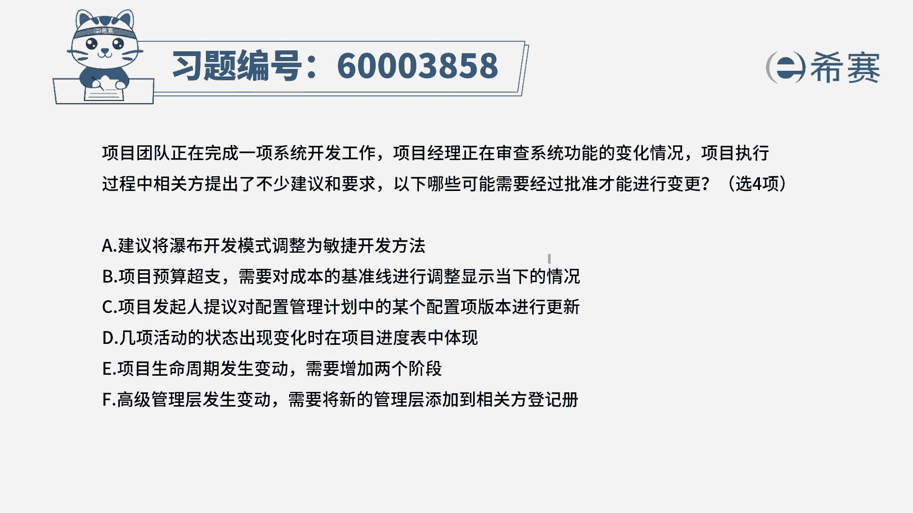

项目团队正在完成一项系统开发工作，项目经理正在审查系统功能的变化情况，项目执行过程中，相关方提出了不少建议和要求，以下哪些可能需要经过批准才能进行更改，请注意哦，要经过批准才能进行更改的一般是什么。

我们说有变更，走流程，一般是涉及到基准的变更，才需要去走流程对吧，那如果说是不是涉及到基准的变更呢，可能就不需要做流程，而这个题目呢他说有四个正确选项，那么也就是说只有两个错误选项，那我们就心里面想着。

要么选正确的选出来，要么就把错误的给排出去，那么这个题目都可以搞定，对吧好，来看一下选项，a，说是建议将瀑布开发模式调整为敏捷开发方法，连整个开发的模式都做了大的调整，这是一个巨大的调整，请注意。

这可不只是涉及到基准了，这是整个方法的一个调整。

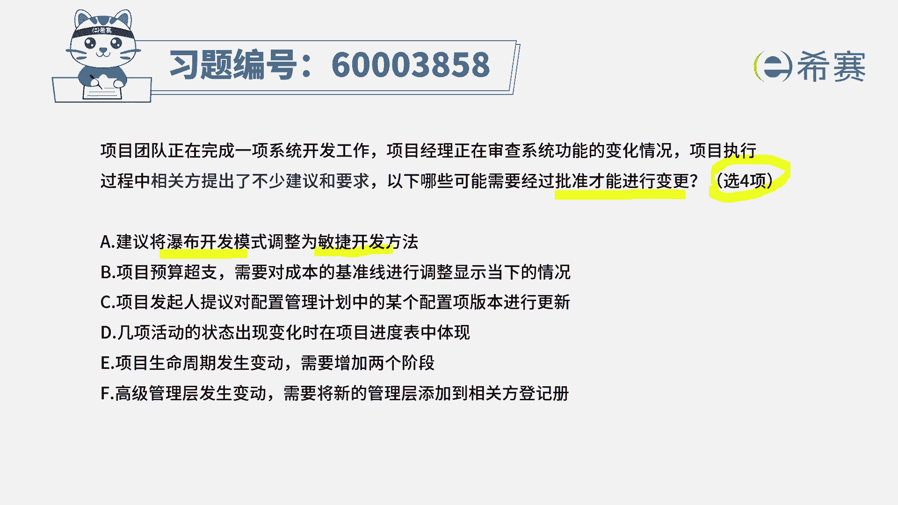

这绝对是需要去经过讨论批准同意。

才可以干的事情，所以他一定是一个正确的选项。

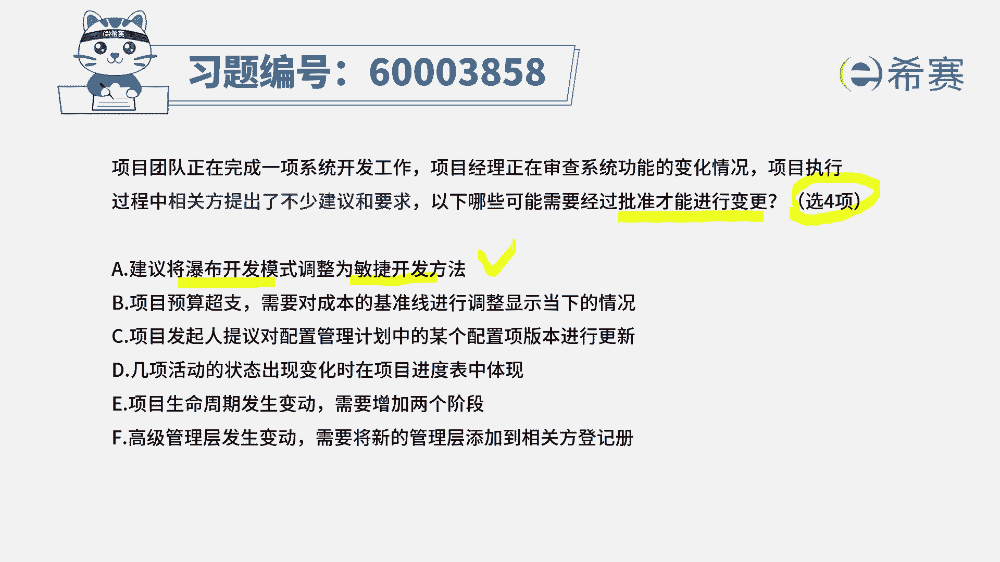

第二个选项，项目预算超支，需要对成本的基准线来进行调整，那肯定就是需要去经过批准了，选项c项目发起人提议，对于配置管理计划中的某一个配置项的版本，来进行一个变更。

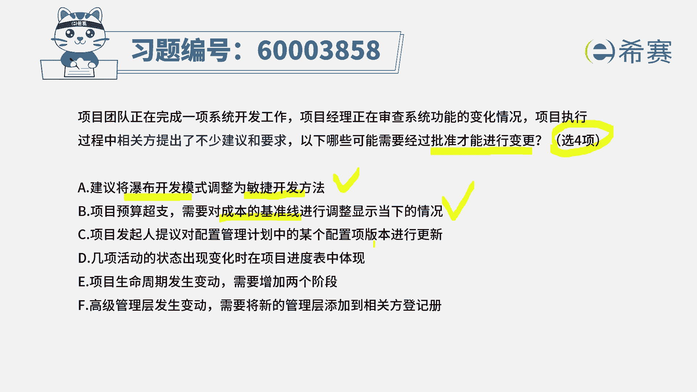

这个我们可能不太清楚不太清楚，我们先打个圈圈好，第四个选项，几项活动的状态出现变化的时候，在进来那个进度表中体现出来，这个一看就不是，对不对，因为这种东西的话，你说啊，我原来开始没有做。

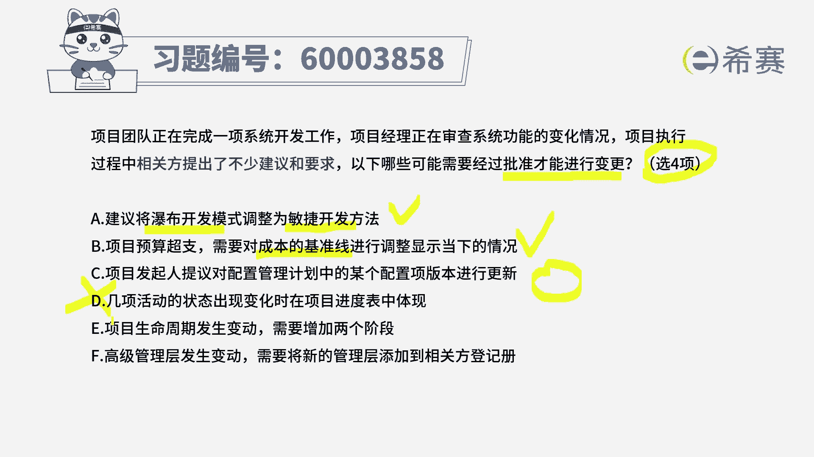

现在已经做了30%，做了70%，然后已经做完了这个活动，那这种调整根本就不需要去经过变更的请求，他这种自然的状态的一个呈现去记录就可以了。

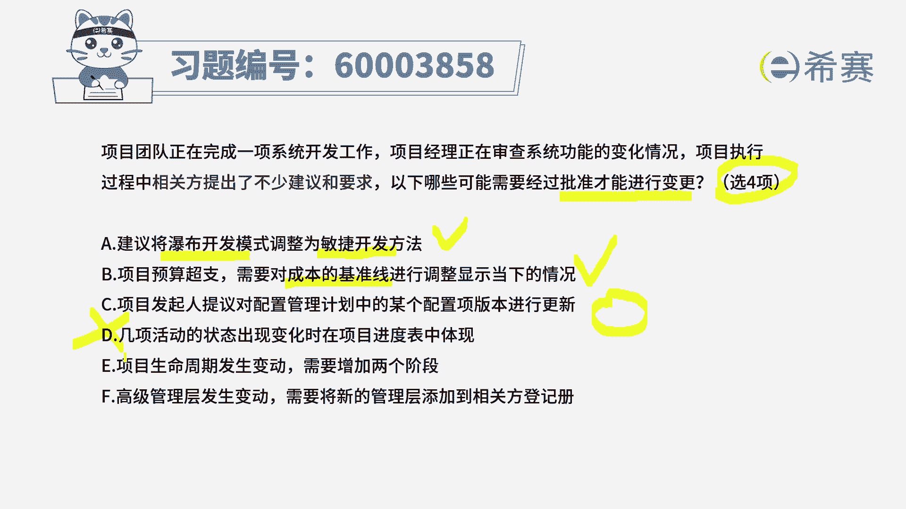

所以他是不需要考虑进来的，他是不需要说啊，经过批准才可以的好。

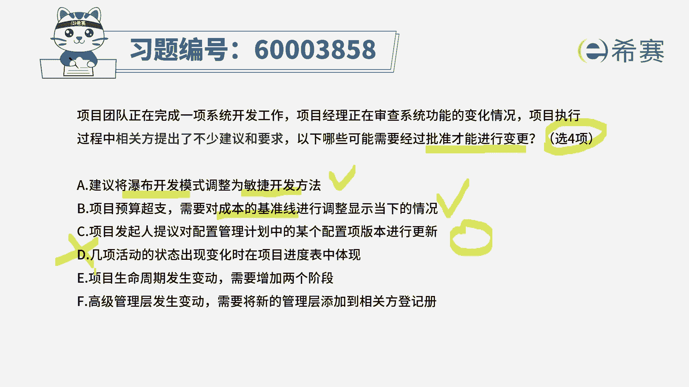

最后一列第五个项目生命周期发生变动，我们需要增加两个阶段，请注意哦，我们说阶段我们可以用会用一个什么词，当一个项目周期很长的时候，我们可能会把它拆解成若干个阶段，每一个阶段可以当做一个子项目来对待。

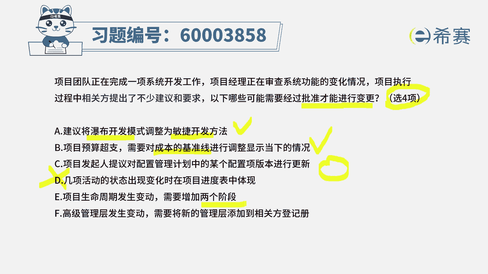

那你现在因为一些原因，然后导致要多增加两个阶段。

多增加两个子项目，这么重大的事情是你项目经理可以搞定的吗，当然不是，肯定是需要领导的批准认可的啊，所以这个呢也是要批准的好看。

最后一条，高级管理层发生变动，需要将新的管理层添加到相关攀登记册，请注意，这种情况下需要谁谁谁来批准吗，并不需要，对不对，我们说相关方发生变化以后呢。

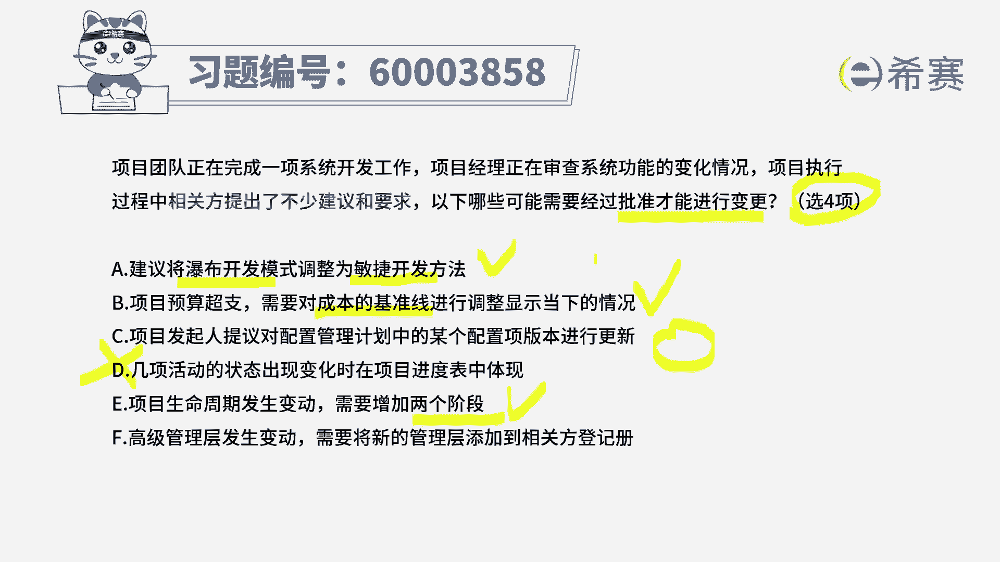

我们只需要去更改这个相关判单机测，然后去更改这样一个沟通管理计划就可以了。

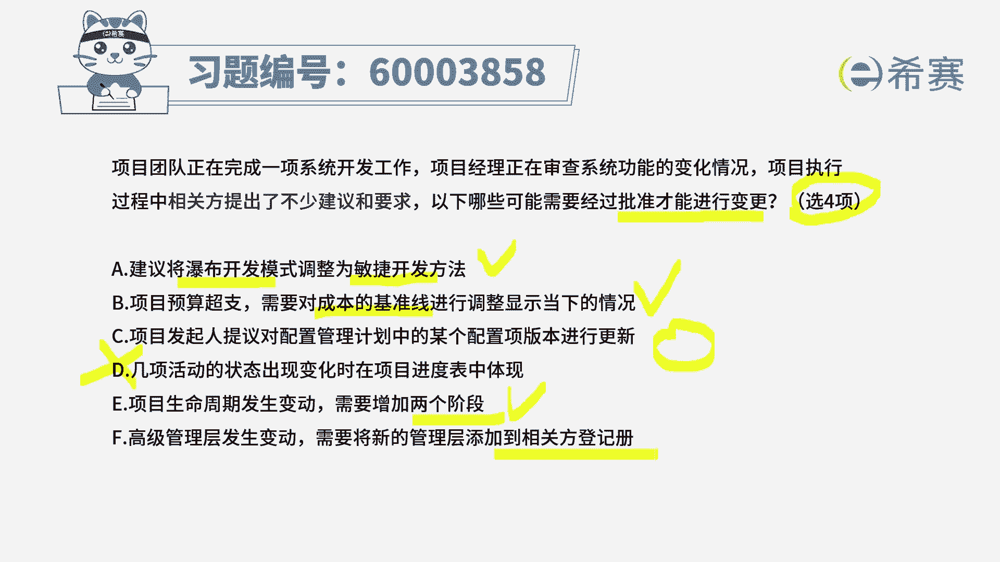

所以这个的话并不需要劳烦你那个什么什么，一些另一群领导来去批准同意，所以呢这个也不选好，有了这样一个信息，其实已经把两个错误选项选出来了以后，你顺便就知道哦，原来c选项可能是正确的。

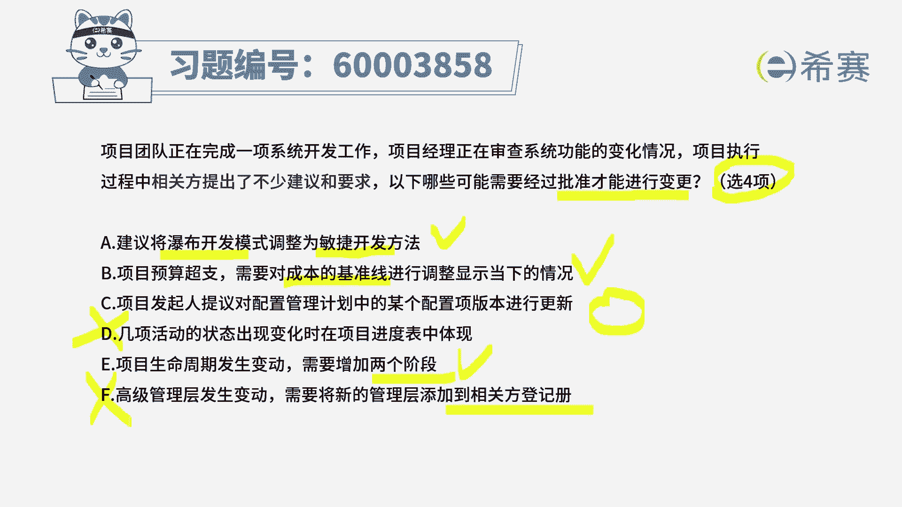

所以你就顺便把c选项记一下，原来c选项对于配置管理计划中的某些，配置项的版本来发生调整，他也是需要去经过一些重要相关派的批准同意，才可以调整的，你就把它记下来就好了，所以答案呢选a b c e。

所以又有一些题目，其实你做起来比较难的时候呢，你可以在试卷上面可以写写画画，你可以把那种错误的东西先画出来，看一看是错误的，先画出来以后也能够有助于我们去做啊，对于某一些待定一下呢。

可以画个圈来表示待定，然后看它到底是更有后面有更错的，或者后面有更对的，从而能够去判定出这个圈，这个待定向它到底是合适还是不合适。

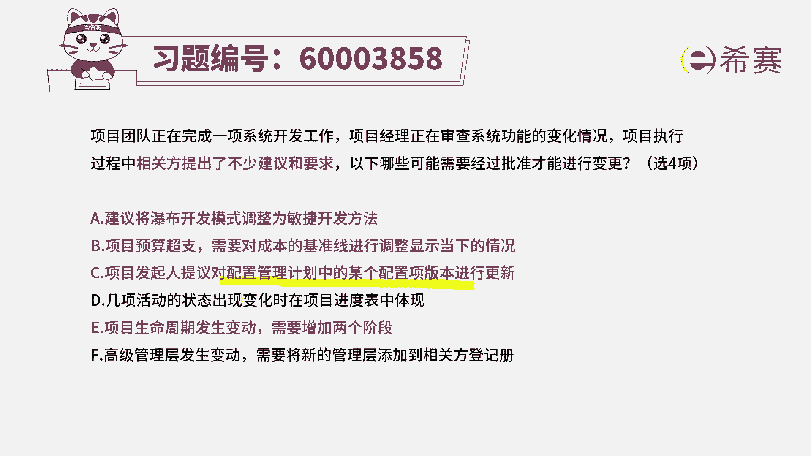

好了解析。