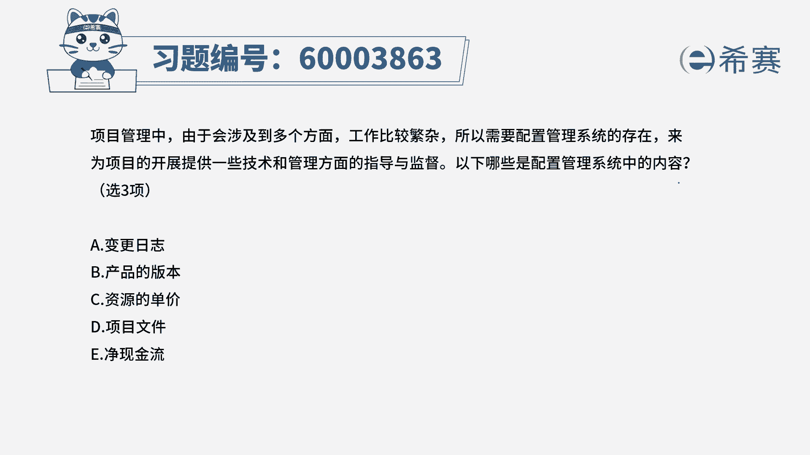
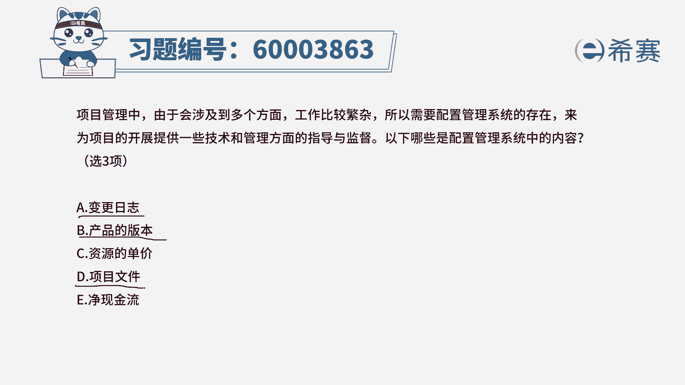
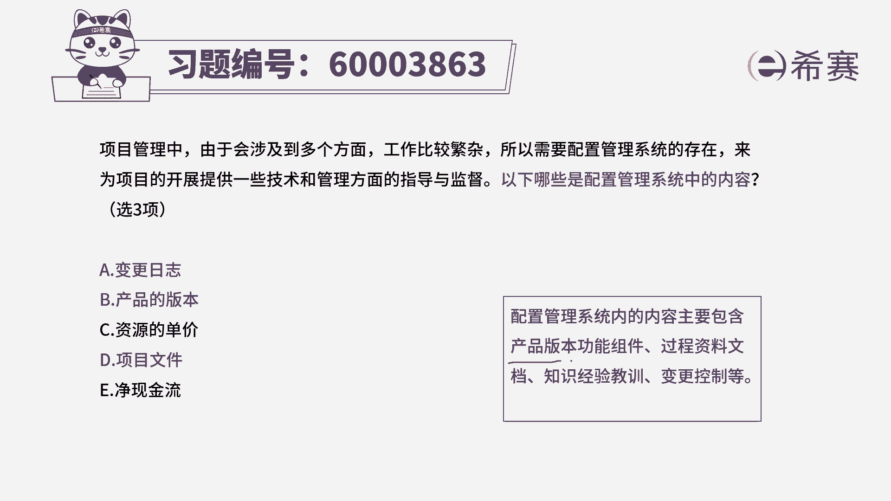
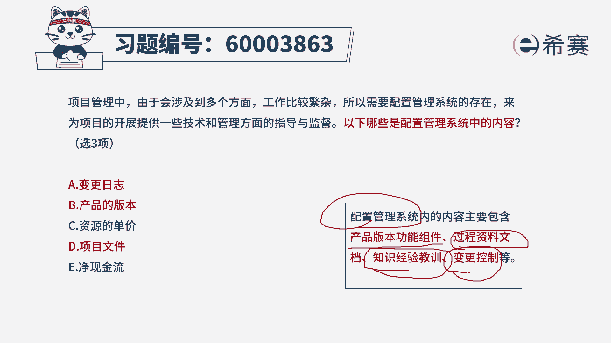

# （24年PMP）pmp项目管理考试零基础刷题视频教程-200道模拟题 - P58：58 - 冬x溪 - BV1S14y1U7Ce

项目管理中由于会涉及到多个方面，工作比较繁杂，所以需要配置管理系统的存在，来为项目的开展提供一些，技术和管理方面的指导和监督，以下哪一些是配置管理系统中的内容，那关于配置管理呢。

其实我们在讲课的时候没有详细展开讲，我们简单提了一下，比方说我们说版本管理，你得要知道一下版本管理，它是属于配置管理中的一部分，就是我们写文档有0。1版，0。2版，0。3版到一点，零版到二点。

零版到三点版，就是这个文档它的这个不同的版本，它一定是属于配置管理系统的一部分，所以呢这个第二个选项一定是属于不只是文档，包括我们开发的代码啊，这些程序，这些个产品它都是应该被管控起来的啊。

这是属于这一条，另外呢我们在讲这个配置管理的时候，其实是先从变更管理开始来说说，变更管理是属于配置管理中的一部分，关于一个产品它的版本的变迁，其实就是基于这种变更的发生变化导致的，所以呢变更的内容。

它一定也是属于配置管理中的一部分，然后剩下的三个文件中还要挑选一个，挑哪个呢，我们看一下选项c是资源的单价，选项d项目文件选项一是净现金流，那我们知道其实关于版本管理中，除了有产品的管理。

除了有这些代码的管理，还有文件的管理，也就是我们的文件，不然是需求规格说明书，概要设计说明书，详细设计说明书等等，这些文件也是需要去被管控的，所以呢这个它也是属于配置管理系统的一部分。

所以答案选a bd，那具体的关于配置管理中包含的内容呢，这里给大家做了一个简单的总结，首先第一个就是我们在这个产品中，它所办的若干功能组件都应该要被管控起来。

必要的是过程中，所有的这些文档材料都应该被管控起来，还有在做项目的过程中，所得到这样一些经验和教训，也应该被管控起来，还有一个就是整个变更控制系统，所有变更相关的变更日志啊，变更请求啊。

都应该被管控起来，都是配置管理系统中的一部分，所以答案是选a b d。

