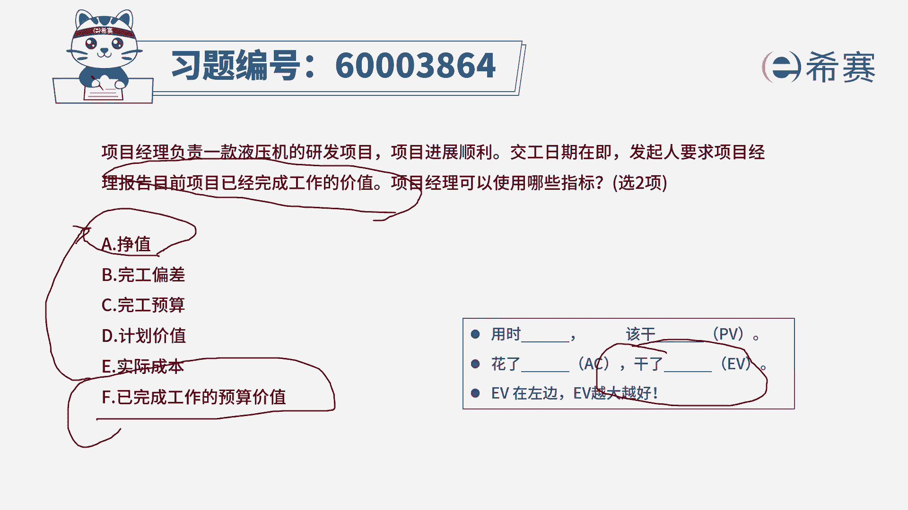
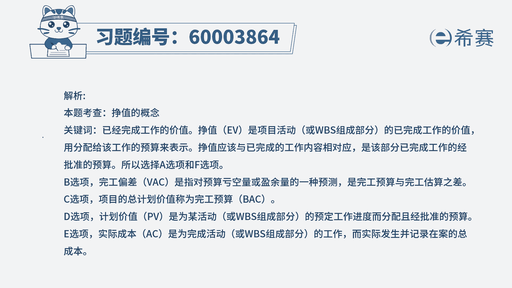
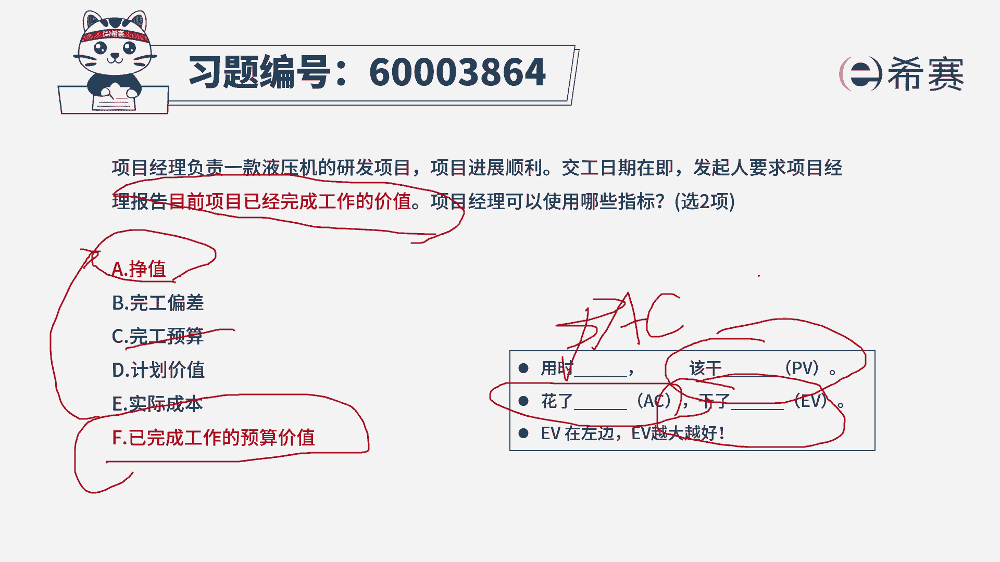
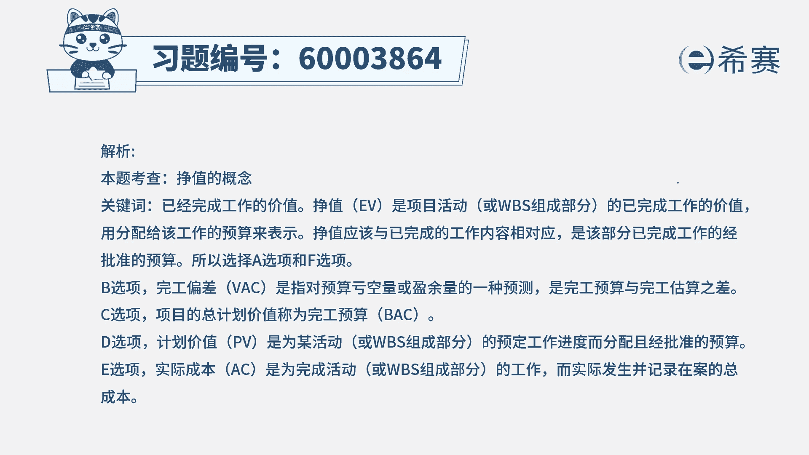

# （24年PMP）pmp项目管理考试零基础刷题视频教程-200道模拟题 - P59：59 - 冬x溪 - BV1S14y1U7Ce

项目经理负责一款液压机的研发项目，项目进展顺利，教工日期在即，发起人要求项目经理报告，目前项目已经完成工作的价值，项目经理可以使用哪些指标，答案是选两项，那这里呢给了六项中，我们来挑一下。

首先他问的是什么，他问的是要告诉我，目前项目已经完成工作的价值，就已经完成工作价值是什么，那不就是正值吗，所以a选项正值肯定刚好就是符合，那我们把这六个选项都看完，一个是正值，一个是完工偏差。

一个是完工预算，一个是计划价值，一个是实际成本，还有最后一个呢是已完成工作的预算价值，那最后一条已完成工作的预算价值，它不就是正值吗，啊大家是不是还记得我们在讲课的时候，有讲过这样一句话。

说用了多少时间，该干多少活，花了多少钱，干了多少活，其中那个干了多少活，就是我们的正值，也就是到目前为止已经完成了工作的价值，也就是这里，刚好是相贴合，所以他其实说的是同一个意思，对不对啊。

这一条其实就是对它的解释啊，所以答案呢是选a和f，那这个其实相对来讲会比较好选，解析在后面需要的同学可以自行查看。

那其他几个，比如他说完工偏差的话，其实肯定是做比较才能够知道，那计划价值，就是我们原计划在这个时间点该完成多少东西，而实际成本是到目前为止我已经花掉了多少钱。

也就是d选项呢是pv，然后e选项是a c，而其中这个完工预算的是b a c是原计划，这个项目总共要花多少钱，而完工偏差呢是cv好解析。

