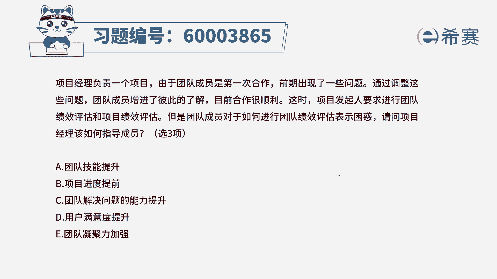
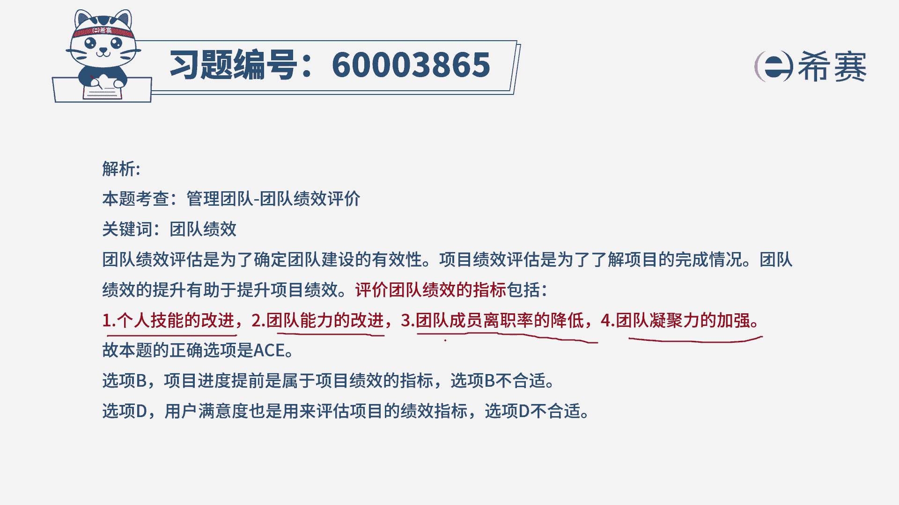
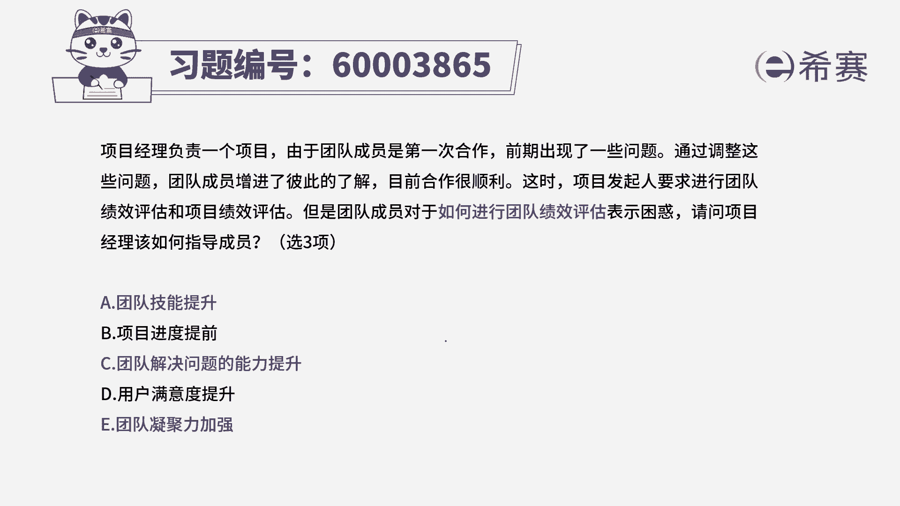

# （24年PMP）pmp项目管理考试零基础刷题视频教程-200道模拟题 - P60：60 - 冬x溪 - BV1S14y1U7Ce

项目经理负责一个项目，由于团队成员是第一次合作，前期出现了一些问题，通过调整这些问题，团队成员增进了彼此的了解，目前合作很顺利，这时项目发起人要求进行团队绩效评估，和项目绩效评估。

但是团队成员对于如何来进行团队绩效评估，表示很困惑，请问项目经理该如何指导成员呢，此题选三个正确答案，那我们把这五个选项都看一下啊，选项来说是团队技能的提升选项，b是进度的提前选项。

c是团队解决问题的能力的提升选项，d是用户满意度提升以及选项，e团队凝聚力的增强，那这样一些信息呢，其实你乍一看你可能觉得有点摸不着头脑，但我们需要去呃反思一下，关于团队绩效评估都评估一些什么东西。

那整个团队需要评估呢，其实就是说看一下我们现在这个团队怎么样，怎么样，一般会从几个维度来看，一个人都是团队的成员，他们的水平怎么样，然而团队凝聚力变得怎么样，然后个人的水平怎么样。

以及整个团队他是否那种离职率，是有提升还是有下降，从这四点来看的话呢，你会发现其中a c13 个选项刚好是相符合，一个是团队成员的技能的提升，团队成员解决问题能力，提升。

团队凝聚力的增强，那这三条呢刚好都是符合，我们这边看到这四条动的技能提升能力，提升凝聚力的提升，以及包括团队成员离职率的降低啊。

所以呢答案是选这三个选项，至于说项目的进度提前，它就是团队绩效提升的一个方面，其实我们绩效的能力更强，除了有进度提前，同时可能有成本的受控，质量非常棒等等方面，而用户满意度。

一般是这个项目交付完了以后才会去考量的，在过程中，其实我们不太会直接就去考量，这一个用户满意度，所以答案是选a c e。

