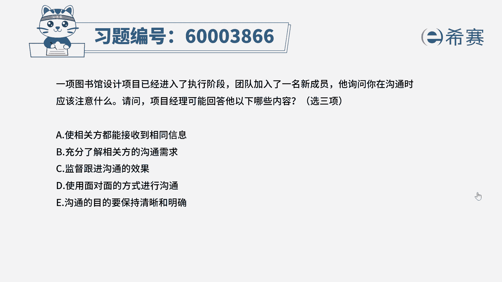
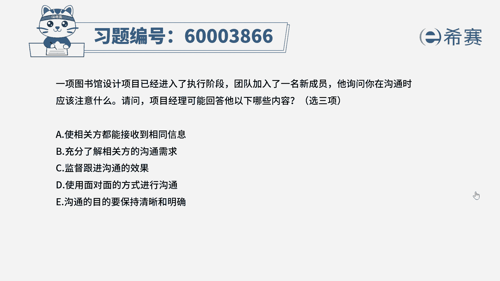
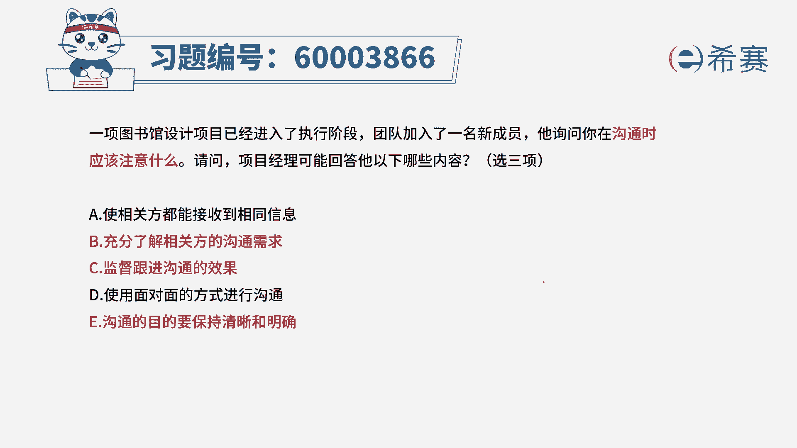
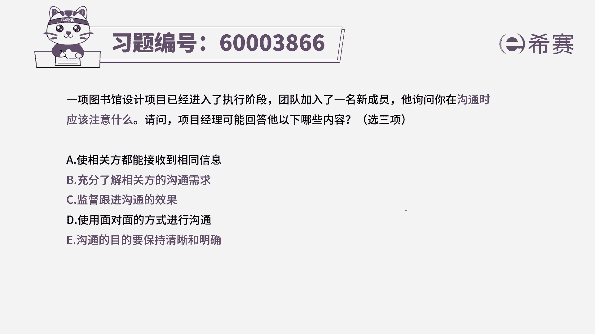
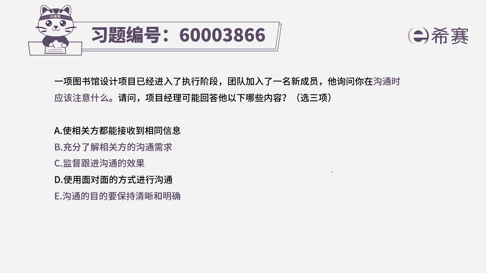
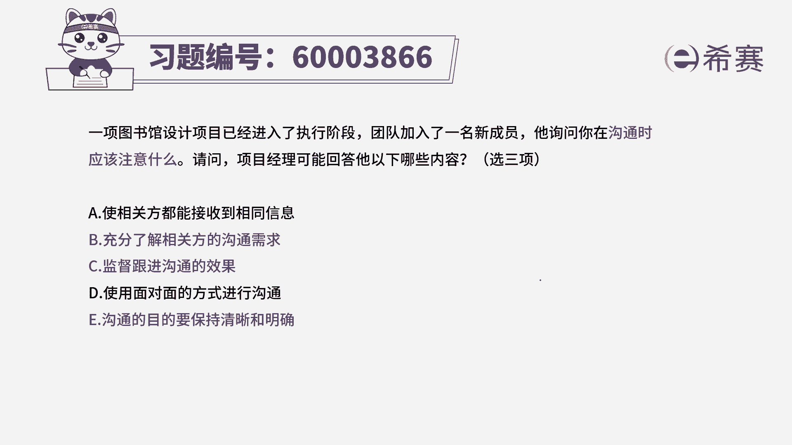

# （24年PMP）pmp项目管理考试零基础刷题视频教程-200道模拟题 - P61：61 - 冬x溪 - BV1S14y1U7Ce

一向图书馆设计项目已经进入了执行阶段，团队加入了一名新成员，他询问你在沟通时应该注意什么，请问项目经理可能回答他以下哪些内容，选三项，请注意，所有的定向多选题，都是会明确告诉你选两个答案还是三个答案。

或者说是四个答案，他会明确告诉你啊，那这个题目中关于沟通，有新同学加入进来以后，要选三项注意事项，我们分别看一下四个选项，选项a说是相关方都能接收到相同的信息，我们需要接受相同的信息吗，请注意哦。

我们在沟通的时候，其实不同的人，它所需要的信息的需求是不一样的，所以a选项是首先是不应该被选的好。

第二个选项充分了解相关办的沟通需求。

这肯定是没毛病的，一定是需要的对吧，选项c监督跟进沟通的效果。

我们继续要去了解对方的需求，同时要去执行沟通，同时要去跟进建议沟通效果，去监督沟通也是对的，第四条，使用面对面的方式来进行沟通。

请注意，并不是所有的沟通都只能用面对面的方式。

那如果说我们不在一起呢，我们在那两个国家或两个城市呢，可能会用发邮件的方式，打电话的方式，视频会议的方式，所以不只是面对面这一种方式，还有更多的方式，那你现在已经看到a和d都是错误选项。

你就可以把答案选出来了对吧。

那你就基本上已经可以选出来，答案是b c1 ，那只有一我没有看。

我们来看一下，一说是沟通的目的要保持清晰和明确。

哎这也是没有错的，确实，所以我们在沟通的时候，首先是要了解我们为什么要沟通，我们的沟通的目标目的是什么，然后需要去了解对方的沟通的需求，然后去呃做一个好的这种沟通计划，按照这个沟通计划来进行沟通。

并且要跟进沟通的效果。

所以答案是选b c一这三个选项。

