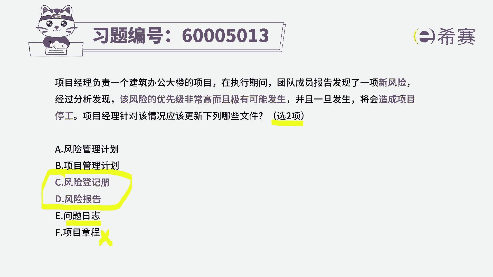
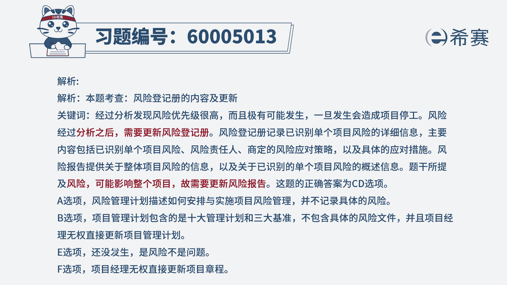

# （24年PMP）pmp项目管理考试零基础刷题视频教程-200道模拟题 - P66：66 - 冬x溪 - BV1S14y1U7Ce

项目经理负责一个建筑办公大楼的项目，在执行期间，团队成员报告发现一项新风险，经过分析发现该风险的优先级非常高，并且极有可能会发生，一旦发生了，将会对项目造成停工的影响，所以它是一个发生的概率很大。

同时发生影响也很大的这样一个风险，那么针对这样一个风险，项目经理应该更新哪些文件，那这个的话其实他因为题干都明确告诉你，只选两项，这就很好选了啊，你看到这六个选项中，风险管理计划，项目管理计划。

他都只是告诉我们如何去管理项目，如何去管理风险，他们都是这种指南性的文件，是一个方向性的文件，所以呢不会去直接更新他们好，c和d呢风险登记册，这肯定是毫无疑问要去更新的，因为我识别到一个新的风险对吧。

并且呢这个风险对项目的影响还挺大的，所以对整个项目的影响很大的时候，一定是要去更新风险报告，编剧给一些重要相关范围更新，所以答案只选两个的话，一定是选c和d，然后后面两项问题日志呢，其实一般来讲。

我们说问题日志是当问题已经发生了以后，我们才去更新问题日志，在没有发生之前是不要去更新问题日志的，但是这里有一个点呢，就是说当这个事情特别的时候，其实我们也是可以去想到一些应对的计划呀。

然后可以去把它列作当做一个问题来去对待，就当它的概率非常大的时候，其实是可以当问题的对的，只是说这里面明确告诉你只选两项的情况下，已经有两个更好的选项摆在这里，我们就优先选它，如果说他非得说选三项的话。

你也可以把问题列进来啊，他作为一个0。5的这个，这样一个重要程度的来选啊，最后一个项目章程，这肯定是不要选了，因为项目章程它只是一个呃，在前期做这种呃支撑性的一个文件，会明确告诉我们整个项目框架呀。

大的这些粗粒度的东西。

所以他肯定是不要选的，所以答案选c d，如果你想要看更多的这些详细解释。

