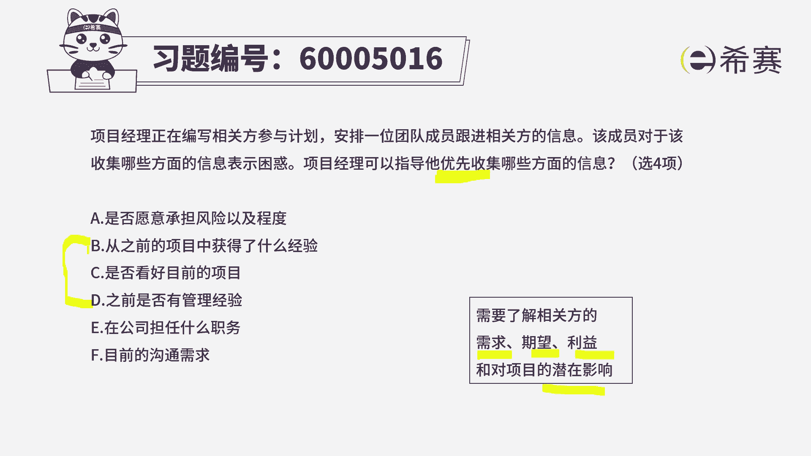
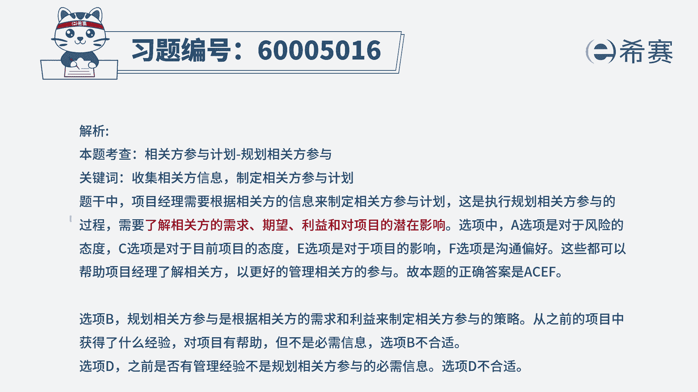

# （24年PMP）pmp项目管理考试零基础刷题视频教程-200道模拟题 - P67：67 - 冬x溪 - BV1S14y1U7Ce

项目经理在编写相关方参与计划，安排一位团队成员跟进相关办的信息，该成员对于该收集哪些方面的信息表示困惑，项目经理可以知道，他优先收集下面哪些方面的信息，那么其实也就是关于相关方登记册里面。

优先要收集哪些信息，那我们来看一下总共这六项里面，哪四项是我们重点需要去关注的，首先第一项是否愿意去承担风险，以及愿意去承担风险的程度是什么，是高风险，高收益的追逐型，还是说风险的中立型。

还是风险的规避型，哎我们需要去了解，那么这一条肯定是你需要去关注的，这个相关方的一些基本信息，第二条，从之前的项目中获取了什么样的一些经验，这个呢如果说能获取到，最好没获取到呢，可能也没那么多的关系。

所以它可以作为一个选项，但是作为一个候选项，选项c是否看好这个项目的前景，那这肯定是对的吗，就说你是支持这个项目的，还是不支持这个项目，你看好这个项目，还是不看好这个项目。

那我们肯定是需要了解你这个项目，犯的一些态度好，第四个之前是否有管理经验，这肯定是重要的，但是呢它不是作为那么重要，作为一个候选项，它跟第二个类似，如果我知道他有经验的话，那么我可能在管理他的时候。

我再跟他去做交流，沟通互动的时候，我可能要啊在哪些方面有所准备呀，或者说有所注意呀，对吧好，再下一个在公司担任什么职务，这肯定是你需要去知道的，因为这代表他的权利啊对吧。

我们需要去了解这个相关派的权利利益，然后关注的焦点需求这些东西，所以它的植物代表了他的权利，我们能够了解的话，这就能够更好的去应对了，好最后一个目前的沟通需求，这也是一种需求对吧，沟通需求也是需求哟。

所以这样一看的话，我们发现其实已经把四个选出来，因为他只告诉我们选四个，所以呢答案是什么，a c e f，总体来讲，其实就是去了解相关拍他的一些像需求，期望利益，权利影响等这些方面。

至于说b和d这两个呢，你说要不要加进来，如果说加进来当然更好，但它不是第一梯队的，他不是最核心，重要的，题目中也告诉我们说是优先收集哪些东西，这个b和d如果有当然是更好，如果没有。

也没那么多关系，是这样一个情况。

