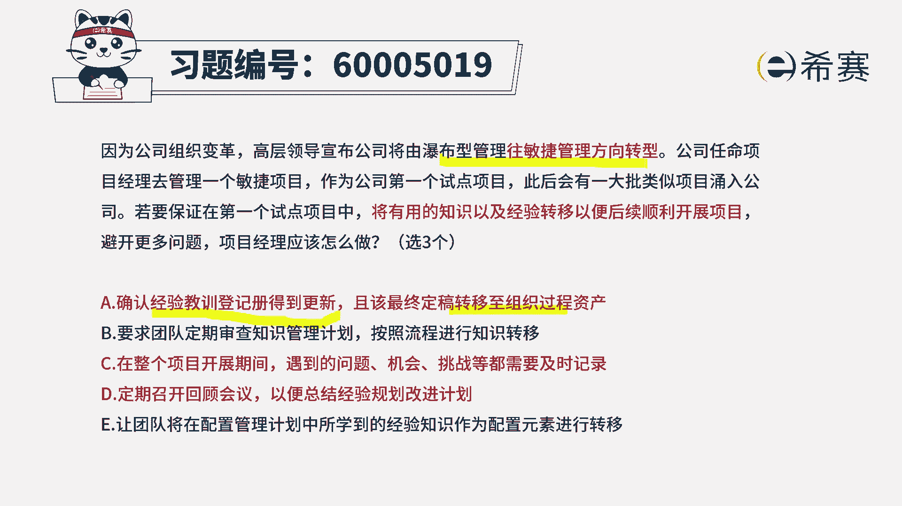
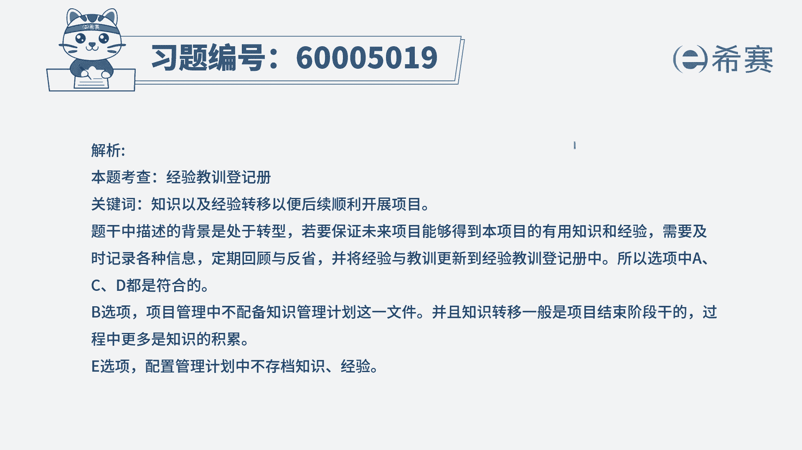

# （24年PMP）pmp项目管理考试零基础刷题视频教程-200道模拟题 - P68：68 - 冬x溪 - BV1S14y1U7Ce

因为公司组织变革，公司将由瀑布型管理模式，玩敏捷管理方向来转型，公司任命项目经理去管理一个敏捷项目，作为公司的第一个试点项目，此后会有一大批类似项目涌入公司，若要保证在第一个试点项目中。

将有用的知识以及经验转移到，以便于后续顺利的开展项目，避开更多的问题，那项目经理应该怎么做，他告诉我们说有三个正确答案，那首先你要了解一下，目前呢我们是瀑布模型，现在想要往敏捷的方向去转型。

想要去积累更多的这样一些经验和教训，累积这些组织过程资产好，我们一起来看一下接下来的五个选项，选项a确认经验教训登记册得到更新，并且呢，该最终的定稿，能够转移到组织过程资产库里面来，那这个表达方式。

在结构化项目管理中是绝对没有问题，在敏捷中有没有问题呢，好像我们不太确定对吧，对于不太确定的东西呢，我们就做一个待定好，第二个要求团队定期的去审查知识管理计划，按照流程进行知识转移。

这一句话一看就是错误的，为什么呢，因为团队成员，其实你并不需要一直去查看这样一个，知识管理计划，你只要是定期的去做回顾啊，反省啊，总结啊就可以了，没有这么一些要求，因为一般来讲员工在前期就做过一些培训。

那么在过程中如果说以遗忘的时候，我们再去培训，但是更多的其实就是要求大家日常来做总结，然后可能阶段性的做一些回顾和反省，应该是做这样一个情况，所以第二个选项是错误的好。

第三个在整个项目开展期间遇到的问题，机会挑战等都需要及时记录下来，这肯定是对的，这一看就是对的啊，因为我们做这样一个敏捷项目的话，我们需要去把这些经验和教训给积累下来，你怎么样积累，你先来记录。

然后再去梳理整理，然后再去把它转变成一个知识册，对吧啊，这肯定是对的好，第四条，定期的召开回顾会议，以便总结经验，还有呢以便一句规划改进计划，所以总结经验，规划改进计划都是在这个回顾会议中。

这一看就是没有毛病，就是正确的啊，所以这句一定是对的，最后一条，让人团队将配置管理计划中所学到的，这样一些经验知识作为配置元素来进行转移，这个话是错的啊，配置管理计划中。

只会告诉我们说该如何去进行配置管理，比方说如何去收集信息，如何去整理信息，如何去做这些版本的管理之类的，他不会有什么，从这个配置管理计划中来，得到这样一些经验和教训。

他只告诉我们说如何去做这样一些经验和教训，所以这个表达是有问题的，而整个选项呢只有三个是正确的，那么也就是有两个错误的，现在两个错误都被挑出来以后，你就成了反向来推导哦。

原来a选项也是正确的，所以答案是选a c d，所以这样的话你就知道哦，原来在敏捷中，其实也会有这样一些经验，教学能力测也会需要去做这个事情，尤其是从瀑布型往敏捷转型的时候，一定会是过渡性的过程中。

两种方式都会去使用到敏捷敏捷，它其实并不是不去用文档，而只是说更更关注这些个成果，更关注这些个代码程序，但是文档本身还是需要的，它要够用就好。

所以答案选a c d。

