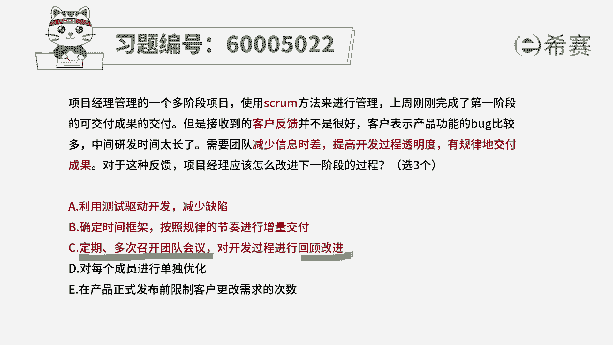
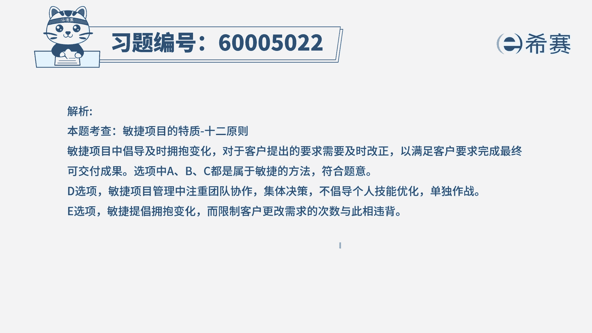

# （24年PMP）pmp项目管理考试零基础刷题视频教程-200道模拟题 - P69：69 - 冬x溪 - BV1S14y1U7Ce

项目经理管理的一个多阶段，项目使用spring方法来进行管理，上周刚刚完成了第一阶段的可交付成果的交付，但是接收到的客户反馈呢并不是很好，客户表示产品功能的bug比较多，中间研发的时间太长了。

需要团队减少信息时差，提高开发过程的透明度，有规律的去交付成果，对于这样一种反馈，项目经理应该怎么改进，下一阶段的这样一些过程呢，这里面很明确，首先是用敏捷的方式，用swin这种方法来去做事情。

并且已经获取到了客户的反馈，接下来我们需要去做一些调整，来去响应客户的反馈，这里告诉我们，一共是有三个正确答案，那我们就一起来看一下，首先选项a利用测试驱动开发来减少缺陷，诶这个刚好响应的什么呀。

刚好响应说bug比较多的这样一个情况，对不对，那既然bug比较多，我们有没有一些好的方式来去减少bug呢，刚好在敏捷若干实践里面，其中有一种实践叫测试驱动开发的方式，它是能够减少bug的。

所以它一定就是一个正确的好，第二个确定时间框架，按照规律的节奏来进行真正交付，这刚好是满足他雷条，他说希望能够有规律的去交付，对不对，他说之前时间太长了，然后希望能够有规律的去交付。

那刚好这一条也是满足第三条，定期多次召开团队会议，对开发过程进行回顾改进，那这个进行回顾改进，这肯定是其中的一条重要的，ok这个肯定是对的，然后这里呢定期多次召开谈论会议，这个我们不确定，所以不太清楚。

就是前半句不清楚，后半句一定是正确的，那么在这种情况下，这个c选项我们先作为一个带选项，再继续往下面看好，第四个对每一个成员进行单独优化，请注意哦，在敏捷上是不强调这种个体优化的。

而是说团队是一个敏捷开发团队，大家是一个每个人都是t型人才，我们一起来形成合力，大家是一荣俱荣，一损俱损，所以你这边不提倡这个，这个是错误的，最后一个在产品正式发布前，限制客户更改需求的次数。

这个跟敏捷是不是刚好相违背，敏捷中他是拥抱变化，哪怕说在什么什么后期，依然欢迎你提出变更请求，所以这个是跟敏捷的整个意图是相违背的，那把这两个错误的选出来以后，那正确的只有三个对吧，那这里明确告诉你。

只有三个是正确的，那就好选了吗，那就是a b c。

所以呢正确答案是abc，虽然说可能大家对于前面这句话有疑惑，定期多次召开团队会议有疑惑，但是你也可以把这个团队会议理解成，会，然后还可以在迭代回顾会议中，来进行回顾和总结，所以答案选a b c。

