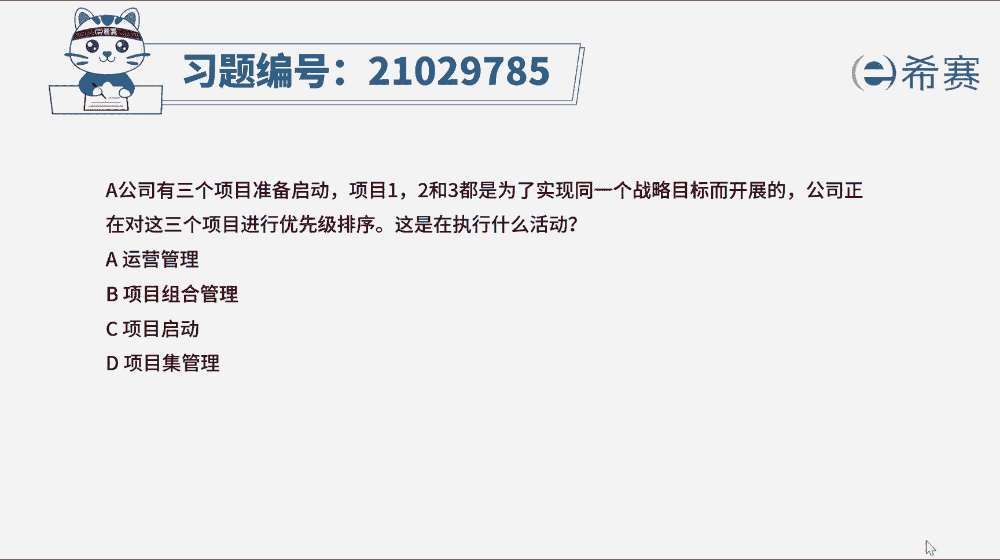
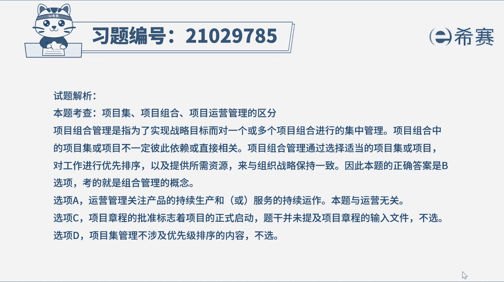
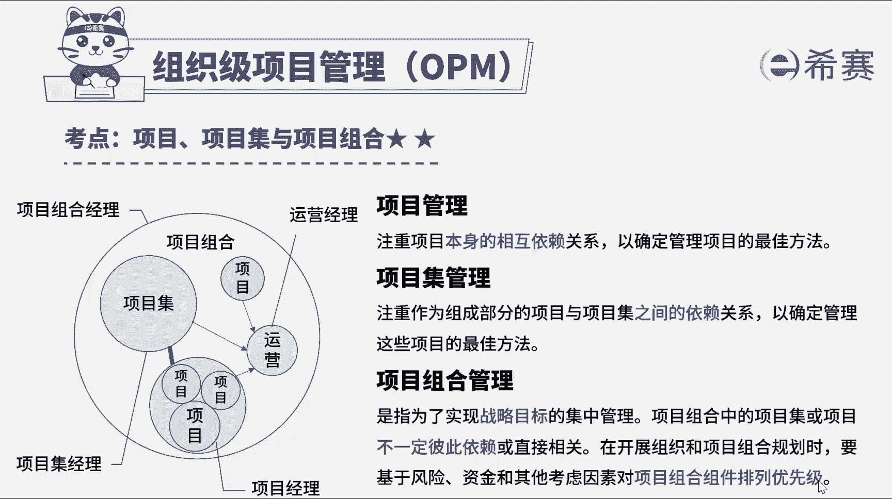

# （24年PMP）pmp项目管理考试零基础刷题视频教程-200道模拟题 - P6：6 - 冬x溪 - BV1S14y1U7Ce

a公司有三个项目准备启动项目，一二和三，都是为了实现同一个战略目标而开展的，公司正在对三个项目进行优先级排序，这是在执行什么活动，a运营管理，b项目组合管理，c项目启动d项目集管理好，我们读完题目。

先找到题干的关键词，三个项目都是为了实现同一个战略目标而开展，正在进行优先级排序，问在执行什么活动，这里存在三个不同的项目，所以是项目集，项目组和层面的活动，项目集是一组相互关联且被协调管理的项目，子。

项目集和项目及活动，以便获得分别管理所无法获得的利益，项目组合是为实现战略目标而组合在一起，管理的项目，项目及子项目组合和运营工作，项目集和项目管理的重点在于，以正确的方式开展项目集和项目。

而项目组合管理则重点在于，开展正确的项目集和项目，题干提到在进行优先级排序，就是为了开展正确的项目，因此本题的答案是b选项d选项错误，再来看一下其他选项，选项a运营过程，关注的是产品的持续。

生产或服务的持续运作过程，与题干无直接联系，选项c项目的正式启动，往往伴随着项目章程的批准，题干并没有提及制定项目章程的输入文件。

因此c不正确好了，那我们这道题就先讲解到这里，大家可以自行参考一下相关的文字解析，整个题目讲解下来。

我们可以知道本题考察的知识点是项目集。

