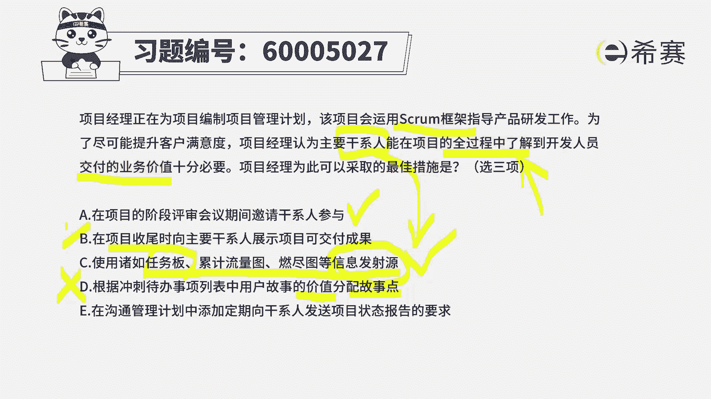
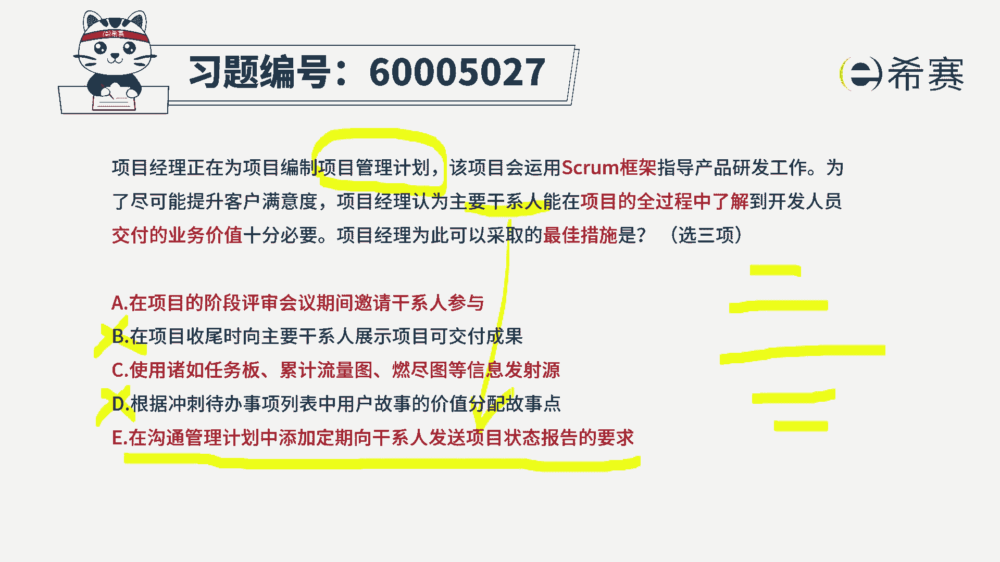
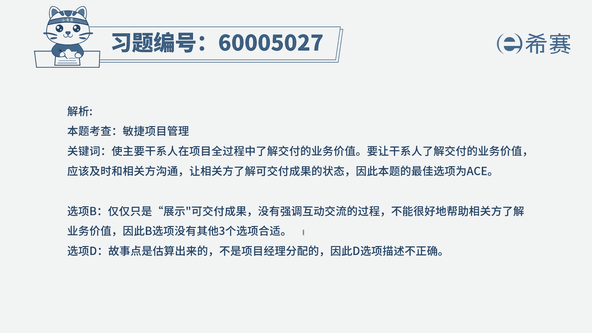

# （24年PMP）pmp项目管理考试零基础刷题视频教程-200道模拟题 - P71：71 - 冬x溪 - BV1S14y1U7Ce

项目经理正在为项目编制项目管理计划，该项目会运用spring框架来指导产品研发的工作，为了尽可能提升客户满意度，项目经理认为，主要干系人人在项目的全过程中，了解到开发人员交付的业务价值，是十分有必要的。

那项目经理可能会为此采取的最佳措施，是有哪些呢，呃有三个正确答案，那我们可以看到，首先他给的是一个spring框架来去指导开发，然而会是希望在整个过程中，能够去了解到我们交付的这些业务价值。

那么来从这五个选项里面挑选三个选项，a在项目的阶段评审会议期间，来邀请干系人参与，首先你得有一个慈悲要认识啊，干系人是谁，干系人其实也就是我们在学习的时候，讲一个词叫相关番呃，干系这个词呢以前在第五版。

在拼搏指南第五版之前都一直叫干系人，然后在第六版才改叫相关番，但是呢后面新的版本又把它又改回去叫干系人，所以它都是同一个词啊，知识的中文翻译不相同而已，干性就是相关方，相关方就是干性。

它都叫stakeholder，同一个词，好选项，a在项目的阶段评审会议期间来邀请干性参与，诶，这肯定是有必要的对吧，也就是我们这一个啊，冲刺评审会议或是迭代评审会议，那邀请重要的相关方来参与。

他能够去给我们评审，同时会提出一些想法和意见诶，这是很有必要的，刚好能够满足题干的这样一个需求，能够让他了解我们这个项目的一些价值，好选项，并在项目收尾时，向主要干系人来讲是可交付成果，请注意。

收尾都上了，已经是项目完成了，也才叫收尾，对不对，事儿都已经办成了以后，而题干中会告诉我们是要全过程了解，那你在最后的那一刻，然后才能给给我展现，其实我并不能够太了解到，你在过程中的这些具体情况。

所以它应该是不合适的好选项，c使用诸于任务版，累积流量图，燃尽图等信息发射源，这个刚好是很符合这种敏捷的方式，敏捷中会强调一个词叫透明沟通，就我们需要去跟对方透明沟通。

让对方能够知道我们当下做的这些事情和情况，而任务版这个词呢，你可能如果觉得有点陌生的话，你想一想有个词叫看板，看板里面会列出这些用户故事和任务版的，它就是我们通常说用户故事会有大的用户故事。

叫epic对吧，然后有中间的这个用户故事叫sm，然后再有想的用户故事就是user story，然后呢用户故事还可以再拆解到任务task，那这个任务版本其实就是这个用户故事，再调到更小的线，具体的任务。

然后把它用展现的这种方式，用一块看板的方式来展现出来，叫任务版，然后累积流量图也叫累积流图，它其实是过程中持续的一个阶段中，来去把项目进行的情况，有哪些任务是在等待累计任务是在去研讨，哪些任务是在开发。

哪些任务是在测试中，哪些任务已经完成，把它整个统计下来，那这也是一种很好的去展现这个项目进展情况，的一种方式，燃尽图是在这一轮迭代中，我们当前完成的工作内容还有多少没有完成，待完成的一种展现形式。

那这些东西呢它都是一个叫信息发射源，信息发射源有的时候翻译成叫信息发射器，其实就是一个信息同步的工具，有了这样一个信息同步工具以后，那这些关键相关方他随时想要知道我这个信息，他都可以来知道对吧。

所以他肯定是可以选的啊，好第三个选项好，第四个选项，根据冲刺待办列表中的用户故事的价值来分配，故事点数请注意哦，故事点数的估算它不是根据价值来估算的哟，它是根据这个故事的难度复杂程度来去估算的。

所以这句话本身就是一个错误的话语，因为本身我们去分配故事点数，也并不能够表示说其他的各种相关方，就都知道了，首先这句话本身错误，第二呢，它是错误的，那这样一看下来的话，其实你就知道第二个是错误的。

第四个是错误的，答案不就出来吗，就是a c e吗，那一呢我们还没看，我们来看一下，一说是在沟通管理计划中添加，定期向干系人发送，项目状态报告的这样一个要求，那这个呢其实会让很多同学会有犹豫，会有疑惑。

我说啊，那在这个敏捷中，还需要有这样一个项目管理计划，在敏捷中你还有没有印象，有一个叫洋葱圈的，就是我们会首先是基于项目的愿景，然后有产品路线图，然后呢会有发布计划，然后再有迭代计划。

然后呢可能还有每日计划，那总体来讲这个东西它算不算是一种计划，所以题目中明确告诉你，在编写项目管理计划，计划还是要有的，只是说不需要那么繁文缛节，不需要那么多的东西，只需要把重要的东西给列出来。

所以在敏捷里面，他其实并不是完全没有计划，他只需要不那么重视计划，他会更关注的是可交付成果，胜过了详细的文档，胜过了完整的文档，但并不表示不需要文档，所以呢其实还是需要有的啊。

并且尤其是当我们已经明确知道，这个b和d是错误的时候，那就更加明确告诉我们说这一选项是正确的，来一选项，顺便你就记一下哦，原来在做敏捷的时候，其实也会有这样一些计划，只是说这个计划可能会变得比较粗略。

然后并且呢他明确告诉我们，既然是需要让这些重要的相关方，能够去了解这种信息，那我有必要把这个东西也给列下来，因为本身沟通管理计划中，就是列出大家的沟通需求，以及我应对这种沟通的方式和策略。

是吧啊，答案选a c e，那么详细的解析呢。

