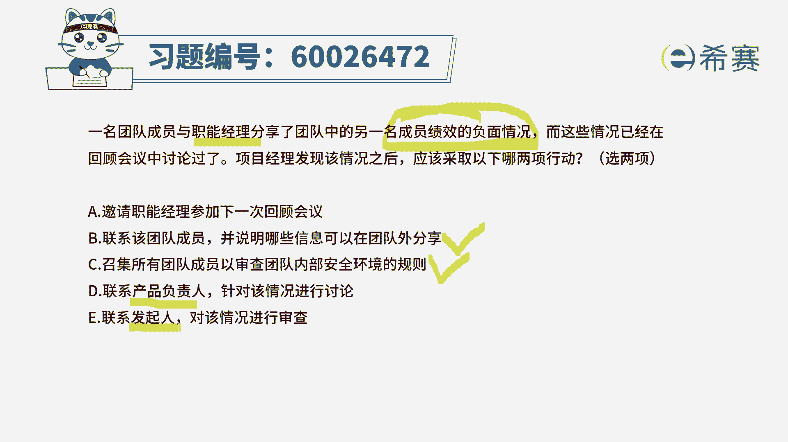
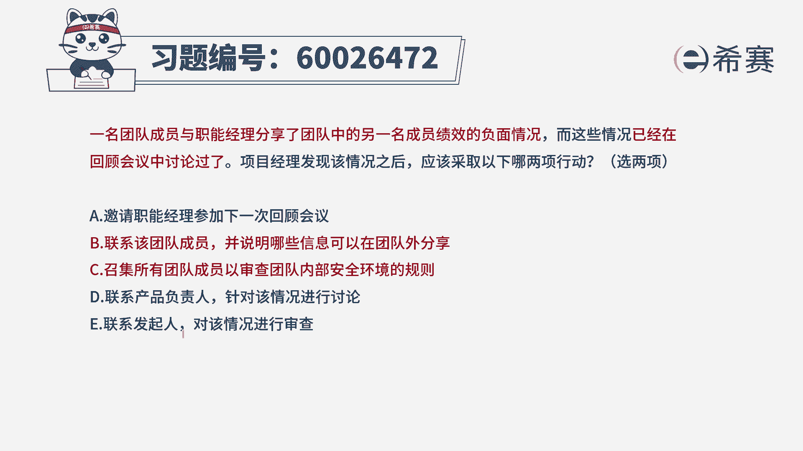
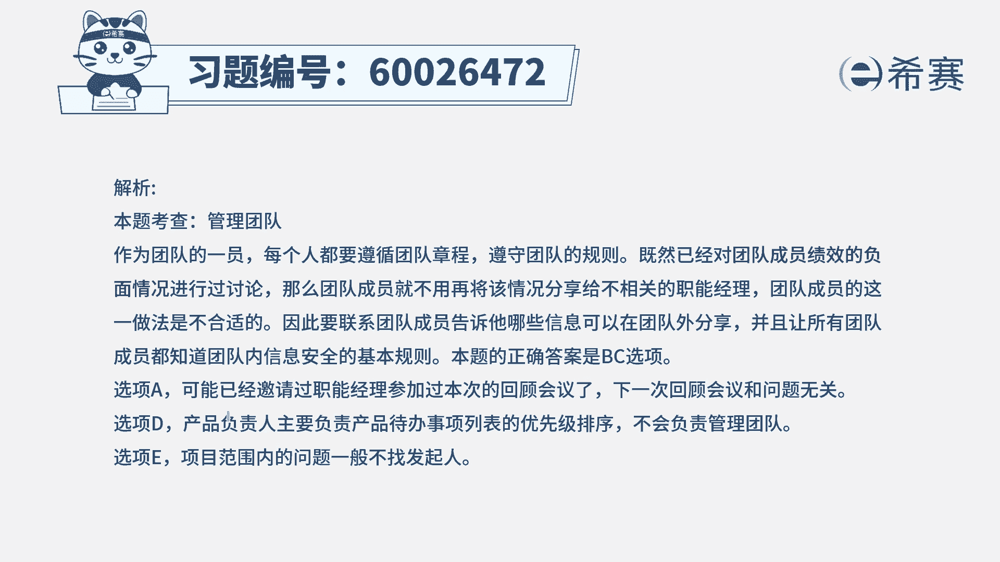

# （24年PMP）pmp项目管理考试零基础刷题视频教程-200道模拟题 - P76：76 - 冬x溪 - BV1S14y1U7Ce

一名团队成员与职能经理，分享了团队中的另一名成员，他的绩效负面情况，而这种情况呢已经在回顾会议中进行了讨论，那项目经理发现该情况之后，应该采取以下哪两项行动，他明确告诉我们说，有两项行动是可以采取的。

那么应该采取哪两项行动呢，首先你得要了解一下一个团队成员，他的这种负面情况适不适合到处去公布，一般来讲是不适合的，难道我不要面子呀对吧，所以基于这种情形，我们其实要知道，哪一些信息可以在团队内部分享。

哪一些信息是可以分享到团的外部，这是有一个基本的规则，所以基于这样一个理念，我们再来看一下这四个选项，选项a邀请职能经理参加下一次回顾会，现在说的是说，这个人他分享了一些不该分享的信息。

我们该怎么样去处理，至于说跟这个职能经理要不要参加，下一次回顾会议，没有什么直接的关系，选项b联系该团队成员，并说明哪一些信息可以在团队外部分享，这个很显然就符合，就说哪些事情是可以说的。

哪些事情是不能说的，我们需要有一些界限，我们需要有一些基本规则，选项c召集所有团队成员，以审查团队内部安全环境的规则，其实也就是再一次强调，基于这个的话，我自己在管项的时候也经常会这种情形。

就如果说团队成员中有a犯了一个，什么什么错误，那我通常会跟大家一起去讲，如果遇到某种类型的情况，我们该怎样去处理，就集体去做一次啊培训或者是做一次教育，所以这种方式呢它其实是一种可行的方式。

而这而第四个选项联系产品负责人，针对该情况进行讨论，这种事情不必要去跟产品复制人来讨论，因为它主要是对于产品待办事项列表的生成，优先级排序，然后这样一些可交付成果的验收，来来去负责的这样一个角色。

学校里联系方发起人对他进行审查，一般来讲，发行不会去管这个项目，管理中的一些具体的琐碎的小事情不合适，那么这样看下来呢。

只有b和c两个选项是可以选的，答案就是bc，那这里面我们会要强调一个点，就是团队要一起共事，他需要一些团队基本规则，在敏捷中呢，团队的基本规则给一个词叫团队章程。

我们经常说没有规矩不成方圆，那团队章程就是我们的规矩，我们需要去了解清楚哪些是可以在内部说，哪些是可以在外部说，哪些事不能说。

