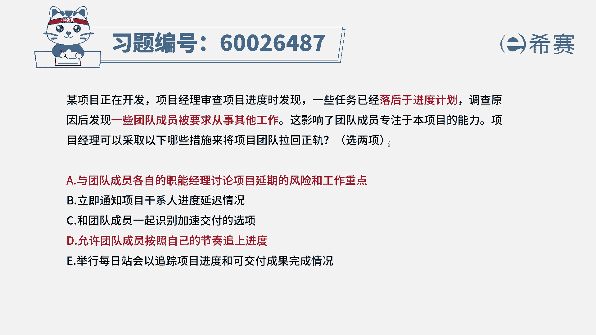
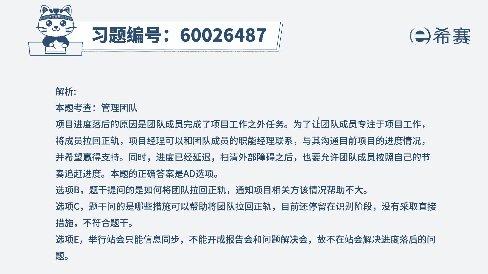

# （24年PMP）pmp项目管理考试零基础刷题视频教程-200道模拟题 - P77：77 - 冬x溪 - BV1S14y1U7Ce

某项目正在开发项目经理审查进度的时候呢，发现一些任务已经是落后于进度，计划调查原因以后才发现一些团的成员呢，他被要求去从事一些其他的工作，而这影响了团队成员专注于本项目的能力。

项目经理可以采取以下哪些措施，来将项目团队拉回正轨，那么这里既然明确告诉我们，他之所以落后，是因为去做一些别的事情，那我们就想办法让他不要去做别的事情，来做该做的事情，对不对。

那别的事情是他自己主动去做的吗，一般来讲肯定不是，一般肯定都是一些其他领导来安排的，就是除了项目经理以外的其他领导是谁呢，那不就是职能经理吗，所以接下来这五个选项里面有两个是正确的。

我们看有没有那种职能经理来去安排工作，然后我们去跟他交涉，让他不要去安排了，好，选项a与团队成员的各自的职能经理来讨论，这个项目延期的风险和工作重点，这好像刚好就符合的不对，所以他肯定是正确。

答案选项b立即通知相关干系人，进度落后，这个能解决问题吗，同步信息并不能马上解决问题，它不是一个具体有效的解决方案，他没有去直接解决，只是去同步的信息而已，选项c与团队成员一起来去识别，加速交付的方式。

请注意哦，在敏捷中其实没有要求你去非常加速的交付，o当然你你说他能不能够，其实也不是不能够，也不是不可以，这是一种可选的方式，但它不是一个特别好的方式，因为不管说是在敏捷也好，现在是预测型也好。

我们其实都要求是更相信员工，去信任员工，而这里刚好有第四个选项，能够跟第三个选项去pk，因为第四个选项说，允许团队成员按照自己的节奏来追上进度，就说我给他空间，我用y理论来管理他。

而相信他自己能够去完成，去达成，那这相比之下b比c更好，所以呢答案是选d，因为它只有两个正确答案吗，会在通过这种方式来去追踪项目的进度，和可交付成果的情况，请注意哦。

也不要把美日将会变成一个问题解决会议，所以e选项错误，所以答案呢是选a和b好。

详细解析。

