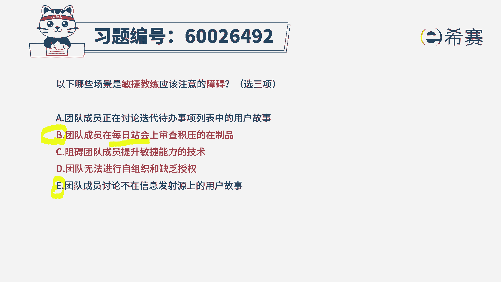
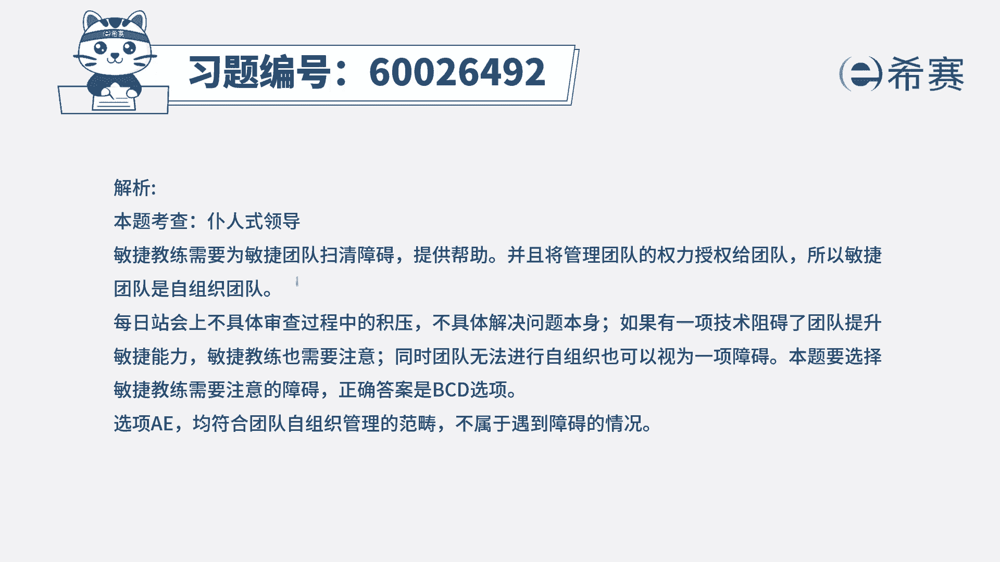

# （24年PMP）pmp项目管理考试零基础刷题视频教程-200道模拟题 - P78：78 - 冬x溪 - BV1S14y1U7Ce

以下哪些场景是敏捷教练应该注意的，障碍有三条，那怎么从五条里面选三条出来，我们就应该是还比较好选一点，首先敏捷教练有个很重要的一个作用，就是要去消除障碍，帮助团队去消除障碍。

那么这边有哪些障碍是我们需要去消除的选项，a团队成员正在讨论，迭代代办事项列表中的用户故事，这个可不可以讨论，这是可以讨论的啊，没问题啊，所以他不是一个障碍，ok他是一个可以讨论的事情，选项。

审查基亚的再制品，主要的作用是信息同步，一般来讲每个人回答三个问题，昨天干了什么，今天要干什么，干这个事情的过程遇到什么困难和挑战，以这个为主，他不去，他可以去抛出问题，但不去直接解决问题。

这种积压在制品的事情，这就是在在深度的去讨论交流，并且想要去解决，这个是错误的啊，是不对的，它是一种障碍，然后选项c呃，阻碍团队成员提升敏捷能力的技术，那这个呢肯定是会阻碍整个团队的敏捷性。

那肯定是一个问题对吧，肯定也是我们需要去清除的选项，d团队无法进行自组织，缺乏授权，而本身我们是需要得到授权，需要成为一个自组织，自管理的团队，那既然缺乏，那肯定是有问题，肯定是要去清楚的。

在那这样看下来，b c d就是我们需要去清楚的，在而最后一条，团队成员讨论不在信息发射原上的用户故事，也就是说，他讨论的是一些别的一些用户故事的事情，这个没问题吧，我讨论一下应该不是很要紧吧，论。

我们在因为本身敏捷呢，会提倡的是集中的这种开发的方式，那集中开发我们坐在一起有一种叫渗透沟通，就不知不觉中就获取一些信息，可能会讨论一些事情，我们不能要求所有人，这八个小时从头到尾全部都在工作。

那中间可能会聊一些别的事情，聊一些闲的东西，这个没有太多的关系，无山太阳，所以敏捷教练你要去清楚，在就是这样的三个，但在这里的话，其实可能很多人会把这一个没有选进来，来把这一个选进来了。

我们重点只关注什么东西，如果没有按照这种敏捷的规则来进行的话，这就是一种障碍。

就是我们要去清楚的这个点，希望你能够看明白，好详细的解析。

